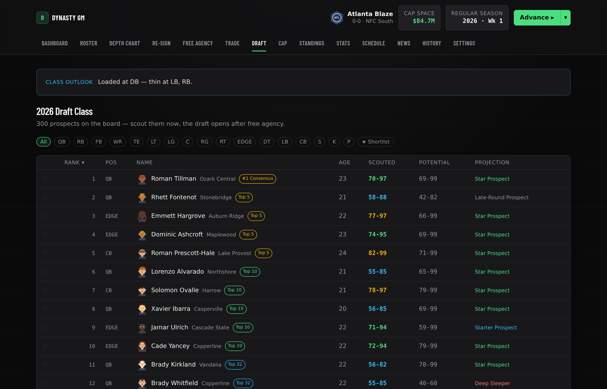
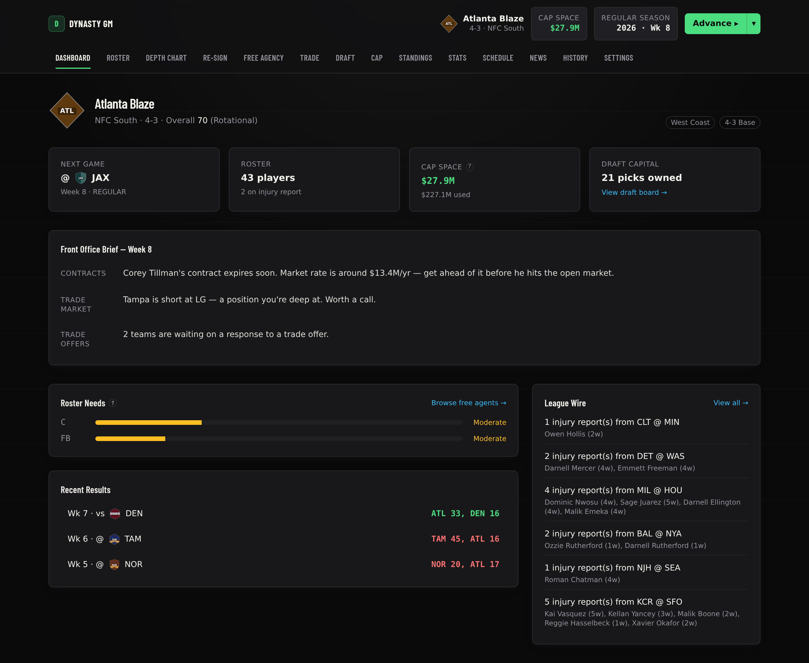
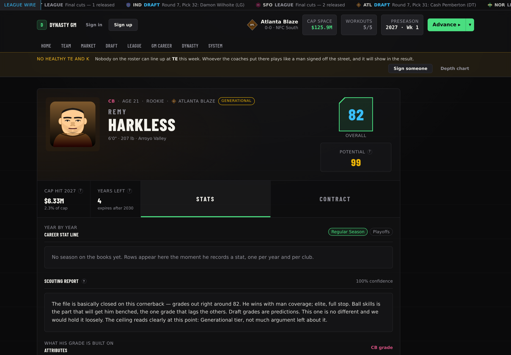
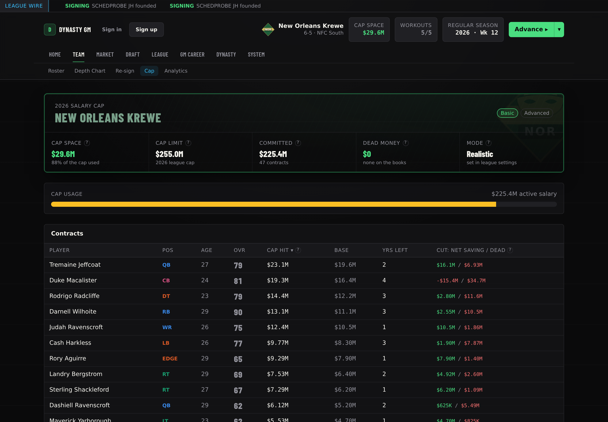
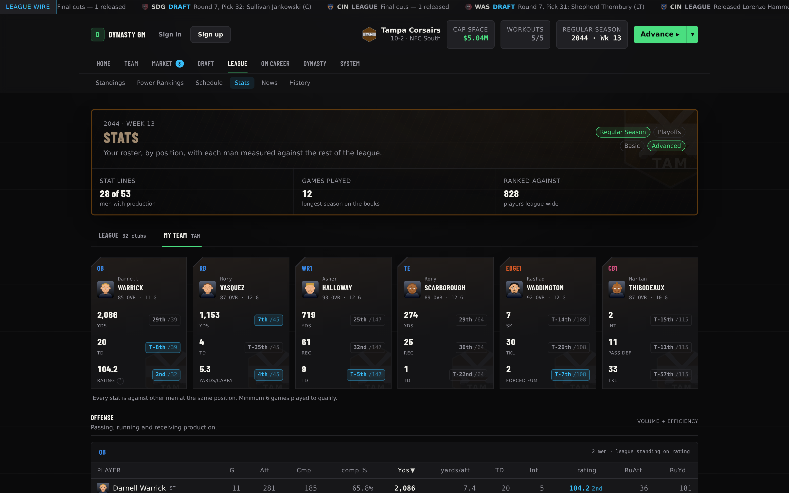
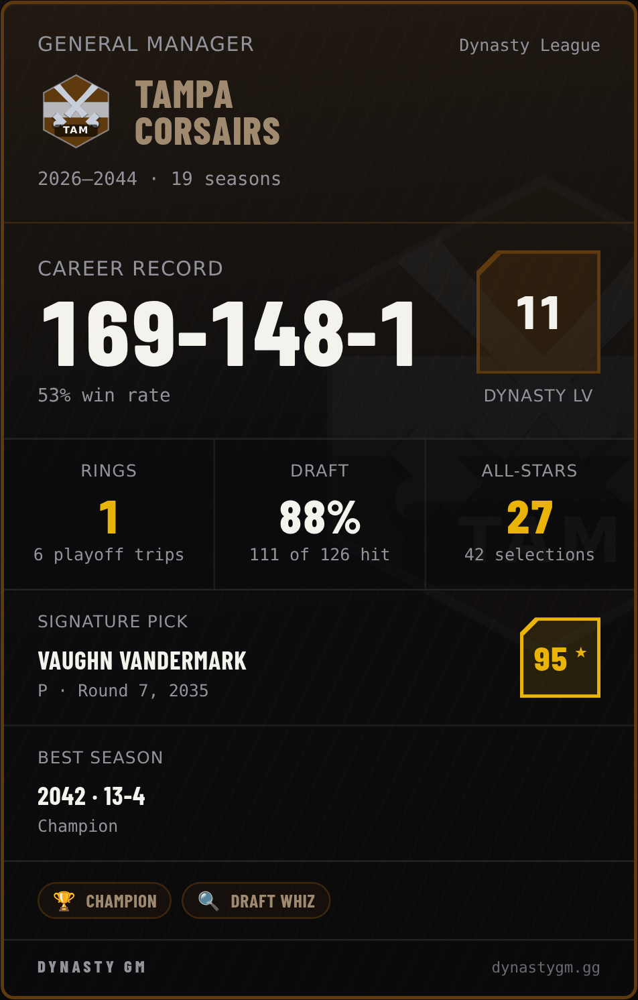

# Dynasty GM Football

A single-player American football front-office simulator. Built with **Next.js
14 (App Router, TypeScript)**, **Tailwind CSS**, and **Prisma + Postgres**.

You are the GM of one franchise in a 32-team league of fictional teams and
generated players (no real NFL data/names anywhere). Every core system from
the design doc is implemented end-to-end: player generation, scouting
fog-of-war, the sim engine, salary cap, free agency, trades, the draft, and
the full season/offseason cycle.

<p align="center">
  
</p>
<p align="center">
  
  
  
  
</p>
<p align="center">
  
</p>

<sub>Screenshots are regenerated from the app at the commit they ship with, never
mocked up. If one of these looks unlike the app you are running, the README is
the thing that is out of date.</sub>

> **Balance disclaimer:** Every number that the design doc marked "tunable" —
> position weights, RNG spreads, market-value curves, AI valuation formulas,
> the draft pick chart, etc. — is a first-pass placeholder. They're all
> centralized in **`lib/tuning.ts`** (plus a few adjacent files: `lib/cap.ts`
> for market value, `lib/ai/gm.ts` for AI valuation) and commented with
> `[TUNE]`, `[SAFE]`, or `[FRAGILE]` tags so they're easy to find and adjust
> once you've playtested.

## Play it now (no coding required)

This repository is private, so the one-click deploy button won't work here —
use Vercel's normal import flow instead:

1. Go to [vercel.com/new](https://vercel.com/new) and **sign in with GitHub**
   if it asks (free, one click — use the same GitHub account this repo lives
   in).
2. If `stox` isn't in the repo list, click **Adjust GitHub App Permissions**
   and grant Vercel access to it (all repos, or just this one).
3. Click **Import** next to `stox`. The app lives at the repo root, so you
   don't need to change anything on the configuration screen — just click
   **Deploy**.
4. The first deploy will likely **fail** — that's expected, not a real error.
   It fails because the app needs a database and doesn't have one yet:
   - Open the new project in Vercel, go to the **Storage** tab.
   - Click **Create Database** (or **Browse Marketplace**) → choose **Neon**
     (Postgres) → pick the free plan → **Connect** it to this project.
     This automatically fills in the database connection the app needs — you
     don't have to copy/paste anything.
   - Go to the **Deployments** tab and click **Redeploy** on the latest one.
5. Once that build finishes (green checkmark), click **Visit** — that link is
   your game. Bookmark it; it stays live and keeps your save, and every
   future push to this branch redeploys it automatically.

## Running it locally (for developers)

This needs a Postgres database reachable from your machine — a free one from
[neon.com](https://neon.com) works, or a local Postgres install. Put its
connection string in `.env` as `DATABASE_URL`, then:

```bash
npm install          # also runs `prisma generate` via postinstall
npm run db:push       # creates all tables from the schema
npm run dev            # http://localhost:3001
```

Other useful scripts:

```bash
npm run db:studio    # Prisma Studio — browse/edit the raw database
npm run build         # production build: generates the Prisma client,
                       # applies any pending MIGRATIONS (not a schema push —
                       # `prisma migrate deploy`), then `next build`. This is
                       # exactly what Vercel runs on every deploy.
```

## First things to click through

1. **Home page** — click **Create League**. Pick a team, a start type
   (randomized 32 rosters, or a blank-roster **Fantasy Draft**), a cap mode,
   and a difficulty. League generation takes about a second (32 teams,
   ~1,500 players, contracts, a full schedule, and your starting scouting
   book all get created at once). Each difficulty rung says what it actually
   changes — a rating bonus for every AI club, and how willing your scouts
   are to commit to a number.
2. **Team Dashboard** — your record, cap space, roster needs (bar chart by
   position), recent results, the league transaction wire, and — whenever
   the league is somewhere in the offseason — an **Offseason Roadmap**
   widget showing all five stages (Housekeeping → Re-sign → Free Agency →
   Draft → New Season) with the current one highlighted and how far through
   it you are, so it's never ambiguous whether a free agency window or draft
   period is open. The current stage is a link to the screen it's played on;
   the finished and upcoming ones deliberately aren't. It's hidden on a
   brand-new save's first preseason, where it was the biggest thing above
   the fold and drew four stages as complete that never happened.
3. **Roster** — every player on your team, with scouted rating **ranges**
   instead of hard numbers (unless you disable scouting in Settings), plus
   a **Fill Roster** action that shows you the whole plan before it spends
   anything — every man, his deal, the total against this year's cap, the
   room left afterwards, and the dead money if you cut them all — and signs
   only free agents whose asking price already sits at or under the
   league-minimum tier, on one-year deals with no signing bonus and no
   guarantee. A position where nobody will play for the minimum is left
   empty and says so rather than reaching up the market. Click a name to
   open their **Player** page — attribute-by-attribute scouted ranges, a
   role/potential **label** (Prospect → Star → Franchise → Generational,
   reading off the same fogged data so it can be wrong until
   scouting narrows in), contract details, a **Release** button, and — on a
   draft prospect — **Full Scout** (a two-step confirm: the first press asks,
   the second spends) and **Work him out**. There is no weekly-scouting-points
   button: that system was replaced by the shortlist, which spends your staff's
   attention automatically every week on the men you have starred. A
   draft prospect's card also shows a **College Profile**: a full college
   season box score (revealed progressively across the NFL season) plus
   combine/pro-day testing and a competition-strength grade.
4. **Depth Chart** — reorder each position group with the ▲/▼ buttons. This is
   the order the sim allocates the ball and the tackles in — so it decides who
   leads your team in receiving, not who wins you the
   game. The unit ratings that actually decide a game read the best available
   man at each position regardless of chart order. Chart order used to move a
   club's offensive and defensive ratings by 0.19 points on average through
   scheme fit; that term is deleted, so its effect on the scoreboard is now
   exactly zero. Unavailable men are filtered out
   *before* the order is read, so an injured starter is not something to
   reorder around — his backup starts on his own.
   Every row carries its cap hit and every group header carries "$X committed
   here". "Auto-Sort by Rating" resets it to true-value order.
5. Hit **Advance ▸** in the top-right repeatedly to sim games — the dropdown
   only ever offers targets that make sense for the phase you're actually
   in (no more "Advance to Midseason" once you're already in the
   offseason), and disappears entirely on a gated phase (Re-sign, Draft)
   where there's nothing valid to multi-advance into. Click any final score
   to read the generated **recap** and box score. The whole offseason is
   three presses: one settles the season just played and opens the new league
   year, one puts the draft class on the board and turns your own expiring
   men into a decision, and one releases whoever you didn't keep and opens
   free agency.
6. **Free Agency** / **Trade** / **Draft** pages work whenever the league
   phase allows it (the top bar always shows the current phase — Regular
   Season, Free Agency, Draft, etc.). The season loop is: Regular Season →
   Playoffs → Offseason (progression, aging, new draft class) → Re-sign
   window → Free Agency (3 weeks) → Rookie Draft → back to Preseason.
   - **Re-sign** shows your own expiring contracts starting the week their
     final contract year begins — not just once the offseason RESIGN phase
     opens — with a **Not Re-sign** action (confirm, then release) and a
     **Let the AI Pick** button that delegates every pending decision to
     the same logic AI teams use for their own players. A deal with nothing
     left after this league year reads **"Expiring this offseason"** (the
     man is still yours and nobody else may sign him — he only walks if the
     window shuts with him undecided); one with a year still to run reads
     **"One season left"**. The **Franchise Tag** is a full-width control on
     both this row and the player's own contract tab, and pressing it opens
     a preview before anything is committed — the tag salary and the five
     cap hits it is averaged from, his old deal coming off the books, the
     dead money that accelerates, the net cost, and cap space before and
     after — then a confirm with the price in the button label.
   - A **first-round pick's rookie deal carries a fifth-year option**, and it
     is answered in this same window, after his third season and before his
     fourth. The control is on his contract tab beside the tag, priced the
     same way and confirmed the same way — the tier he has earned and what
     earned it, the option salary and the band of position cap hits it is
     averaged from, the season it lands in and that year's room before and
     after, and what releasing him would cost once it is guaranteed — with
     BOTH answers as buttons, because turning it down is a real move with a
     real cost: he plays his fourth year out and reaches free agency a year
     early. The front-office brief on the dashboard is what tells you it is
     waiting. AI clubs answer their own in the same step.
   - **Draft** is a year-round scouting hub, not just a DRAFT-phase screen —
     the incoming class exists from week 1 and is fully browsable
     (sortable, filterable, ★ shortlist-able) all season. It carries a
     **Class Outlook** banner ("Loaded at LB, DB — thin at QB") since each
     year's class now has real position-strength personality instead of
     being an identical flat random sample, and a position-weighted
     **consensus big board** (#1 / Top 5 / Top 10 / Top 32 badges, round 1
     only) alongside per-player Prospect/Star/Franchise/Generational tags.
     The page is two views — **The Board** is the men, the filters, the
     name search (which searches the whole class on the server, not the
     eighty rows on screen) and your own picks; **The Room** is the
     broadcast — with the clock standing above both, and after the last
     card they become **The Class** and **What's Left**. Before you press
     Start, the war room tells you whether your picks fit under the cap and
     names the exact selection the money runs out at. Live draft day paces
     one AI pick at a time (pausable) instead of silently batch-skipping,
     and when you want it over there's **Fast Forward to My Pick** or
     **Run Out the Draft** — chunked a dozen picks at a time so the board
     visibly moves and stoppable between chunks.
   - **Trade** value is driven by real positional economics, not raw
     rating — see `lib/ai/gm.ts` below.
7. **Cap** and **Stats** pages each have a **Basic / Advanced** toggle. Advanced
   adds real charts (cap allocation by position, multi-year cap outlook,
   cap hit vs. market value, your spend vs. the league average; passer
   rating leaderboard, an offense-vs-defense quadrant, your team's scoring
   trend). Stats also has a **League / My Team** toggle — My Team swaps the
   league leaderboards for one full-roster table of position-shaped
   efficiency stats (completion %, Y/A, YPC, catch %, tackle+sack "impact,"
   INT+PD "playmaker" score, etc.) for every player you have that's
   recorded a stat.
8. **Settings** — cap mode, difficulty, scouting toggles, injury and
   progression rates, trade rules, sim variance, recap verbosity, and more.
   (This used to describe the list as "every option from the design doc's
   settings screen". Commit `18e02c6` took the design-doc framing out of the
   app as fiction-breaking, and removed three toggles from this form that
   gated nothing; three more that still gate nothing are named under Known
   simplifications below.)

## Where things live

- `prisma/schema.prisma` — full data model (teams, players with true vs.
  scouted values plus college/combine profile JSON, contracts/cap, draft
  picks, scouts, coordinators, league state, settings blob)
- `lib/tuning.ts` — **every balance constant in the game**, grouped by
  system — including `TRADE_VALUE`/`TRADE_VALUE_TIER` (positional trade
  economics) and `AI.DRAFT_POSITION_VALUE` (draft-specific position
  premium, a deliberately separate curve from trade value)
- `lib/gen/` — player generation, name/team pools, league creation;
  `lib/gen/prospectProfile.ts` generates each rookie's college season,
  combine/pro-day testing, competition grade, and each class's
  position-strength bias
- `lib/scouting.ts` — the fog-of-war system (section 6): observed values,
  error bands by attribute difficulty, confidence growth
- `lib/cap.ts`, `lib/cap-summary.ts` — salary cap in Realistic / Simplified /
  Off modes, market-value curve, rookie scale, the franchise tag's *price*
  (the tag move itself, and the dead money it books, is in
  `lib/freeagency.ts`), and `askingPrice()` — the advertised number, which
  falls the longer a man sits unsigned and is exactly market value in his
  first week on the wire
- `lib/franchiseTag.ts` — **why this club cannot tag this man**, written once
  and read by the player card, the re-sign row and the impact preview behind
  both, in the same order the server action refuses in (tags off in settings,
  wrong phase, deal not up, tag already spent), so a greyed control can never
  name a reason the server does not hold
- `lib/fifthYearOption.ts` — the fifth-year option on a first-round pick's
  rookie deal: who has one, when it is answered, and the three tiers it is
  priced by. A leaf like `lib/franchiseTag.ts` and for the same reason — the
  player card, the front-office brief, the impact preview and the server action
  all read one six-branch rule, in the order the server refuses in. The tiers
  are the real CBA's own bands (top 5 / top 10 / 3rd-20th of the position's cap
  hits) over the SAME `positionSalaryBand` the franchise tag is priced with, so
  the two can never disagree about what a position pays. The database half —
  which tier he has earned, and the two writes — is `fifthYearOptionQuote`,
  `exerciseFifthYearOption` and `declineFifthYearOption` in `lib/freeagency.ts`
- `lib/contractClock.ts` — the words for where a deal sits on its clock, in
  one place: "Expiring this offseason" (nothing left after this league year)
  and "One season left". They differ in exactly the fact that matters — when
  he can leave — and neither says he is already gone
- `lib/sim/` — unit ratings (`units.ts`), drive-based game resolution
  (`engine.ts`), recap text generation (`recap.ts`)
- `lib/ai/gm.ts` — the shared AI GM brain used by free agency, trades, and
  the draft: needs, league scarcity, personality profile, and
  `playerValueDetailed()` — trade/asset value from position-tier
  replacement-level curves, position-specific age arcs, contract surplus,
  bounded team-need and scarcity multipliers, and a hard per-tier ceiling
  (see `scripts/benchmarkTradeValue.ts` for the full scenario coverage)
- `lib/freeagency.ts`, `lib/trade.ts`, `lib/draft.ts` — the three acquisition
  systems, each with a user-facing path and an AI-vs-AI/AI-vs-user path
- `lib/season.ts` — the season/offseason phase machine and `advanceWeek`,
  the single entry point that moves league time forward
- `lib/lineup.ts` — **the single definition of the starting eleven** (11
  personnel on offence, nickel on defence). Anything that needs to know who
  starts reads this; three parts of the app used to disagree, and one of them
  fielded twelve defenders
- `lib/negotiation.ts` — the ONE contract evaluator. `decideOffer` is called
  by the client interest meter and by the server on submit, so the meter can
  never promise something the server refuses. `scripts/checkNegotiationAgreement.ts`
  proves it across ~1,025,000 swept comparisons
- `lib/consensus.ts` — the free public draft board, wrong in five learnable
  ways; `lib/shortlistAttention.ts` (weekly scouting attention split across
  whoever you star) and `lib/workouts.ts` (pre-draft private workouts)
- `lib/dynasty.ts` — GM levels, XP and the three-branch skill tree
- `lib/teamRating.ts` — team/unit ratings and league ranks, and
  `lib/powerRankings.ts` — the weekly 1-32 ordering that is allowed to
  disagree with the standings
- `lib/playerSeasons.ts` — year-by-year stat lines, reconstructed by
  replaying box scores (which are never deleted) and indexed into
  `PlayerSeason`
- `lib/weekReport.ts`, `lib/gameShape.ts` — the post-advance Week Report, and
  the shape of a game derived from the drives already stored on every result
- `lib/frontOffice.ts` — the front-office brief on the dashboard: what a GM
  is handed on arriving, each item carrying its own headline, detail and the
  door out of it, ordered by urgency rather than by the order the items
  happen to be pushed in source
- `lib/auth.ts`, `lib/owner.ts`, `lib/password.ts` — accounts, sessions, and
  the ownership boundary enforced in three places: the home list, every
  server action, and every league page render
- `lib/ratings.ts` — attribute weights per position, `computeOverall`, and
  the position-conversion maths (`RELATED_POSITIONS`, and THE CEILING MOVES
  WITH THE FLOOR — a converted player's `potential` travels with his rating)
- `lib/glossary.ts` — **one definition of every term in the game**, each with
  a `definition` and a `why`. `tip(key)` renders it; every `?` bubble in the
  app reads from here, so a word cannot come to mean two things on two
  screens
- `lib/awardTypes.ts` — **the one list of trophies**, in a leaf module that
  imports nothing. The writer, the seeded backstory, the XP model, the
  dynasty leaderboard, the GM career page, the wire, the history table and
  the player card all read it, so a career page can never count four awards
  above an honours list showing five. `lib/awards.ts` is what decides who
  wins them each season, including the exclusion rule that stops Offensive
  and Defensive Player of the Year from being a second printing of the MVP
- `lib/capEnforcement.ts` — what happens when a club cannot fit a contract,
  including `autoClearCapRoom` (an AI club short of a rookie deal releases
  the LEAST valuable men who cover the bill, never the biggest saving)
- `lib/analytics.ts` — the derived measures behind the Analytics screen:
  drive outcomes, per-play rates, unit spend against unit rating
- `lib/gmCareer.ts`, `lib/tradeRetro.ts`, `lib/dynastyScore.ts` — your tenure
  (record, hit rate, badges, signature pick), deals re-priced today and
  graded, and the whole-franchise Ring of Honor score. The first two are
  bounded to your hire year; the third deliberately is not, and the panel
  says so
- `lib/development.ts` — progression, decline and the attrition that clears
  the free-agent pool
- `lib/leaderboard.ts` — the public, opt-in GM board
- `lib/leagueFile.ts` — versioned league export/import, with the validation
  as the actual feature
- `docs/deployment.md` — how this is deployed, the environment variables, and
  a plainly-stated known-risks section
- `app/league/[id]/` — every screen (dashboard, roster, player, depth chart,
  free agency, re-sign, trade, draft, cap sheet, analytics, stats, standings,
  power rankings, schedule, game recap, league news, history, GM career,
  dynasty, scouting, a read-only view of any rival club, settings)
- `app/actions/` — server actions backing every mutation (sign, cut, trade,
  draft, scout, advance week, settings)
- `components/ds/` — the design system: every shared presentational piece
  (`PageMasthead`, `SectionHeading`, `RatingBadge`, `ScoutingRange`,
  `Tooltip`, the position colours, the panels). Reach for one of these before
  writing new styling
- `components/draft/` — Draft Day's broadcast: the hero, the live selection
  feed, run watch, board depletion and both best-available boards, plus
  `DraftViewToggle.tsx` (the Board / Room split, with the clock standing
  above both, and pane names that change to The Class / What's Left once the
  last card is in), `ProspectSearch.tsx` (a search of the whole class, run on
  the server, not a filter over the eighty rows on screen),
  `RookieCapWarning.tsx` (what your own picks will cost and which one the
  money runs out at, said before you press Start rather than on the clock)
  and `RoundPicker.tsx` (rounds 2-7 one round at a time, all 32 on screen,
  instead of a two-lane scroll box)
- `components/analytics/` — one component per analytics panel
- `components/charts/` — the small shared chart kit (bar/line/scatter) used
  by the Cap and Stats Advanced views
- `scripts/benchmarkTradeValue.ts` — permanent, framework-free benchmark
  suite for trade valuation (`npx tsx scripts/benchmarkTradeValue.ts`);
  `scripts/checkRestructure.ts` — the restructure/extension gate (every
  length x seasons played x bonus size x void years x conversion, asserting
  that a zero-dollar restructure changes nothing and that total charged
  equals money paid, INV-21); `scripts/checkFranchiseTag.ts` — the franchise
  tag's gate, and deliberately NOT a clause inside the restructure one: that
  defect lived in a pure function, this one never lived in the arithmetic at
  all, so it drives the real write path against a real database over 320
  contract shapes, 3,104 checks;   `scripts/checkFifthYearOption.ts` — the same rule on the path that ADDS a
  contract year instead of replacing one, 56 shapes and 629 checks against a
  real database: the option year is held outside the signing-bonus proration
  window, the fourth-year cap hit does not move by a dollar, the option year is
  guaranteed and a release through the real `cutPlayer` pays for it, and
  declining moves nothing at all;
  `scripts/simHealth.ts` — the invariant-checking
  harness (see `GAME_INVARIANTS.md`), which builds every third league as a
  fantasy draft so both start types are exercised

## Design principles (standing, not up for re-litigation)

These came from the app owner directly and they override any local design
argument — including a well-reasoned one. If a change conflicts with
something here, the principle wins and the change is wrong.

0. **THE POINT IS IMMERSION — a universe the player can get lost in.** In the
   owner's words: *"The design philosophy is trying to create a universe the
   player can get lost in. There are stories, careers, etc that need to feel
   like have happened so the player can reach the peak immersion."*

   This is the principle the rest of the list serves, so it comes first. It
   has a specific and demanding consequence: **the world must have a past,
   and the past must be legible.** A thirty-year-old on your roster had a
   career before you met him and the game should be able to show it, season
   by season, club by club — not collapse it into a summary row. A franchise
   has titles, droughts, records and rivalries. A season leaves stories
   behind it. None of that is decoration; it is the difference between
   managing a database and running a club.

   **And it is the differentiator, not a nice-to-have.** *"No other game has
   something for that armchair quarterback nerd to dive into like this.
   that's why i'm a stickler for the cap and stats to have such depth."* So
   when depth and tidiness conflict on the cap page, the stats page or a
   player card, depth wins — this is the audience the game is FOR. That does
   not license clutter (principle 5 still holds: a column that reads the same
   on every row is noise), and it does not license inventing a number
   (principle 6). It means the honest, real, hard-won detail stays in, and
   "this is a lot" is not by itself an argument for cutting it.

   It also sets the bar for what "not enough data" means. Where the world's
   history is *generated*, generate it in full and **keep** it — the
   "Before 2026" row existed only because `buildVeteranCareers` computed a
   veteran's career season by season and then merged it away. The fix for a
   thin-feeling world is almost always to stop discarding what was already
   invented, never to invent a second time on top of a summary. See
   principle 6: a reconstructed split is a different fiction wearing the
   first one's totals.

1. **It must feel like a game, not a spreadsheet.** *"we dont want this to
   just feel like text — the avatars and graphics add SO much to the feel of
   the game."* and *"it needs to be and feel alive."* Information density is
   not the goal. A screen that is nothing but figures has failed, however
   efficiently it packs them.

2. **Avatars, team logos and colour are identity, not ornament.** They are
   what make a name read as a *player* rather than a row key, and a
   three-letter abbreviation read as a *franchise*. Never remove them to save
   vertical space. If a row needs to be taller to carry an identity, the row
   gets taller.

3. **Rating colour is meaningful above ~80.** *"i also love the rating
   colors. They should be meaningful after ~OVR 80 IMO."* Below that band,
   stay neutral — a 62 and a 74 are both "a guy" and painting them is noise.
   From ~80 up, real distinguishable steps so an 81, an 88 and a 94 are
   apart at a glance, climbing toward elite.

4. **Colour is never the only channel.** Every coloured rating step also
   carries a glyph, and adjacent steps must survive a colourblind-separation
   check (`scripts/validate_palette.js` from the `dataviz` skill) — run it,
   don't eyeball it. This one does *not* bend to preference: it is the reason
   the earlier rainbow ramp was replaced rather than merely restyled.

5. **A column with the same value on every row carries no information.** This
   is the one part of the density argument that was right. The "Active" pill
   on 27 of 28 roster rows and "Unevaluated" on 300 of 300 draft rows are
   noise; the avatar beside them is not. Cutting the former is not licence to
   cut the latter.

6. **No lying metrics.** A number shown to the player must be the number the
   system actually used. This has been a recurring bug class here (a ledger
   reading "Trades 0" beside a tile reading "Trades Made 7"), so it is
   written down: if you display a rank, it must be the rank of the grade you
   displayed.

   The corollary, which principle 0 makes tempting to break: **immersion is
   never a licence to invent a number.** A metric borrowed from the real
   sport must be the real metric or it must not carry the name. EPA is the
   worked example — it is defined per play against down, distance and field
   position, `DriveResult` records none of those, so the game does not ship
   an "EPA" column. What it ships instead is the drive-efficiency family it
   *can* compute honestly (points per drive, drive success rate, three-and-out
   rate, yards and plays per drive), which is what a real front office runs
   on anyway. The owner's ruling: *"lets just do what we can reasonably do
   without reinventing the wheel."*

7. **Every page gets decluttered, and length is not the same as clutter.**
   *"We still want it decluttered — as with EVERY page on our game. we should
   try to eliminate clutter where we can."* This is a standing rule, not a
   one-off request, and it has a specific meaning worked out across several
   passes.

   What gets cut is **a second reading of a fact already on the screen**, **a
   panel that reports nothing** and **anything with no job on the page it is
   on**. The draft-complete pass (`14e64b4`) is the worked example: it cut a
   selection feed that was a *third* rendering of the same 224 picks, a "Best
   Available" panel that was the first eight rows of the table directly
   beneath it re-laid-out, a war-room ledger reading all zeros by definition
   once the board was empty, and a private-workout line offering a budget
   nobody could spend. 4,971px to 2,771px, and nothing a GM would go looking
   for was lost.

   What does NOT get cut is depth. The owner, on the GM career page: *"I
   would rather have a lot of really cool data on GM career across 2 or 3
   tabs rather than minimal on one tab to save room."* A long panel with one
   job, a clear hierarchy and room to breathe is good; a short one where four
   panels compete for attention is clutter. **Height is a signal, not a
   target** — ask whether a page is long because it is rich or long because
   it repeats itself, and only the second is a defect.

   Tabs are the tool that resolves the two: more total content, each view
   with a single job stated in its name, and every panel in it earning its
   place against that job. `DraftViewToggle` and `PlayerCardTabs` are the
   pattern — switching is client state, never a URL, because both panes are
   already server-rendered when the page paints, so a navigation would buy
   nothing and cost the reader his scroll position.

## Working on this repo alongside other agents

This tree is often shared by several sessions at once. Two rules exist because
both were learned by breaking the deploy branch, not by reasoning about it.

**Never stage by path on a shared tree.** `git add lib/season.ts` stages the
file *as it currently is*, including whatever an agent you cannot see wrote
into it thirty seconds ago. That is how a commit once swept an `import
{ runAiTradeMarket } from './aiMarket'` into `lib/season.ts` while
`lib/aiMarket.ts` was still untracked — every route touching the league layout
threw `Module not found` until it was rebuilt from `HEAD`.

`git update-index --cacheinfo` is worse, because it looks surgical and is not:
it writes the *whole index entry*, silently discarding anything another agent
had staged at that path. It has already destroyed a sibling's staged
`lib/tuning.ts` once, recovered only because the blob was still reachable
through `git fsck --unreachable`.

**Use a temporary index.** It cannot touch anyone else's staging because it
never opens their index:

```sh
export GIT_INDEX_FILE=/tmp/idx-$$
git read-tree HEAD                       # start from committed state, not the shared index
git hash-object -w path/to/file          # -> <blob>
git update-index --add --cacheinfo 100644,<blob>,path/to/file
tree=$(git write-tree)
commit=$(git commit-tree "$tree" -p HEAD -m "message")
git update-ref refs/heads/<branch> "$commit"
unset GIT_INDEX_FILE
```

To change one hunk of a contended file, read the committed version first
(`git show HEAD:path`), apply the hunk to *that*, and hash the result — never
the working copy.

**Verify in an isolated worktree, never in the shared tree.** A `tsc` run in
the shared tree measures a mix of everyone's in-flight work and will report
failures that do not exist on the branch, and hide ones that do. A false alarm
of exactly this shape cost an afternoon:

```sh
git worktree add --detach /tmp/vfy origin/<branch>
ln -s "$PWD/node_modules" /tmp/vfy/node_modules
cd /tmp/vfy && npx tsc --noEmit -p tsconfig.json | grep -E '^(lib|app|components)/'
```

Note that `tsc` will **not** catch importing a `'use client'` module into a
Server Component. That one only shows up at runtime, as a 500.

**The shared database is shared too.** It has hit `too many clients already`
(100/100) with sibling sessions' processes. Delete scratch leagues **by
collected id, never by name prefix** — a prefix sweep once destroyed another
session's live harness mid-run.

## Known simplifications (documented, not bugs)

- ~~Negotiation patience is per-session, not stored.~~ **Fixed — this entry
  described the old behaviour.** Patience now persists: `NegotiationTalks`
  carries `patienceSpent` keyed by team + player + league year, it never
  decreases within a year, and it is read server-side
  (`readPatienceSpent` in `lib/freeagency.ts`) rather than passed up from the
  browser. Reloading the page no longer reopens talks with a full meter.
- AI teams don't carry their own `ScoutingReport` rows — they evaluate free
  agents and trades off true ratings. Modeling AI fog-of-war there would 32x
  the scouting data for no gameplay benefit in a single-player game, and a
  veteran is a known quantity anyway. **The rookie draft is the exception**:
  once the consensus board became deliberately fallible (`lib/consensus.ts`),
  clubs picking off true ratings meant the board the user is shown predicted
  nothing about the order players actually came off it. AI clubs now draft
  off the public board plus a private per-club lean, with no scouting rows
  involved — see AI CLUBS DRAFT OFF A READ in `lib/draft.ts`.
- ~~The re-sign window isn't exclusive.~~ **Fixed — this entry described the
  old behaviour.** The RESIGN phase IS an exclusive window:
  `releaseUnresignedExpiringContracts` runs on the way OUT of it, so nobody
  else can sign your expiring men while you are working them. The incumbent
  also carries a real edge inside it — a hometown discount that is priced
  into his reservation number and deliberately NOT extended to the rival
  bidding against you, which is the one loyalty concept in `lib/negotiation.ts`.
  What is still not modelled is a separate legal-tampering period before that
  window opens.
- AI-vs-AI trading now runs on its own (`lib/aiMarket.ts`), so this is no
  longer a hole — but it is deliberately QUIET on its first ship. The
  in-season market is deadline-weighted and aims well under the real NFL's
  35-40 trades a year, plus one pass at the top of free agency and one on
  draft day. What is still not modelled: trades DURING the draft itself
  (clubs move up before the board opens, not between selections), three-team
  deals, and any trade involving cash or conditional picks.
- College stats/combine testing are procedurally generated at class
  creation, not the output of an actually-simulated college season — see
  the header comment in `lib/gen/prospectProfile.ts` for exactly what's
  tuned to real NCAA norms (13-game season, the real NCAA passer
  efficiency formula) versus placeholder.
- `showAdvancedStats`, `autoAdvanceWeeks` and `confirmRiskyMoves` are stored
  on the settings blob and gate nothing. They are no longer OFFERED on the
  Settings screen — a control that does nothing is worse than an absent one —
  but whatever an existing save stored is preserved rather than dropped
  (`app/actions/league.ts`).
- Difficulty declares three knobs and moves two. `aiUnitBonus` shifts every
  AI club's offence and defence by -1.5 / 0 / +2.25 and `userScoutPenalty`
  widens or narrows the half-width of a scouted range; `aiSharpness` (0.75 /
  0.9 / 1.05) has no consumer anywhere in the codebase. The create-league
  form's hint line describes only the two that exist. The in-league Settings
  tooltip still says difficulty makes AI teams "value players more sharply in
  trades and free agency", which is a described feature that does not exist.
  It is named here rather than quietly deleted, because principle 6 above
  says a number shown to the player must be the number the system actually
  used, and a sentence is no different.
- Stat lines are allocated top-down from team drive totals (so the score and
  box score can never disagree) rather than simulated play-by-play.
- **The AI operates the fifth-year option, but the AI's PICK valuation still
  does not know it exists.** `decideFifthYearOptions` (lib/season.ts) runs in
  the RESIGN step and every non-user club answers every option it holds, priced
  and gated off the same functions the user's own control uses — so this is not
  a second instance of the franchise-tag defect below. What is NOT wired is the
  other half of why the option matters: `AI.DRAFT_POSITION_VALUE` and the
  draft-pick chart still price round one over round two on talent alone, when
  in the real sport a first-rounder is also five years of control instead of
  four. Folding that in means re-anchoring the pick chart, which is a balance
  change that reaches every trade in the game and is deliberately not being
  made in the same pass as the feature it would be pricing.
- **An exercised option is fully guaranteed the moment it is picked up.** The
  real rule guarantees it for injury on exercise and in full at the start of the
  fifth league year. This game has no concept of releasing an injured man, so
  the first stage would be a rule with no way to observe it — and a guarantee
  that depends on something the GM cannot see is worse than a harsher one he
  can. The preview says so before he presses, and the harsher version is the one
  that makes the decision a real bet.
- **The option's middle tier reads "is he a starter", not "did he play 75% of
  the snaps in two of three seasons".** There are no snap counts in this game
  and there is no honest way to invent them: `PlayerSeason` is reconstructed
  from box scores and a box score names no offensive linemen at all, so a
  playing-time test built on it would put every first-round tackle in the
  cheapest tier by construction. `lib/lineup.ts` — the single definition of who
  starts, read as the best men at the position rather than the depth chart's
  order, which is what stops it being a free click — is the closest honest
  answer. It fires more often than the real rule's playing-time leg does, so
  more first-rounders reach the transition-tag tier here than in the real sport.
- The franchise tag has no escalating price for putting it on the same man
  twice. Real football charges 120% of the first tag to tag him a second year
  and 144% for a third; `franchiseTagValue` knows exactly one price, and a
  `Contract` row carries `isFranchiseTag` but no count of how often. So an AI
  club refuses a second consecutive tag outright rather than quote a price the
  user's own screen would not (lib/season.ts, THE ONE MAN THE CLUB WILL NOT
  LET WALK FOR NOTHING) — the conservative half of the real rule — while the
  user, who has no such gate, pays the same money the second time as the
  first. Related and also deliberate: the re-sign page's *"Let the AI pick"*
  button never spends the user's tag. It is a once-a-year irreversible move
  with its own priced confirm step, and a delegate that burned it silently
  would take that decision away with no way back.
- A fantasy draft's player POOL is a league and a half of talent — about 1,956
  undifferentiated draws with no camp-body tail, median 77 against the
  randomized generator's 73. Priced at market, the 1,696 men who get drafted
  are worth 167% of a 32-club cap where randomized rosters are worth 99%, so
  every fantasy contract reads at roughly half of market. That is the pool
  rather than the pricing — a fantasy pick is priced through the same rule the
  league generator uses for a randomized roster, and bending the draft's curve
  to flatter a deeper pool would leave the game with two disagreeing answers to
  "what does a roster cost".

## Changelog

Every notable change lands here with the commit it shipped in, so there's
always a plain-English trail back to "what did this look like before." To
undo anything, ask to revert to a commit below (or the app owner can do it
directly: `git revert <hash>`, or check out an earlier commit — nothing is
ever force-pushed over, so every state below still exists in git history).

- **2026-08-24 — A receiver caught 158 passes for 1,444 yards and every man on
  his club averaged the same yards a catch.** Yards per reception was flat
  across a whole offence: measured over 24 replayed league-seasons, WR1 10.81,
  WR2 10.80, WR3 10.80, TE1 10.79 and RB1 10.78 — a checkdown to the third-down
  back worth the same as a go route, where the NFL runs 12.9 / 10.8 / 7.6 by
  position. That flat column also capped the receiving record book, because a
  leading receiver's total is his catches times exactly that number. Separately,
  every club in the league shared the ball out identically: the lead back's
  share of his backfield's carries was 57.3% for everybody (real clubs run 40%
  to 88%), so the leading rusher each year was simply the best club's starter
  and the leader board had no tail at all — 260 / 266 / 272 carries for its
  median, p90 and best of twenty-four. `roleTendency` in `lib/sim/tendency.ts`
  is now `passTendency`'s opposite number: that one says how often a club throws
  it, this one says who it throws it to. Leader per season, before → after
  against real: rushing yards 1,385 → 1,771 (1,700-2,000), carries 258 → 380
  (300-380), receiving yards 1,455 → 1,744 (1,700-1,900), tight end 748 → 1,018
  (1,000-1,200), receptions 126 → 134 (110-135). Passing, sacks and every team
  result are untouched — all 6,528 game scores are bit-identical across the
  pair, because none of this is in the drive loop. The fabricated backstory in
  `lib/gen/leagueHistory.ts` was re-fitted to match, and it matters more than it
  sounds: of 996,059 completed player-seasons in the development database,
  803,798 are seeded rather than simulated, so four rows in five on a stat
  leaders page never went through the sim at all — its backs were catching passes
  for 4.15 yards apiece. The stats and news mastheads also now name the phase,
  so playoff week 1 no longer reads "2029 · WEEK 1" exactly like the opening
  Sunday. Shipped in `daf59c7`.

- **2026-08-24 — Two agents broke the shared tree the same way, so the
  procedure is now written down instead of re-learned.** A new *Working on
  this repo alongside other agents* section records the three hazards that
  have actually cost time here: staging by path on a shared tree sweeps
  another session's uncommitted work into your commit (this took the deploy
  branch down once, via an import of a file that was still untracked);
  `git update-index --cacheinfo` looks surgical but writes the whole index
  entry and silently discards what someone else had staged there; and
  typechecking in the shared tree measures everybody's in-flight mix at once,
  which produced a false `aiMarket.ts` build failure that origin never had.
  The section gives the temporary-index recipe that is immune to all three,
  the isolated-worktree verification command, the reminder that `tsc` cannot
  see a `'use client'` module imported into a Server Component, and the rule
  that scratch leagues in the shared database are deleted by collected id and
  never by name prefix. No product code changes.

- **2026-08-24 — A four-point ceiling band next to a forty-point one told you
  which prospect was elite.** The scouted POTENTIAL range was clamped to the
  ends of the rating scale rather than slid onto it, so a prospect whose
  ceiling read near the top got a *shorter* range than everyone else — and the
  length of the cell became the tell the cell exists to hide. Measured over
  4,800 fogged prospects at the confidence a new draft class arrives with,
  36.9% ended on exactly 99 and the widths ran from 20 points to 40. The window
  now slides, sharing one helper with the established-player band that had
  already been fixed the same way, so every prospect at a given confidence
  shows the same width and several ceilings map to the same range near the
  ends. Nothing else about the fog moves. Shipped in `2174100`.

- **2026-08-24 — The note that teaches everyone about the fog said the fog had
  no bias, and it has had one for days.** `lib/scouting.ts` carried a
  measured-looking paragraph stating that `observe()` carried no per-player
  bias. It had been true when written; the bias landed in `1858e9d` and the
  note was never re-run, so the file that exists to explain scouting had been
  telling readers the opposite of what its own code does — and it was read,
  believed and relayed onward as fact before anyone re-measured. Rewritten with
  the real ladder (centre error 6.25 at cold confidence down to 1.00 at 95, band
  coverage 97-99%), with both of its stale "candidate repairs" deleted: one is
  done, the other is now measured as unable to work. Comment only, no behaviour
  change. Shipped in `3420e4d`.

- **2026-08-24 — Every bust in the game was a scouting accident, so fixing the
  draft board deleted busts entirely.** The consensus number one peaked below 78
  in 10% of drafts, which looked like a healthy bust rate but was really the
  board occasionally crowning a man who could not play: sweeping development's
  own ceiling-trust knob across its entire range moved his bust rate by 0.0%.
  Development now has a hidden **arc** — drawn once from a player's own id,
  never redrawn, never stored, never shown, not in the schema — for how much of
  his growth he actually converts. About one man in nine is on a failing arc
  whose mean is negative, so he slides rather than merely stalling. A first pick
  can now fail for a football reason instead of a bookkeeping one. The rookie
  idle floor, the potential-tier ladder and the ceiling-erosion rate are
  untouched, and ten simulated league years show slightly *less* rating
  inflation than before. Shipped in `ca9512e`.

- **2026-08-24 — The consensus number one was a rotational prospect one draft
  in fifteen, and nobody had watched him.** The app owner's own board had a
  63-67 corner projected "Rotational Prospect" sitting above two Franchise
  Prospects. The centre of the board was healthy; the tail was not — the #1
  carried a sub-Star ceiling in 24.2% of drafts and the worst seen was a 57
  overall with a 58 ceiling. The cause was that the room's error was applied
  flat to all four hundred names, so 47% of consensus number ones were reads
  from the two regimes whose own names mean "nobody got a real look". The board
  now examines its own opinion: a prospect is graded once, how high he lands
  decides how hard the industry then looks, and he is graded again with the
  room's read of him narrowed in proportion. Sub-Star number ones fall to 2.8%,
  the worst #1 becomes a 72 overall with a 77 ceiling, and a Generational
  prospect goes first overall in 22.0% of drafts against 5.6%. Shipped in
  `4b93f5d`.

- **2026-08-24 — The first pick stopped busting the moment the board stopped
  crowning frauds, so development has to carry it now.** Sizing for the hidden
  development arc, once the board fix removed the half of the game's busts that
  were really scouting accidents. The consensus 1.01 now fails to be a starter
  by age 27 in 10% of drafts and fails to be a star in 25%, against 5% and 12.5%
  at the old size. Measured at age 27 rather than career peak, because career
  peak initialises at a man's arrival rating and so cannot see a player who
  stopped being good — the old rail sat at exactly 2.5% across a fourfold change
  in this setting, and the reason is now written into the probe so it is not
  re-registered. Ten simulated league years drift 1.8 points LESS than before
  the week's work. Shipped in `e19d251`.

- **2026-08-20 — Visual redesign kickoff.** Starting a staged visual
  redesign (design tokens → dashboard → player page → rest of the app) to
  move away from the generic dark-dashboard look. Game logic, simulation,
  and database behavior are explicitly out of scope for this effort.
  Checkpoint commit — the last one *before* any redesign changes —
  is `529cdff` ("Fix GM Career page missing the current season's games").
  If a redesign stage doesn't land well, this is the commit to come back to.
- **2026-08-20 — Redesign Stage 1: design tokens.** New token layer
  (color roles, a big-number type scale, section/panel layout primitives,
  a `--team-accent` variable) plus 14 reusable presentational components
  under `components/ds/`, all reviewable at `/design-system` — a
  developer-only route with no nav link, not real game data. Nothing in
  production pages changed yet. Commit `6b79705`.
- **2026-08-20 — Redesign Stage 1 refinement: distinctiveness pass.**
  Follow-up to the token pass, aimed specifically at not reading as
  generic: a proprietary notched-corner "rating chip" shape for OVR/
  potential instead of a plain rounded tile; stronger team-color
  presence (a two-tone header ribbon, team-colored record numbers,
  per-team-colored matchup names); a more dramatic Draft Day "On The
  Clock" state (broadcast-style status tag, scoreboard-style clock
  digits); an editorial League Wire treatment (colored category kickers,
  a bigger lead story); and a real hand-drawn line-icon set
  (`components/ds/icons.tsx`) replacing every emoji/text-glyph icon.
  Still on `/design-system` only.
- **2026-08-20 — Redesign: Dashboard, Player Page, and Live Draft mockups.**
  Full-page compositions assembled from the components above, still mock
  data only, at `/design-system/dashboard`, `/design-system/player`, and
  `/design-system/draft` — a preview of what those real pages could look
  like before any production page is touched. Added four more reusable
  components along the way: `FrontOfficeBrief` (the game's core
  differentiator gets its own visual treatment, not a plain gray list),
  `RosterNeeds`, `StandingsTable`, and `RecentPicksFeed`. Caught and fixed
  two real layout bugs in review: `MatchupCard` overflowed/clipped a
  team's logo when squeezed into a two-column layout with a score shown,
  and `RecentPicksFeed`'s round/pick label wrapped to two lines in a
  narrow sidebar. Also removed a duplicated OVR/Potential display on the
  player mockup — the hero already shows it, so a second panel just
  repeating it added nothing.
- **2026-08-20 — Redesign rework: richer heroes, real actions, fixed a
  systemic contrast bug.** Reworked all three mockups after side-by-side
  reference screenshots showed the first pass was too passive. Changes:
  `TeamHeader` now embeds the next matchup + win probability and a
  tenure/scenario line instead of a separate matchup card; `PlayerHero`
  got a bigger "trading card" treatment (photo-tinted panel, position-
  specific key stats, a bolder filled rating chip) with attributes moved
  to their own section (was duplicated with the page's Ratings section);
  `OnTheClock` became a horizontal control-panel layout with real Make
  Selection/Pause buttons and a stadium-light texture; `FrontOfficeBrief`
  and the new `PickTradeOffer` got real per-item actions (Sign a CB,
  Accept/Counter/Decline) instead of a chevron implying "go elsewhere";
  `NewsRow` gained a metric slot so a story carries its own payoff, not
  just a timestamp; `StandingsTable` gained rank-change deltas and a
  colored "last five" form guide; added position-group color coding
  (`positionColor.ts`, reusing the already-CVD-validated viz palette) and
  a `ScoutsRoom` advisor-quote component. Fixed two real bugs caught in
  review: a win-probability pill that read as clipped by the corner
  watermark (wasn't actually clipped — DOM measurement confirmed — but
  was unreadable against it, fixed by giving that row a solid backing);
  and, more importantly, a **systemic contrast bug** — several curated
  team colors (see `lib/gen/teamLogo.ts`) are deliberately dark for use as
  fills/borders, but multiple components were using that same dark color
  as small TEXT on the near-black background. Fixed with a new
  `--team-text` CSS token (a lightened `color-mix()` of `--team-accent`)
  used everywhere team color renders as text, defined once in
  `globals.css` so every current and future component gets it by
  switching one variable. Also fixed a real prospect-row layout
  regression the Draft rework introduced (names truncating mid-word once
  a Draft button was added) by giving the name its own line instead of
  sharing it with status pills.
- **2026-08-20 — Redesign Stage 2: the real Dashboard.** First production
  page — `app/league/[id]/page.tsx` now uses the redesigned components
  instead of the mockup. Checkpoint before this change: `e002cb2`. Real
  data wiring, not just a visual swap:
  - `TeamHeader` shows real division rank, tenure (reusing
    `buildGmCareerSummary` from the GM Career page), and the actual next
    opponent with a new **display-only** win-probability estimate
    (`lib/winProbability.ts` — never touches the sim engine, which plays
    every game out on its own regardless of this number).
  - `lib/frontOffice.ts`'s `BriefItem` now carries a real headline/detail/
    action/href instead of one sentence, so the brief's buttons actually
    navigate (Browse Free Agents, Open Extension, Explore Trade, Open
    Cap, Review Offers) — every underlying threshold/decision is
    unchanged, only how the text is composed.
  - League Wire merges real `Transaction` rows with real game recaps
    (reusing the `Game.recap` text already generated at sim time) into
    one feed, sorted by recency with the actual result outranking
    same-week trivia news — no new schema.
  - Division standings' "last five" form guide is real `Game` history,
    not synthetic.
  - Deliberately **not** implemented (would require real new logic, not
    presentation): playoff clinch-scenario math, and week-over-week
    standings rank deltas (no historical snapshot exists to diff
    against) — `StandingsTable` just shows "—" for those today.
  - Caught two real bugs in review before shipping: transaction team
    logos were only resolved against the 4-team division (any other
    team's news showed a blank placeholder) — fixed by querying exactly
    the teams referenced in that batch of transactions; and the real
    game recap was getting crowded out of the League Wire's top 6 by
    generic stat-leader trivia on a same-week tie — fixed by giving game
    results sort priority over news on ties, and marking the top story
    `featured`.
  - Verified against three real leagues in different phases (mid-season,
    playoff push, post-draft/offseason with no next game scheduled) via
    Playwright, watching the browser console for client errors on each.
- **2026-08-20 — Wired up the two deliberately-skipped Dashboard features.**
  Both genuinely needed new logic, not just presentation — built and
  verified them properly rather than faking the data:
  - `lib/clinchScenario.ts` — real mathematical division/playoff
    clinch and elimination detection. Runs the *exact same* seeding
    algorithm `lib/season.ts`'s `seedPlayoffs()` uses (a deliberate,
    documented duplicate of its private `byStanding` comparator — keep
    them in sync) against a worst-case-for-this-team /
    best-case-for-everyone-else projection of the remaining schedule.
    That's the standard definition of "clinched" in real sports, not a
    heuristic. Verified against synthetic edge cases (a 17-0 team, a
    0-17 team, week 1) and against every real saved league with a
    won-or-lost scenario — output matched hand-checked math in every
    case. Known simplification: future games project win/loss counts
    only, not point differential, matching the tiebreaker simplification
    `byStanding` already accepts.
  - `lib/standingsTrend.ts` — real week-over-week rank deltas, computed
    from existing `Game` history (no snapshot table) by finding each
    division team's most recent played game and subtracting its result
    back out to reconstruct last week's order. Verified the deltas are
    zero-sum within a division (a rank permutation can't gain or lose
    positions net) across every real league with a live race, and
    visually confirmed the ▲/▼ arrows on a league with actual movement.
  - Both surface on the real Dashboard hero/standings now — `TeamHeader`
    got a `tone: 'good' | 'bad'` scenario tag instead of always-gold.
- **2026-08-20 — Redesign Stage 3: the real Player Page.** Restyled the
  container/hero around every existing interactive piece — contract
  extension/restructure/cut, the sign-offer form, the scout button, the
  fog-of-war reveal logic — without touching any of their behavior. The
  hero shows a filled `RatingBadge` when the OVR is revealed, or a
  `ScoutingRange` when it isn't, exactly mirroring the real
  `view.revealed` branch (same pattern the draft-prospect mockup already
  established) — potential is always a range regardless, per
  `ScoutedPlayerView`'s own contract. Added a small "key stats" line in
  the hero (top 3 season stat entries) — additive, doesn't remove the
  full Season/Career Stats sections below. Verified against a revealed
  own-roster player and an unrevealed opposing-roster player in the same
  real league, confirming both branches render correctly and every
  button (extension, restructure, release, sign offer, scout/focus
  report) still works.
- **2026-08-20 — Redesign Stage 4: Roster + Depth Chart.** Checkpoint
  before this change: `4b0837a`. Smaller, presentation-only pass on two
  pages: the Roster table's position column now uses
  `positionBadgeClass` (the same categorical position-group colors as
  everywhere else) instead of a plain gray monospace label, and its OVR
  column uses the `.stat-value` display-number treatment. The Depth
  Chart's per-position group card switched from `.card` to the denser
  `.panel` styling and its position header is now colorized the same
  way. No data-fetching, sorting, or drag/reorder logic touched —
  `DepthChartGroup`'s `move()` reorder function and
  `setDepthChartAction` call are byte-for-byte unchanged. Verified via
  Playwright screenshots of both pages against real roster data (39
  players across every position group) and by exercising the depth
  chart's actual up/down reorder buttons end-to-end (swap persisted,
  then reverted), confirming zero console errors throughout.
- **2026-08-20 — Redesign Stage 5: Draft Hub + Draft Day.** Checkpoint
  before this change: `cad04f6`. One page serves two very different
  moments — the year-round scouting hub (browsing the ~300-deep class
  before the draft opens) and the live draft event — so it got two
  treatments:
  - **Live draft**: replaced the plain "On the clock" pill with a
    team-tinted hero panel (radial gradient, watermark team logo,
    stadium-light texture — the same "event" language as the
    `/design-system` Draft Day mockup), showing round/pick/team and
    embedding the real `LiveDraftTicker` unchanged (pause, fast-forward,
    last-pick readout, the actual AI-pick-tick timer). Deliberately did
    *not* reuse the mockup `OnTheClock` component as-is — it assumed a
    countdown clock the real page has no equivalent state for, so
    building a fake mm:ss timer would have shown information that isn't
    real. Kept the functional ticker instead of inventing one.
  - **Big Board table** (used in both states): position column now uses
    `positionBadgeClass`, OVR/rank columns use `.stat-value`, the table
    wrapper switched from `.card` to `.panel`, and the position-filter
    pills moved into a `SectionHeading` action slot instead of a bare
    row. Upcoming Picks strip and Recent Picks list switched to `.panel`
    for the denser data-block look, matching Roster/Depth Chart.
  - No changes to sorting, filtering, shortlist, big-board consensus
    ranking, or the pick/draft server actions — every `SortKey`,
    `sortHref`/`posHref`/`shortlistHref` builder, and the `DraftPickButton`/
    `ShortlistStar`/`LiveDraftTicker` prop wiring is untouched.
  - Verified against a real league mid-live-draft (round 1, pick 21,
    user on the clock) and a real league still in-season with the
    scouting hub showing a full 300-player class, both via Playwright
    with zero console errors.
- **2026-08-20 — Redesign Stage 6: Trade Center + Free Agency.**
  Checkpoint before this change: `69570f8`. Both pages are dense
  data-browsing surfaces, so this was the same treatment as
  Roster/Draft: `positionBadgeClass` on every position label,
  `.stat-value` on every OVR figure and the trade builder's live
  cap-space-after readout, and `.card` → `.panel` on every data block
  (the two `TeamPanel` roster/picks columns in the trade builder, the
  deadline-passed banner, the "best trade partners" callout, the trade
  summary bar, the trade-evaluation result panel, pending AI offers,
  trade retrospectives, and the free agent table). No changes to any
  trade math, evaluation logic, server actions, sort/filter behavior,
  or the pending-offer accept/decline/review flow — every prop and
  handler in `TradeBuilder`, `PendingTradeOffers`, and
  `TradeRetrospectives` is untouched, only className/JSX structure.
  Verified against a real league with a pending AI trade offer, an
  expired trade deadline banner, and a 100-player free agent board, via
  Playwright with zero console errors.
- **2026-08-20 — Redesign Stage 7: Cap.** Checkpoint before this change:
  `382c893`. Started with the same restrained Roster/Trade treatment
  (`.card`→`.panel`, `positionBadgeClass`, `.stat-value` on the OVR
  column) but a user review of the first pass correctly flagged that,
  next to the hero-panel pages, it read as barely changed — the Cap
  page's summary block genuinely deserved a real focal moment the way
  Dashboard/Player/Draft got one, not just quieter borders. Reworked
  the top cap-usage block into a team-tinted hero (radial gradient,
  watermark team logo, stadium-light texture — the same device as
  Draft Day's "On The Clock") with cap space as a single large
  `stat-value` figure in `--team-text`, the usage bar and Active
  Salary/Dead Money/Mode detail underneath. The four Advanced-view
  chart panels, the Contracts table, and the Dead Money list kept the
  quieter `.panel` treatment — they're data blocks, not the page's one
  focal number. No changes to any cap math, sort logic, or the
  Basic/Advanced toggle. Verified against a real league's Basic and
  Advanced views via Playwright with zero console errors.
- **2026-08-20 — Redesign Stage 8: consolidated nav shell, League Wire
  ticker, Standings/Schedule, and a Free Agency/Depth Chart depth
  pass.** Checkpoint before this change: `973abab`. A user review of
  the Cap/Free Agency/Depth Chart pages, plus reference screenshots
  from another design (explicitly given as inspiration, not a spec to
  copy 1:1), triggered a broader pass than a single-page stage:
  - **Consolidated top nav** (`components/LeagueNav.tsx`) — the old
    15-item flat tab bar is now six categories (Home, Team, Market,
    Draft, League, GM Career, System) with a second-tier sub-nav for
    whichever category is active. Every real destination from the old
    bar still exists at the same URL; nothing was removed or renamed,
    only regrouped. GM Career got promoted to its own top-level
    category rather than nesting under Team, per a direct ask mid-work.
  - **League Wire ticker** (`components/ds/LeagueWireTicker.tsx`) — a
    continuously-scrolling strip of the league's most recent
    transactions, above the header on every league page. Deliberately
    passive/ambient only, per explicit instruction: it shows real
    `Transaction` headlines (already-happened facts — trades, signings,
    injuries, stat-leader trivia), colored by the same category
    vocabulary as the News page, and never anything the player needs
    to reliably see or act on (cap space, alerts, and roster needs stay
    in the static header/Front Office Brief, not the ticker). Pauses on
    hover so a headline can be read; holds still under
    `prefers-reduced-motion`.
  - **Free Agency** got a real hero: a team-tinted cap-space strip plus
    a "Top Available" spotlight (the single best free agent on the
    market by rating, independent of whatever position filter is
    active) with its own scouted-OVR badge and a Negotiate action —
    not just a recolored table.
  - **Depth Chart** got a team-tinted masthead (team name, group count,
    and a real "N positions with no backup" callout computed from
    actual roster depth — not a fabricated stat) and the starter row in
    each position group now gets a team-accent left border instead of
    a generic gray highlight.
  - **Standings** now wires up real week-over-week rank deltas for
    every division (reusing `computeRankDeltas`, previously only used
    on the Dashboard's own division), switched to `.panel`, and
    colorized W/L.
  - **Schedule** now renders each matchup with the `MatchupCard`
    component instead of a plain one-line row — team records, real
    per-side scores, split team-color identity bar. Dropped from a
    3-column to a 2-column grid after review showed longer city names
    (San Francisco, Kansas City) truncating awkwardly at 3 columns.
  - **Every remaining page title** switched from the plain
    `text-2xl font-semibold` to the same big condensed display
    treatment already used in every hero panel this stage
    (`font-display font-extrabold text-3xl uppercase tracking-wide`),
    so page identity reads with real weight everywhere, not just on
    hero-panel pages.
  - No changes to trade/cap/scouting math, sort/filter logic, or any
    server action. Verified every touched route (Dashboard, Team
    sub-nav, Market sub-nav, League sub-nav, GM Career, Trade, Free
    Agency, Depth Chart, Schedule) via Playwright, including confirming
    the ticker's marquee animation itself (not just its static layout)
    causes zero console errors and pauses correctly under
    `prefers-reduced-motion`.
- **2026-08-21 — Redesign Stage 9: Stats, News, History, GM Career,
  Settings.** Checkpoint before this change: `1053772`. The last of the
  league pages, brought to the same bar as the rest:
  - **Stats** — leader tables switched to `.panel`, every leader's
    headline number now uses `.stat-value`, position labels use
    `positionBadgeClass` (both in the league-leader lists and the My
    Team roster stat line), and point-differential in Team Stats reads
    as a real signed display number. The Advanced-view chart panels
    moved to `.panel` too.
  - **News** — rebuilt each row into an editorial dispatch: a colored
    category kicker above the headline (reusing the existing per-type
    color map rather than a new one), the headline in the display face,
    detail beneath, and the year/week as a quiet monospace byline —
    instead of a plain line of text with a pill floating on the right.
  - **History** — the selected franchise's block became a team-tinted
    hero (watermark logo, team name in `--team-text`); Dynasty Score,
    the record tables, and Award Winners moved to `.panel`, and
    "Franchise History" picked up the display-face heading.
  - **GM Career** — the plain logo+title row became a team-tinted hero
    panel naming the franchise, with tenure underneath; badges, cap
    management, best season, and the awards table moved to `.panel`,
    and average dead money reads as a `.stat-value` figure.
  - **Settings** — form sections moved to `.panel` with `label-sm`
    section headers.
  - No changes to any stat math (passer rating, dynasty score, GM
    career aggregation all untouched), the news type filter, the
    history team selector, or the settings form action. Verified all
    five routes plus the Stats Advanced view via Playwright with zero
    console errors.
- **2026-08-21 — Design review fixes + real analytics in the Advanced
  views.** Checkpoint before this change: `5d9fdb2`. A full read-through
  of the app as a player would see it turned up several real problems,
  and the Advanced views were asked to become "a nerd's paradise":
  - **Fixed: two need tiers rendered the same color.** `needSeverity()`
    in `lib/ai/gm.ts` returned `text-warn` for *both* "High" and
    "Moderate", so the Dashboard's Roster Needs bars showed two
    genuinely different severities as visually identical. Moderate now
    gets its own color. This function is display-only — it returns a
    label and a Tailwind class and never feeds an AI decision (the raw
    0..1 score does that), so no game behavior changed; a comment on it
    now says so.
  - **Fixed: Re-sign page.** Every row repeated the same full sentence
    ("final year, expires after this season") — replaced with a compact
    Walk Year / Expired pill, so the row carries the same information
    without the wall of duplicated text. Positions colorized, OVR uses
    `.stat-value`, rows moved to `.panel`, and the cap-space strip now
    shows cap space as a real figure plus how many contracts are
    actually awaiting a decision.
  - **Fixed: long city names wrapped to two lines** in the Dashboard
    standings table ("New Orleans" broke mid-name).
  - **Fixed: the ticker duplicated the Dashboard's League Wire.** Both
    were showing the same stat-leader trivia. The ticker now carries
    only real breaking events (trades, signings, injuries, draft picks,
    firings, awards, championships) and excludes the NEWS/DEV_MILESTONE
    trivia the Wire already covers. Injuries outnumber every other
    event type by an order of magnitude, so a plain "most recent 14"
    was a wall of identical injury lines — it now round-robins across
    categories so the strip reads like a real wire.
  - **New: `lib/analytics.ts`** — display-only derivations, documented
    as never feeding the sim or the AI:
    - **Pythagorean expectation** with the football-tuned 2.37 exponent
      (not baseball's 2), plus a **luck** figure (actual wins minus
      expected). Verified: equal points-for/against returns exactly
      .500, dominant/terrible cases are symmetric, and across a real
      32-team league the luck column sums to −0.6 (≈0, as it must) with
      total expected wins landing on the correct 256 for a 16-game
      slate.
    - **Strength of schedule** — opponents' combined win rate. Verified
      the league mean is exactly .500 (mathematically required, since
      every game contributes to both sides) with a realistic .424–.584
      spread.
    - **Cap health** — top-5 concentration, cap-*weighted* age (how old
      the money is, versus the plain roster average), share committed
      to next season, dead-money share.
    - **Contract value ranking** — surplus (market value minus cap hit)
      as ranked bargain/overpay lists.
  - **Stats → Advanced** now opens with Pythagorean W-L, luck, point
    differential, and SOS with league rank, followed by a full league
    luck table sorted by who's been winning the close ones. Every tile
    carries a tooltip explaining how to read it.
  - **Cap → Advanced** now opens with cap-health tiles (each flagging
    amber past a meaningful threshold) and best/worst contract-value
    lists linking straight to the player, above the existing charts.
    League spend rank verified against a direct positional computation
    on real data (28th of 32, $172.8M–$227.8M spread — exact match).
- **2026-08-21 — Redesign Stage 10: the landing / league-creation page.**
  Checkpoint before this change: `7944fe8`. The last page still on the
  old look. It now opens with a real masthead — the game's own name at
  full display scale over a yard-line texture, a tagline, and a Create
  League call to action — instead of a plain "Your leagues" heading.
  Saved franchises moved from cramped three-across cards to full-width
  rows carrying a team-colored left edge, the franchise name at display
  weight, and season/week/phase/record on one line. The league name
  leads each row as an eyebrow above the franchise: with several saves
  it's the only thing that tells them apart (the same franchise can be
  picked more than once), and it was previously buried at the end of
  the meta line in the smallest text on the row. The create-league form
  itself is unchanged in fields, order, defaults, or its server action
  — only its container styling and an anchor target from the hero CTA.
- **2026-08-21 — Fixed: void years were free cap space.** Checkpoint
  before this change: `3867d4e`. **This is a game-balance change, not a
  visual one** — it makes the void-years slider a real tradeoff, and it
  affects existing saves. Void years widen the signing-bonus proration
  divisor, which lowers the cap hit during the real contract years and
  strands the rest of the bonus past the deal's end. In real football
  that stranded proration accelerates onto the cap the moment the deal
  expires — void years are borrowing against the future. The game never
  charged it: `releaseUnresignedExpiringContracts` deleted the contract
  outright, and the *only* `capCharge.create` in the codebase was in
  `cutPlayer`. So maxing the slider and letting the deal run to term
  cost nothing, and the only way to ever pay was cutting the player
  early — backwards. Expiry now raises a "Void years — <player>" cap
  charge for the uncharged remainder. The math itself was already
  correct and is unchanged (proration divides by `years + voidYears`,
  capped at the real-world 5-year maximum; a 4-year deal with +3 void
  years correctly prorates over 5, not 7). Verified across five
  contract shapes that the stranded figure is exact and that
  charged-during-deal + stranded equals the full signing bonus to the
  dollar in every case. Known remaining gap, deliberately left alone
  for now: a **trade** still doesn't accelerate bonus onto the team
  giving the player up (`lib/trade.ts` just reassigns `contract.teamId`),
  so dumping a bonus-heavy contract is still a way to escape it.
- **2026-08-21 — Player card rebuild, richer free-agent negotiation, and
  better portraits.** Checkpoint before this change: `7b3727a`.
  - **Player card** reworked toward a broadcast-style layout: one quiet
    meta line carries position/age/year/team/role, the name splits into
    a given-name kicker over a large surname, and the headline stats sit
    in a divided row beneath. A new **fact strip** across the bottom of
    the hero answers the money questions together — cap hit (with % of
    cap), market value (with surplus or overpay), years left, guaranteed,
    and release cost — instead of leaving them scattered down the page.
  - **Draftees get their own variant of both.** The strip becomes draft
    class / projection / 40-yard / competition tier / measurables, since
    a prospect has no contract, and the headline stats become
    position-appropriate **college production** (passing yards for a QB,
    pancakes and sacks allowed for a lineman, and so on) drawn from the
    profile that already reveals week by week. The empty NFL Season and
    Career Stats panels are now hidden for draftees — the College
    Profile is their whole record, so two panels saying "nothing yet"
    were pure noise.
  - **Combine/pro-day testing** moved out of a cramped 3×2 grid sharing
    a column into a full-width band of six equal tiles reading as one
    workout, with a note on whether the numbers came from the combine or
    a self-hosted pro day (where times tend to run fast).
  - **Free-agency negotiation now matches the extension form's depth.**
    Signing an outside free agent is the same cap decision as extending
    your own player, so it now has the same tools: front/back-load
    structuring, void years, and a full per-year cap schedule with the
    void-year dead money called out — on top of the live competing-bid
    read that's unique to the open market. `signFreeAgent` gained
    `escalation`/`voidYears` (it already stored neither), and the cap
    check now builds off the same contract shape that gets saved.
    Deliberately unchanged: the player still judges an offer on money
    and length only — structure and void years are cap accounting on
    your side of the table, not something he weighs.
  - **Player portraits** rebuilt from flat cartoon faces into actual
    portraits: a team-tinted backdrop and vignette, shoulder pads
    instead of a thin jersey V, life-proportioned heads rather than
    bobbleheads, jaw and cheek shading, and almond eyes with a real
    upper lid in place of white circles with dots. Hair styles gained
    highlight passes. Detail is kept deliberately bold — these render at
    20px in roster tables as often as 128px on a card — and verified at
    both. Still a pure function of (seed, age) with nothing stored, so
    every existing player's face changed appearance but kept its
    identity; no schema or data migration.
- **2026-08-21 — Trade bonus acceleration + one shared page masthead.**
  Checkpoint before this change: `0dfebcb`. Commit: `a13c406`.
  - **Closed the trade half of the void-year hole** (the gap the previous
    entry flagged as deliberately left open). Trading a player now
    accelerates his remaining signing-bonus proration onto the cap of
    the team giving him up, and the contract that travels carries base
    salary only — his bonus does not follow him. Dumping a bonus-heavy
    deal is no longer a way to escape it. **This is a game-balance
    change and affects existing saves.** Concretely, on a 4-year deal
    with a $20M bonus and 3 years left, trading the player away now
    *costs* $7M of cap room instead of freeing $8M, while the acquiring
    team picks him up for base salary alone — which is exactly why
    rebuilding teams absorb contracts in real football.
  - The trade builder's live "cap space after" readout was silently
    wrong under that rule: it assumed sending a player out frees his
    full cap hit. It now models the two sides asymmetrically
    (`freedIfSent` vs `addedIfAcquired`) and shows the dead money you'd
    eat as its own figure, since a single net number hides it.
  - Verified end-to-end against real saved data, not just in theory: an
    executed trade put a charge of exactly the expected amount on the
    correct team and stripped the bonus from the moved contract.
  - **New `components/ds/PageMasthead`**, applied to Roster, Depth
    Chart, Re-sign, Cap, Free Agency, Trade and the Draft hub. Seven
    pages previously introduced themselves seven different ways — some
    with a hand-rolled team-tinted hero, some with a bare `<h1>`. They
    now share one band plus a strip of that page's own real metrics.
    The hero pattern already existed and had been copy-pasted three
    times; this is that pattern pulled into one place.
  - Building those metric strips surfaced three stats that were wrong or
    meaningless, all now fixed: the draft hub's "Your Picks" queried the
    *current season* rather than the upcoming draft year (it showed 0
    while you held 7), "Scouted" counted `confidence > 0` which is true
    for every prospect in the class (so it always read 300 of 300, and
    now means high-confidence), and the class was labelled a year
    earlier than the picks you'd actually spend on it.
- **2026-08-21 — Landing / league-creation screen rebuilt.** The first
  screen anyone sees was a hero followed by a stack of four dropdowns,
  one of which was a 32-item `<select>` for the single most
  consequential choice on the page. Replaced with a two-step layout
  (`components/CreateLeagueForm.tsx`): a browsable franchise picker
  with crests, city/nickname and division — filterable by conference —
  beside a settings panel using segmented controls so every option is
  visible and comparable without opening anything. Deliberately **not**
  shown: a projected team strength. Rosters don't exist until the league
  is generated, so before that every franchise is statistically
  identical and any strength number here would be invented. Doing it
  honestly means running real generation against a seed and passing that
  same seed to `createLeague` (which already accepts one) so the preview
  and the league match — tracked as follow-up rather than faked.
- **2026-08-21 — Trade screen made properly usable.** Checkpoint before
  this change: `1decbc3`. Commit: `8f235dd`. The two roster panels were
  flat, unsorted lists of ~50 players each showing only position, OVR,
  name, age, cap hit and years — no sorting, no filtering, and no way to
  tell whether a player was actually producing without leaving the page.
  Each panel now has its own independent sort state (clickable headers,
  the same idiom the Roster page uses), a name search plus a position
  filter with a live match count and a real empty state, a compact
  season-production line per player, and a link through to the full
  player card. The row had to stop being a `<button>` — a `<Link>`
  nested inside a button is invalid HTML — so it became a
  `div[role=button]` with `tabIndex`, Enter/Space handling and
  `aria-pressed` for the selection state, and the card link stops
  propagation so opening a player doesn't also toss him into the deal.
  The asymmetric cap model (`freedIfSent` vs `addedIfAcquired`) and the
  dead-money readout are untouched. Verified functionally rather than by
  eye: sort headers reorder, row click selects, the card link navigates
  *without* toggling selection, the position filter narrows 37 rows to
  2, and a non-matching search shows the empty state.
- **2026-08-21 — Genre research (`docs/genre-research.md`).** A research
  pass across football/baseball/soccer GM sims, player forums and
  sports-media UI patterns, cross-checked against what this codebase
  actually has. Findings are tagged **[Verified] / [Reported] /
  [Inference] / [Codebase]** and the doc has an explicit "what I could
  not verify" section — `WebFetch` was blocked by the network proxy for
  all eight domains attempted, so every external claim is a search-index
  synthesis rather than a direct read. Treat it accordingly.
  Three findings about *this* codebase are worth calling out because
  they were confirmed by reading the source, not inferred:
  - Coordinators already carry a hidden `rating` that feeds unit
    performance in `lib/sim/units.ts`, and `fireStrugglingCoordinators`
    in `lib/season.ts` already fires underperforming **AI** ones — but
    the player can never see, hire, fire, or scheme their own. The sim
    plumbing exists; only the management layer is missing.
  - `Player.morale` exists in the schema, is explicitly commented as an
    unwired placeholder, and has zero real usages anywhere in `lib/`.
  - `lib/season.ts` states outright that user teams are never auto-fired,
    so there is no job-security or owner-pressure mechanic at all.
  Ranked recommendations, with rough sizing and whether foundations
  already exist, are in the doc's prioritised table.
- **2026-08-21 — Portraits, roster regroup, contract-value tolerance, CPU
  re-sign fix.** Checkpoint before this batch: `c2e5974`.
  - **Portraits read male now.** The previous pass leaned on facial hair
    to signal it, so every clean-shaven seed still read feminine. Fixed
    at the source instead: jaws widened so the chin stays near
    cheekbone width (~38 of the 58-unit skull) rather than tapering to a
    point, a jaw-break line, a brow ridge, smaller/lower-set eyes, a
    thicker neck and broader pads. The stubborn case was long hair —
    it was being painted *over* the cheeks because `LongHairBack`
    rendered after the head, which framed the face unmistakably
    feminine no matter how heavy the jaw beneath it was. It now draws
    behind the skull and stops above the jawline, and long/ponytail
    styles force facial hair (which is how the look actually appears on
    a roster). **Honest status: 3 of 4 sampled faces read clearly male;
    a light-haired clean-featured seed is still borderline.** Reordering
    the RNG draw changed every existing player's face — faces aren't
    stored, so no migration, but they will look different in old saves.
  - **Roster grouped into a squad**, not a flat 39-row list: offence /
    defence / special-teams banners over position-group sections, each
    header carrying headcount, average OVR and total cap, plus a "thin"
    flag that triggers on real lack of backup depth rather than a flat
    threshold (so a normal 2-QB room or the lone kicker isn't falsely
    flagged). Starters get a team-colour accent and a tag, derived from
    the Depth Chart's own rank-0 convention so the two pages agree.
    Sorting still works and reorders *within* groups; the Pos header
    specifically flips which end of the squad leads, so it still does
    something visible.
  - **Contract value got a tolerance band.** $15K over market on a $30M
    deal was being flagged red as an overpay, which is noise. A
    deviation now has to clear **both** 12% of the player's own market
    value **and** a $1M floor before it counts as material — percentage
    alone would flag a $1M punter for being 100% over, and a flat floor
    alone would flag a rounding error on a $30M quarterback. Three-way
    bargain / market / overpay replaces the binary everywhere, with
    market-rate shown in neutral ink rather than forced green or red.
  - **CPU re-sign: found the real bug.** AI teams re-signing their own
    players already worked (verified by driving a saved league through a
    full offseason — 93 extensions across 29 teams). The actual defect
    was that `resignDecisionsForTeam` only looked at contracts already
    at zero years, while the Re-sign page and its own button copy
    promise to handle everything listed, which includes walk-year
    players. Broadened to `<= 1` and fixed the kept/released accounting
    so an un-extended walk-year player isn't miscounted as released.
  - **New `lib/scoutingProse.ts`** — prose-voiced scouting reports whose
    hedging is driven by the *displayed band width* per attribute rather
    than one aggregate confidence number, so it can never state more
    precision than the fog actually allows. Not yet wired into the
    player card.
- **2026-08-21 — Narrative layer: rivalries, storylines, prose scouting
  reports — and wired into the UI.** Checkpoint before this batch:
  `211026d`. The genre research named a storyline engine as the single
  highest-leverage addition: this game had a strong *facts* layer (news
  wire, transactions, recaps, history, awards) but nothing threading
  those facts into an ongoing *story*, which is what OOTP and Football
  Manager are credited for when players explain why they stay attached
  to a save.
  - **`lib/rivalry.ts`** computes rivalry purely from existing `Game`
    rows plus division membership — no schema. Head-to-head record,
    average margin, streaks and a derived intensity.
  - **`lib/storyline.ts`** generates beats in six categories (stakes,
    rivalry, streak, record chase, milestone, player arc). Every beat
    carries the concrete number it was derived from, so nothing is
    invented. It wraps `clinchScenario.ts` and `records.ts` rather than
    reimplementing their maths.
  - **`lib/scoutingProse.ts`** writes a scout's note instead of a bare
    numeric range. Crucially its hedging is driven by each attribute's
    *displayed band width* rather than one aggregate confidence number,
    so it can never assert more precision than the fog is already
    showing — a low-confidence player reads genuinely uncertain.
  - **Wired in** (these were dead code until now): storylines render on
    the Dashboard via a new `components/ds/StorylineFeed`, and the
    scouting report leads the player card above the Attributes grid.
  - Two bugs caught in review rather than shipped: an unreachable
    "first-ever meeting" rivalry branch (with no prior meetings the
    intensity can never clear the narrative threshold, so the sentence
    was dead code), and beats reading "1 **sacks** from 5" — the
    category labels are stored plural, so a gap of exactly one needed
    singularising.
  - Verified against real saved leagues rather than trusting the
    generator: a claimed 3-game losing streak was checked game-by-game
    against raw `Game` rows (wk14/15/16 losses, wk13 a win — correct),
    and a record-chase gap was checked against raw `careerStats`.
  - Known soft spot: the tuning constants (rivalry narrative threshold,
    streak minimum, decline ratios) are all marked `[TUNE]` and are
    defensible but unvalidated against a full season of real play.
  - Note: agent verification advanced the shared demo league
    (`cmt1vj55h...`) through a full season and offseason, so its state
    differs from earlier screenshots in this changelog.

- **2026-08-21 — Standings rebuilt around the playoff picture (`4611465`).**
  Three defects and one missing feature, all on the same screen.
  - **The 32 team links were wrong.** Every row linked to
    `/roster`, which only ever renders *your* team — so 31 of 32 links
    quietly showed you your own roster no matter whose name you clicked.
    Rivals now deep-link into their franchise history; your own row still
    goes to your roster. The Stats page team table had the identical
    defect (every team linked back to `/standings`) and the identical fix.
  - **Division panels shuffled between renders.** The team query had no
    `orderBy`, so Postgres was free to return rows in any order and the
    eight division panels reordered themselves at random. Now ordered by
    conference, division, abbreviation.
  - **The League Wire ticker painted over its own label.** The marquee is
    a later DOM sibling than the "League Wire" chip, so scrolling
    headlines slid straight over the top of it. Fixed with an explicit
    stacking context.
  - **New: a live playoff picture.** `lib/standingsBoard.ts` computes the
    conference field the same way `seedPlayoffs()` in `lib/season.ts`
    will actually seed it at the end of week 17 — every division winner
    above every wild card. This is the point: a projection based on raw
    record would tell you you're 5th when the sim is going to seed you
    4th. The test save demonstrates the rule live — a 3-2 division leader
    seeded #4 above a 4-1 wild card at #5. Bye line and cut line are
    drawn in, with the four teams still in the hunt and their games-back.
  - Also added: current W/L streaks computed from the game log in a
    single pass, point differential (the sim's actual tiebreaker) as a
    column, and week-over-week rank movement.
  - Verified by script against a real save: every division leader seeded,
    no wild card above a division winner, top seed at 0.0 GB, and the
    games-back formula checked against a hand calculation. Screenshotted
    and read back — which is how the ticker overlap and a team-name
    column truncating to "Jackso..." were caught.
- **2026-08-21 — Player names are now unique league-wide (`ee68fd9`).**
  A 53-man roster in the test save fielded two men both called Reggie
  Hollis, four different Northcutts, three Ibarras and four players named
  Priest. Sixty first names and sixty surnames were serving ~1,700
  rostered players plus a 400-deep draft class every year. Simulated
  against the shipped pools: **280 of 1,523 players — 18% of the league —
  shared a full name with somebody else**, and each surname was worn by
  25 players on average.
  - Pools widened to 200 first names / 240 surnames / 76 colleges (from
    60 / 60 / 21). That's the *variety* fix — average surname drops from
    25 players league-wide to 6.
  - Pool size alone does not fix duplicates, though: 48,000 combinations
    still collides ~18 times across 1,523 independent draws. So
    generation now carries a `NameRegistry`. League creation threads one
    ledger through every roster and the free agent pool; each annual
    draft class seeds its ledger from everyone already in the league, so
    a rookie can never be handed a sitting starter's name. Collisions
    re-roll, and if the space were ever exhausted it falls back to a
    generational suffix ("Marcus Whitfield Jr.") rather than a number.
  - Verified end to end by generating a real league: 1,524 players, 1,524
    distinct names, zero duplicates, all 76 colleges used, no suffix
    fallback needed. Simulated on to 3,509 players across five draft
    classes — still zero. Same seed still yields the same names.
  - Note: this only affects newly generated players. Existing saves keep
    the duplicate names they already have.
- **2026-08-21 — Scouting focus is now a real economy (`54a316f`).**
  Focus points were effectively infinite, so no scouting decision cost
  anything and triage — the actual skill of the job — never happened.
  - **Finite grants.** Focus arrives per period (a week in season, or
    the whole pre-draft window as one lump at roughly 6× a weekly
    stipend), sized off your scout staff — 92–122/week for a typical
    team. **Carryover caps at half the incoming grant**, so banking a
    week to afford a Deep Dive is a real play but hoarding is
    impossible: the balance plateaus at 1.5× grant, and a 780-point
    pre-draft balance collapses to 156 at the new league year.
  - **Four tiered actions** replace the single Scout button, each
    closing a *fraction of remaining* uncertainty rather than adding
    flat confidence — Area Look (5), Full Evaluation (18, locks two
    attributes), Deep Dive (45, tightens potential on its own track,
    can surface the dev trait), Development Focus (30, on your own
    player). Repeat passes cost +60% and reveal 18% less each time: the
    sixth Deep Dive on one man costs 180 and buys 1 point of confidence.
  - **The scarcity was measured, not asserted.** One Area Look on all
    400 prospects costs 59% of an entire league year. A full-class Deep
    Dive costs 5.3× everything you will ever earn. A realistic pre-draft
    cycle (deep dive the top 5, evaluate the next 15, look at the rest)
    runs out after 45 of 400 prospects, with exactly one at high
    confidence.
  - **The fog invariant holds** — potential is still always a range.
    That required an explicit ceiling on how much of a player can ever
    be locked; without it, enough Deep Dives collapsed the displayed OVR
    to a single certain number.
  - **New Scouting Department page** puts one pool against three
    competing lanes: the draft class, the free-agent market, and your
    own players' development. Every cost and the remaining balance are
    visible before the click.
  - Existing saves are safe: new columns are additive with defaults, and
    a league that has never seen the system opens with a full allowance
    rather than zero.
  - **Alongside it, two layout fixes.** The dashboard's right rail
    carried two short widgets against a left column three times its
    height — the League Wire moves full-width below, and the rail gains
    an Injury Report (the header said "54 (3 inj)" and named nobody) and
    Season Leaders. The depth chart was stretching its two-deep QB card
    to match the seven-deep WR card beside it and running half empty;
    column flow packs them, the "Unmanned"/"No Backup" tiles now name
    the positions instead of just counting them, and a new "Out Of
    Order" tile catches an 83 sitting behind two 69s (which happens on
    its own, because a new signing appends to the bottom of his group).
  - **Scope warning for rollback:** this is a whole-tree checkpoint, not
    a single-topic commit. Two workstreams were mid-flight and their
    partial work is included — salary-cap enforcement and combine
    percentile ranking. Both are functional but unfinished; their own
    entries follow. It was committed whole deliberately so the hash is a
    checkpoint that actually builds (tsc clean, all 16 league routes
    200). Reverting past it loses the scouting economy too.
- **2026-08-21 — Combine ranks, gated potential tags, and testing that
  correlates with ability (`54a316f`, `f35cc52`).** Three related
  prospect-evaluation changes.
  - **Every combine number is now ranked against positional peers in the
    same class.** A raw 4.62s means nothing on its own — elite for a
    tackle, slow for a corner. Each measurable shows "6th of 47" under
    it. Direction is decided in exactly one table: 40-yard, 3-cone and
    shuttle are lower-is-better; vertical, broad and bench are
    higher-is-better. Getting that backwards would have been a silent,
    plausible-looking bug, so it was proved both ways against a real
    class (fastest 40 → 1st of 52, slowest → 52nd; highest vertical →
    1st, lowest → 49th with a correct four-way tie).
  - **Potential-derived tags are now gated behind scouting.** "Franchise
    Prospect" and friends gave away the thing you're supposed to pay to
    learn. Below 40% confidence the tag reads "Unevaluated"; between 40
    and 75 it's hedged with a question mark; only above 75 does it
    commit. It uses the *same* confidence bands the range readout
    already uses, so the tag and the number beside it can never
    disagree. **Consensus rank badges (Top 5, Top 10, #1) stay
    ungated** — that's public board talk, not private evaluation.
  - **Combine results now correlate with real ability, imperfectly.**
    Previously testing was near-independent of how good a player
    actually is, which made the combine decorative. Rank correlation
    between true rating and 40 time now sits at about **-0.55 to -0.72**
    across positions — strong enough that top prospects mostly test
    well, loose enough that testing is evidence rather than an answer
    key. Three deliberate archetypes are seeded off the RNG: **workout
    warriors** (bottom-third ability, elite testing — the trap),
    **sleepers** (genuinely good players who test great but sit low on
    the public board), and **bad testers** (good players with poor
    numbers). Independently re-measured on my own seeds: warriors 7.6%,
    bad testers 5.4%, mean correlation -0.554, and **zero** physical
    implausibilities across 2,400 prospects (fastest DT 4.70s vs
    fastest WR 4.22s — no overlap).
  - The consensus draft board now reacts to testing as well as scouted
    rating, which is what makes those archetypes exploitable rather than
    cosmetic: a workout warrior actually rises on the public board, and
    a good player who tested badly actually falls into range.
- **2026-08-21 — Schedule rebuilt (`5194e41`).** The page rendered all
  272 games of the season in one flat column — **15,869 pixels** tall.
  Now: your own season as one row per game (week, home/away, opponent
  and their record, result or the opponent's point differential), with
  the next game highlighted and only played games linking to a box
  score; then the league's slate for one selected week, with tabs
  defaulting to the week actually being played. Masthead adds remaining
  strength of schedule. **2,119 pixels.**
- **2026-08-21 — Roster construction panel (`f35cc52`).** The roster
  page was a 53-row table and nothing else, so it could not answer "what
  kind of team is this." Eight unit tiles now sit above the list, each
  showing the starter rating at that unit and its delta against the
  league's average starter there, plus average age and expiring deals. A
  headline names the strongest and weakest units and how many players
  are 30+ (and how many of those start). Two decisions worth recording:
  the rating averages only the men who actually play, because a group
  mean punishes a team for carrying a seventh receiver; and the league
  baseline is the mean of each team's *starter* average, not a flat mean
  over every rostered player — a flat mean sits below everyone's
  starters and would have shown every unit on every team as a strength.
- **2026-08-21 — News, GM Career, and the last two mastheads (`bf6e348`,
  `7f9a1f5`, `63fe094`).**
  - **News** dumped 80 transactions into one flat column — no sense of
    when anything happened, no way to reach anything older, and (because
    the wire is dominated by per-game injury and performance rows) about
    seven thousand pixels of near-identical entries. Stories now group
    under a week heading, headlines are weighted by type (a
    championship, a firing or a trade gets a heavier row; an injury
    report stays a line item — previously they rendered identically),
    and it pages 60 at a time. Ordering moved from row-creation time to
    season/week, which the grouping needs to be contiguous.
  - **GM Career** in a first season was five sparse tiles and six
    hundred pixels of nothing. It now carries a season log — including
    the season *in progress*, which has no `TeamSeasonRecord` row until
    it ends, so a 7-2 first-year GM was staring at an empty table — and
    a ledger of every move made, counted by type.
  - **A self-contradicting count, caught before shipping.** The new
    ledger first filtered trades by `teamId` and reported "Trades 0" on
    the same screen whose summary tile read "Trades Made 7". Trade rows
    carry no `teamId` at all — both sides live in one headline as
    "Trade: BOS <-> LAX" — and the career summary already knew that. The
    matching rule is now one exported function used by both. This is the
    fifth instance this project has produced of a metric that looks
    right and silently isn't; they now get a shared helper rather than a
    second implementation.
  - Also dropped a "Re-signs" column *before* shipping it: nothing
    anywhere in the sim writes a `RESIGN` transaction, so it could only
    ever have read zero.
  - **Stats and History** were the last two screens still opening with a
    bare `h1` while every other page introduces itself through
    `PageMasthead`. Both now carry the same band and metric strip.
- **2026-08-21 — AI re-sign wave measured and found broken (`f5dd6d7`).**
  No fix yet — the measurement is recorded in `docs/resign-audit.md` so
  the correction can be aimed rather than guessed at. Against a real save
  that had already run the wave: **1,046 of 1,318 AI-rostered players are
  on expiring deals**, 564 of them clear the AI's own "worth keeping"
  floor, and **44 contracts were actually signed — 7.8% of the eligible
  pool**. That leaves every AI team shedding roughly ten starters and
  thirty-four players in one offseason, which would flood free agency
  with other teams' starters and hand the user a trivially exploitable
  league. Two independent causes: `suggestedYears()` gives two-year deals
  to anyone under 66 overall (most of a roster), so half the league
  expires on the same cycle; and the wave rolls a willingness coin flip
  *before* any value check, then iterates in roster order, so a team can
  spend its cap room on depth and fail the affordability test for its own
  stars.
- **2026-08-21 — Salary cap enforcement (`8a9ed2f`).** Before this, the
  cap was close to a suggestion: only free-agent signings, extensions and
  franchise tags checked whether a team had room. Restructures, trades,
  rookie deals and week advancement did not.
  - **One shared gate.** `assertCapRoom()` in the new
    `lib/capEnforcement.ts` now guards signings, extensions, tags,
    restructures, both sides of a trade, and rookie deals. It lives in
    its own module rather than `lib/cap.ts` for a concrete reason:
    `lib/cap.ts` is imported by four client components, and the check
    needs Prisma — putting it there would drag the Prisma client into the
    browser bundle. `lib/cap.ts` keeps the pure maths.
  - **Trades check both sides.** A trade can be legal for one team and
    illegal for the other. The existing rule still holds: the signing
    bonus stays with the team giving the player up, and the receiving
    team inherits base salary only.
  - **The week will not advance while you are over**, in Realistic mode,
    for your own team only — and only while a way out actually exists.
    If dead money alone exceeds the ceiling, the week advances with the
    warning standing rather than soft-locking the save. The block names
    the shortfall and the fastest route out; a sticky panel and a
    standing banner carry one-click relief links.
  - **The block is scoped off `OFFSEASON`/`RESIGN` deliberately**, and
    that was only found by tracing four seasons. Contracts age onto their
    next escalating year at the season roll, but expiring deals don't
    come off the books until re-signing ends — so teams go negative in a
    predictable window and recover on their own (6 teams over in 2028, 18
    in 2029). Blocking there would have fired on most users every single
    offseason for a condition that clears one step later. Compliance is
    due from `FREE_AGENCY` onward.
  - **Cuts are deliberately NOT blocked.** A release whose dead money
    exceeds its cap hit *increases* spend, but blocking cuts is exactly
    how you strand someone whose remaining moves all cost money. Instead
    the confirm dialog now says it plainly: "This release costs you $X of
    cap space rather than freeing any."
  - **AI teams obey the same rules**, with one deliberate exception: a
    draft pick is the one transaction a team cannot decline, so an AI
    team clears its own room by releasing the fewest players that fit the
    deal rather than stalling the draft. It pays a real roster cost; it
    doesn't get an exemption.
  - Two things I got wrong and am recording rather than quietly
    dropping. I reported that only one code path checked the cap — it was
    three. And I reported a live bug where the header showed a cap figure
    in a league with the cap turned off; I had the raw
    `{"capMode":"OFF"}` and a roster page rendering "—" in every Cap Hit
    cell (which the code only does in OFF mode), but by the time it was
    investigated every league in the database read `REALISTIC`, and a
    purpose-built OFF league renders "Cap Space / Off" correctly on every
    page. Something changed the setting mid-session. There is no live bug.
  - **Found, verified, and NOT yet fixed: the salary cap never grows.**
    `capForYear(seasonYear, leagueStartYear)` is correct, but its only
    substantive caller passes the current season year for *both*
    arguments, so elapsed is always 0 and the ceiling is pinned at
    $255.0M forever while base salaries escalate every year. That
    compounding is what produces the offseason drift above. It needs a
    `League.startYear` column. Being repaired now, together with the
    contract-length and AI re-sign problems, since all three are the same
    economy.
- **2026-08-21 — The game now plays football after season one (`8f7b779`).**
  This was the worst defect in the project and it had been there the
  whole time.
  - `buildSchedule()` was called from exactly one place —
    `createLeague()` — and the offseason pipeline had **no schedule step
    at all**. A league was born with 272 games in the table and never
    got another one. Verified across every save in the dev database
    before the fix: one sat in **2028 regular season week 4 with zero
    2028 games**; another in 2029 had games only for 2026 plus four
    playoff fixtures a year.
  - Nothing told the user. Weeks still advanced, the toast read *"Week 1
    complete: 0 games played,"* the Advance button stayed green, and the
    only tell was the dashboard's next-opponent strip quietly failing to
    render.
  - This deleted the premise of the game. Every long-arc feature already
    built — GM Career, Ring of Honor, league records, transaction
    retrospectives, dynasty score — was pointed at an empty room. Worth
    noting for the backlog: the playtest reported this as four separate
    findings ("franchise history is a graveyard", "awards become jokes",
    "nothing accumulates", "career stats stop growing"). They are one bug.
  - New `lib/scheduleSeason.ts` owns the single path both callers use,
    and the preseason step invokes it. Preseason is the right gate: it is
    the last phase before `REGULAR` on every route into a new league
    year, and the function is idempotent, so running it on a
    freshly-created league that already has a schedule is a no-op rather
    than a duplicate season.
  - Verified by advancing a real stuck save: 2027 preseason reported
    *"The 2027 schedule is out — 272 games across 17 weeks,"* then played
    16 games a week for three straight weeks. Games by year went from
    `2026:283` alone to `2026:283, 2027:272`. Screenshotted a 2027 week-4
    schedule page showing three played results and fourteen to come.
- **2026-08-21 — Playoff wins no longer contaminate regular-season
  records (`8f7b779`).** `updateStandings` ran for every game with no
  phase guard, so a champion's four postseason wins were incremented
  straight into `team.wins` — and `TeamSeasonRecord` is built from
  `team.wins`. That is where **"2026 Champions (19-1)" on a 17-game
  season** came from, along with 20-game division tables and a title
  winner displayed third in its own division. Standings now update only
  for `kind === 'REGULAR'`; the postseason is already carried by the
  Game rows and by `TeamSeasonRecord.playoffResult`. Verified by running
  a league from week 17 through the final: the champion finished
  **17-0 rather than 21-0**, the largest record in the league was 17
  games, and every season record row written totals exactly 17.

- **2026-08-21 — Dynasty page reachable; scouting ranks actually narrow
  the bands (`ad98a74`).** The GM progression system (Dynasty levels, XP,
  the three-branch skill tree, and the two per-season Full Scout charges)
  shipped with three gaps that all had the same effect — a skill point
  spent changed nothing the player could see:
  - `/dynasty` had **no nav entry**, so it was reachable only by typing
    the URL. It now sits under **GM Career** in the league nav.
  - The **player page** and the **Scouting Dept page** built their
    scouted views without passing `dynasty`, so Scouting-branch ranks
    were ignored on the two screens those ranks exist for. Both now call
    `loadScoutMods(league.id)` and pass it to `buildScoutedView`.
  - **Full Scout** had no button on the player card. It now sits beside
    the ordinary Scout button, showing its remaining charges, so the
    price of a perfect evaluation is compared against an incremental
    look at the moment the choice is made.
  Also lands `app/actions/dynasty.ts`, whose profile upsert keys on
  `leagueId` rather than `id` — `loadDynastyProfile` can return an
  in-memory default with no id, and keying on `id` would have inserted a
  fresh row on every Dynasty action instead of updating the one.
  Verified: `tsc --noEmit` clean; `/dynasty`, `/scouting`, `/gm` and both
  a drafted and a rostered player page return 200.
- **2026-08-21 — Saves are now scoped to the browser that created them
  (`0c79c45`).** The pre-launch blocker. The home page ran an unfiltered
  `prisma.league.findMany()`, `deleteLeagueAction` deleted any id it was
  handed, and none of the 33 server actions checked whose league they were
  operating on. On one machine that is invisible; the moment this is served
  to two testers, each sees the other's franchises and can delete a
  twenty-season dynasty with one click.
  New `lib/owner.ts` mints an opaque random id into an **httpOnly cookie**
  and stamps it on `League.ownerKey` at creation. This is **not
  authentication** — whoever holds the cookie is the owner, and clearing
  cookies loses the saves — but it is the correct boundary for a
  single-player game with no accounts, and it had to exist before a public
  test deploy. Three enforcement points: `listOwnedLeagues()` (home page),
  `assertLeagueOwner` / `assertTeamOwner` (every server action — a
  page-level check does nothing for POST endpoints), and `canViewLeague()`
  inside `getLeagueContext` (every league page render).
  **Legacy saves** (`ownerKey IS NULL`, created before the column) stay
  visible in development and are adopted by the first browser that opens
  them, so existing local saves don't disappear; in production they are
  invisible and undeletable, because on a shared deployment an unowned save
  is precisely the thing nobody should be able to claim.
  Verified live: with the test league stamped to a foreign owner key its
  page returned **404** and it vanished from the home list; restored to
  unowned, all 17 league routes returned 200.
  *Still open before a real public deploy:* the cookie is the only
  credential, so it cannot survive a cleared browser or move between
  devices. If saves need to follow a person rather than a browser, that is
  a real sign-in and a separate change.
- **2026-08-21 — Reversed the density pass; avatars and graphics restored
  (`044cc45`, more to follow).** The visual refinement pass read "refine" as
  *densify* — strip ornament until only figures remain — and stripped player
  avatars or team logos from **thirteen files**, including halving the player
  page's hero avatar from 128px to 64px and replacing a team crest in the
  news feed with a blank grey disc. The app owner's reaction, and the reason
  this is now a standing principle above: *"we dont want this to just feel
  like text. the avatars and graphics add SO much to the feel of the game"*
  and *"it needs to be and feel alive."*
  What was kept from that pass, because it was correctness rather than
  taste: the single monotonic rating ramp replacing the old rainbow (colour
  had been carrying meaning alone, and the rainbow implied an ordering it
  did not have), tabular figures so digits align in columns, and the removal
  of two constant columns. What was reversed: everything else. Avatars are
  back at their original sizes; the ~30px row target is abandoned; the
  player page and `PlayerHero` are treated as near-final and take the ramp
  fix and tabular figures only.
  The pass then flips from subtracting to adding — team crests and team
  colour on screens that currently show only an abbreviation, real trophy
  and ring marks instead of text labels for championships and awards, and
  small inline shapes (five-game form, cap allocation, positional depth)
  where a bare number is doing a picture's job. All built from what is
  already in the repo (`TeamLogo`, `PlayerAvatar`, `generateTeamLogoParams`,
  `positionBadgeClass`, `--team-accent`, `ds/icons.tsx`), seeded and
  deterministic, no external assets.
  Rating colour is being re-tuned in the same pass: neutral below ~80, three
  distinguishable steps above it, glyphs retained, and the steps validated
  against a colourblind-separation check rather than eyeballed.
- **2026-08-21 — Two latent layout bugs fixed (`30d7102`).** Surfaced by the
  reverted visual pass but not part of it — both predate it and would still
  be broken without it. `.table-clean th` set `text-left` at specificity
  (0,1,1), so every `text-right` header utility (0,1,0) in the app silently
  lost to it: the standings table, the GM season log and the Dynasty XP
  ledger were all rendering left-aligned headers over right-aligned figures.
  And `PageMasthead` hardcoded a five-column fact strip, stranding the Depth
  Chart's sixth fact alone on a second row. Verified in a browser, not by
  reading the CSS.
- **2026-08-21 — League Wire was showing seeded backstory instead of news
  (`b987a5e`).** Reported as *"the league wire is just naming all the past
  champions."* On a 2029 save the wire's 120-row window held 22 CHAMPION rows
  and 97 award rows dated 2004-2023, and exactly one event from the save's
  own history. Two causes, both fixed. **(1)** League creation seeds ~24
  years of fictional franchise backstory and writes every row at creation
  time, so `orderBy createdAt desc` ranked all of it above anything that had
  actually happened — `createdAt` is honest about when a row was *written*
  and silent about when the event *happened*. Both wire queries now floor on
  `seasonYear >= current - 1`. **(2)** `wireScore` decayed staleness on
  `currentWeek - c.week` with no reference to the year, so a title won in
  week 21 of 2014 against a current week 5 produced a *negative* difference
  and therefore zero decay — it held its full weight of 100 forever. Age is
  now measured in league time. Also, per *"it doesnt always need to be
  filled"*, the ticker no longer pads to fourteen items: it takes at most
  four per category and renders nothing when nothing is breaking. Reaching
  for filler is what put 2008 championships on a 2029 strip.
  In the same pass: **Dynasty promoted to its own top-level nav category.**
  It was a sub-tab under GM Career, so the level/XP/skill-tree system was
  invisible to anyone who had not already clicked into that category, and it
  was reported as missing entirely.
- **2026-08-21 — Contract negotiation became a minigame (`1885f1c`).** The
  ask was *"the contract negotiations for re-sign and free agency need to be
  more of a minigame instead of them accepting everything. A live updating
  interest meter might work"* and *"the salary should just be a slider too"*.
  A model and panel were built to that spec and **never connected to
  anything** — `NegotiationPanel`, `InterestMeter` and `lib/negotiation.ts`
  had zero call sites, while the live path was `apy >= 0.9 * market`: four
  lines, no personality, no term, no guarantee, no patience, no rival. That
  *was* the "they accept everything" bug.
  Both screens are now real — sliders, live meter, server-authoritative
  patience, and a loss condition. **One evaluator survived**
  (`lib/negotiation.ts`); `lib/freeagency.ts`'s is deleted, and both the
  client meter and the server acceptance call the same `decideOffer`,
  because a meter that says "he'll sign" while the server refuses is exactly
  the lying-metric bug this project keeps shipping.
  Proven rather than asserted: **234,801 offer comparisons, zero
  disagreements**, six runs, comparing the session the client holds against
  one the server re-resolves — every field, not just `accepted`. The check
  caught two real bugs on the way: an offer charging one patience pip while
  the button promised two, and a nonsense minimum-price quote for prove-it
  players. Consolidating also made his reservation price depend on **true**
  ratings while the estimate you see stays **scouted**, so scouting quality
  now matters at the negotiating table.
- **2026-08-21 — The production build was run, and passes.** `next build`
  had not been run against this tree in a long time, and `tsc` cannot see
  Suspense boundaries, server/client component violations or route config
  problems. All 27 routes compile, exit 0. Every league route is dynamic
  (`cookies()` in the ownership check makes them so); only `/design-system/*`
  is static — and publicly reachable, which is worth knowing.
- **2026-08-21 — User accounts, so a save is no longer a cookie
  (`d1ffad7`, `c6b3686`).** Until now the browser cookie *was* the
  credential: clearing cookies destroyed a twenty-season dynasty
  permanently, and no save could follow anyone to a second device. Username
  and password accounts, with `League.userId` nullable and
  `onDelete: SetNull` so deleting an account can never cascade away the
  leagues. **`ownerKey` deliberately survives alongside it** — it is what a
  signed-out player still owns saves by, and what the claim flow matches on
  when somebody signs up, so existing saves become theirs rather than being
  orphaned. Signed-out visitors can still play; the app invites an account,
  it does not demand one.
  Both properties were *proven*, not assumed. The claim round-trip asserts
  the cookie jar is literally empty before signing in — the obvious version
  of that test passes for the wrong reason — and then confirms the league
  returns. Access control was attacked at the wire with nine real Server
  Action ids from account B against account A's league (delete, advance, cut,
  franchise tag, trade…): all nine refused, and **the same calls against B's
  own league succeeded**, so the refusals are the guard and not a broken
  harness.
  *Known gap, stated on the sign-up form itself:* there is no email, so there
  is no self-service password reset. An operator script is the whole recovery
  story. Password hashing uses Node's built-in scrypt rather than
  bcrypt/argon2 — pure-JS bcrypt blocks the serverless event loop for over a
  second and native builds must match Vercel's runtime — with a versioned
  format and `needsRehash`, so switching later is a branch plus a re-hash on
  next login.
- **2026-08-21 — Contract negotiation gaps closed (`05ecfc6`).** Patience
  was taken from the client, so **a page reload reset it** and the entire
  loss condition was defeated by pressing F5 — "they accept everything"
  again, with more clicks. It now lives server-side. And the re-sign window
  gained a rumoured suitor, built from `leadingCompetingBid` — *the same
  function free agency uses* — so the rumour cannot be dishonest: it is
  literally the AI's own bid, and the named club genuinely pursues him if he
  reaches the market.
- **2026-08-21 — Public leaderboard, custom league files, password change
  (`4cf1d4a`).** The leaderboard is opt-in and **default off**, and opting
  out *deletes* the rows rather than hiding them. There is no stored `level`
  column, because a stored level can disagree with `levelFromXp`. It is
  gameable — XP comes from a sim the player controls — and the page says so:
  the denominator is on every row, a per-season sort moves a grinder *down*,
  and fewer seasons wins a tie. League import/export ships with the
  validation as the actual feature: **51 hostile files, 51 specific
  refusals, zero partial leagues**, including a 30MB upload refused in 59ms
  without reading the body.
- **2026-08-21 — A real front door (`4cf1d4a`, `9289831`).** Landing pitch,
  a 32-crest team-select board replacing a dropdown of abbreviations, and a
  handover screen showing the club's **real** overall/offense/defense/special
  teams with real league ranks. The picker deliberately shows no rating and
  says why: no roster exists until you press start.
- **2026-08-21 — Difficulty is three rungs, Normal by default (`9289831`).**
  Easy/Normal/Hard. The part that would have broken quietly: settings live as
  a JSON blob that nothing rewrites on read, so 83 existing saves still said
  `ROOKIE`/`PRO`/`LEGEND` and would have indexed the modifier table as
  `undefined` — every difficulty knob silently NaN. `parseSettings` maps the
  old names on the way in.
- **2026-08-21 — A franchise has colours (`90efdc6`).** Crest colour derived
  from the team row's cuid, minted during league generation — so the Boston
  Minutemen were crimson in one save and olive in the next, and **no
  pre-league screen could show the crest the player was about to get**: the
  picker and the handover screen drew the same club differently. Identity now
  derives from the abbreviation, which is franchise-stable and exists before
  any league does.
- **2026-08-21 — Three deploy blockers, each only visible in production.**
  (1) **P1002** — `DATABASE_URL` was the pooled endpoint, and `migrate
  deploy` runs DDL in a held-open session that a transaction-mode pooler
  cannot hold; it hangs rather than failing fast. The schema now declares
  `directUrl` (`3524226`). (2) **P1012** — `DIRECT_URL` existed but was not
  ticked for Preview environments. (3) **npm 11.6 blocks dependencies'
  install scripts**, which is how Prisma downloads its engine binaries, so
  the build died seconds in with the cause showing only as a warning fifty
  lines above the error. `package.json` now carries an `allowScripts` block
  (`f977bc4`). All three could **only** fail in production: this machine runs
  an npm with no such feature and no pooler.
- **2026-08-21 — Team strength in the dashboard hero (`da0eff8`).** Overall
  appeared only inside the win-probability small print — "71 overall vs 75"
  — which is the one place a GM would never look. The hero now carries
  overall, offense, defense and special teams with league ranks, from the
  ratings the page was already computing. The three composites are ranked at
  the call site because `TeamRating` carries a rank for the overall and for
  each unit but not for them, and a rank under a figure must be the rank of
  that figure.
- **2026-08-21 — The fullback is retired, and the starting eleven has one
  definition (`97de874`).** Three parts of the app disagreed about what a
  starter is and **one was arithmetically impossible**: the group table summed
  to 11 on offence and **twelve** on defence, while the depth chart used a
  third rule — one per position, so seventeen. That is why the screen could
  not tell you how many starters you had. `lib/lineup.ts` is now the single
  answer: 11 personnel on offence (QB, RB, 3 WR, TE, five linemen) and nickel
  on defence, which is also what the existing unit weights had been assuming.
  The fullback is gone from code and from the database — **2,070 existing
  fullbacks converted to running backs**, not deleted, so nobody lost a
  player, a contract or a career. That migration mattered more than the code:
  between the type change landing and the data being converted,
  `attrsForPosition('FB')` threw inside the weekly sim and **every
  pre-existing save was un-advanceable**.
- **2026-08-21 — Weekly power rankings (`6aa87a0`).** A 1-32 ordering that is
  allowed to disagree with the standings — résumé against opponent strength,
  adjusted margin, roster rating, recent form, each z-scored before weighting.
  Its first draft measured schedule strength as opponents' win percentage;
  measured at week 7, **every 5-1 team had an opponents' win rate of exactly
  .389 and every 4-2 exactly .444** — over short samples that figure is a pure
  function of your own record, so a third of the weight was re-asserting the
  record column. Rebuilt on an SRS solve. Movement comes from a **weekly
  snapshot**, never a recomputation, because ratings depend on the current
  roster and a club that signed somebody on Tuesday would otherwise rewrite
  its own history; before any snapshot exists there are no arrows at all.
  Team strength also lands on the standings — OVR and league rank per row.
- **2026-08-21 — Year-by-year player stats (`97de874`, model in
  `lib/playerSeasons.ts`).** The per-season decomposition turned out not to be
  lost, only un-indexed: every played `Game` keeps its box score, and nothing
  deletes games, so year/team/games/stats is **reconstructable by replay** —
  verified to reproduce `careerStats` exactly for all 1,114 players with a
  career on file. What genuinely cannot be recovered is a seeded veteran's
  pre-league career: it was built season by season at generation and only the
  merged total was kept. That is one honest `Before <year>` row with a
  footnote, never an invented split. Mid-season trades render as a `2TM` line
  with each club beneath it, in real chronological order.
- **2026-08-21 — Contracts: 12-year terms, one evaluator, a real ledger
  (`dfa3fe4`).** The age ladder is gone; the **player** refuses a deal that
  outlasts him, on a willingness horizon walked forward from the same
  `retirementChance` that actually retires him. Extensions **append** years
  and now run through `decideOffer` like the other two paths — that was the
  last rubber stamp, and `extendContractAction` was a live POST endpoint that
  signed contracts with no meter at all. The interest meter gained a genuine
  **"he might sign here"** band, seeded on the exact offer so resubmitting
  cannot re-roll it, and narrower the better you have scouted him.
  **A live money bug came out of it:** `deadMoneyOnCut` charged prorated bonus
  against every year while proration divides by at most five, so a 4-year deal
  with the void slider at +3 — shipped and reachable — charged **$31.4M of
  dead money against a $22.4M bonus**. `capHit` was correct, so nobody was
  falsely shown over the cap, but cutting a player *writes* dead money as a
  real charge: existing saves contain overcharges of roughly $9M.
  Agreement between the client meter and the server: **973,878 comparisons,
  zero disagreements**.
- **2026-08-21 — The GM season log is the GM's, not the franchise's
  (`a39bfa0`).** The Season Log header read the tenure count — correctly
  bounded on the hire year — while the table beneath it queried
  `TeamSeasonRecord` with no year floor at all. A four-season GM got a
  header saying "4 seasons" above nine rows reaching back to 2021, i.e.
  seeded franchise history from before he existed. Same floor as
  `lib/gmCareer.ts` now applies to the page's own query, and the
  synthesised "In progress" row stands down once the season has a real
  record, so header and row count agree in all four cases checked
  (1 / 2 / 4 / 10 seasons).
- **2026-08-21 — A roster spot is not a place on the field (`ad6c175`).**
  `lib/sim/units.ts` ranked a player his depth chart did not name behind
  every player it did, and nothing added an arriving player to a chart.
  Reproduced with a **97-overall receiver traded to a club whose best was
  69: zero snaps over four weeks**, while his old club still held rank 0 for
  him. A league-wide audit one offseason deep found **229 roster players
  missing from their own chart, 31 of them out-rating everyone listed at
  their position**, plus 144 slots naming departed players. New
  `reconcileDepthChart` runs on trade, draft, signing and cut — it never
  re-sorts players the chart already lists, so a hand-set order survives
  every roster move. **Free agency was the live one:** `signFreeAgent` is
  the single funnel for every signing in the game and the free-agency page
  has no phase gate, so a week-8 signing took no snaps for the rest of the
  season. `units.ts` now merges an unnamed player in on rating instead of
  benching him — measured over **27,895 position-group orderings, zero
  divergence** on well-formed data, so it is a safety net, not a balance
  change.
- **2026-08-21 — Every starter is highlighted, not just the top man
  (`3b354f6`).** The Depth Chart tinted exactly one row per position, which
  is correct at the nine positions where one man starts and wrong
  everywhere else: **three receivers start, three corners, two of each
  front-seven position**, so WR showed one highlighted man and six
  identical rows beneath him with no way to tell WR3 (a starter) from WR4
  (not). Starters now come from `startersAt()` in `lib/lineup.ts` — the
  app's single definition of the starting eleven — and every one is tinted
  and labelled ST1..STn, with a **Bench** rule where the lineup ends and a
  red ghost row for an unfilled starting slot. The re-sign pop-out gets the
  same treatment and **opens with the row**, since who plays if he walks is
  the decision, not an optional detail. Three masthead numbers were reading
  off index 0 for the same reason and were wrong: "Starter OVR" averaged
  16 men and called them the starters (now the actual 24), "Injured
  Starters" could not see an injured WR2, and "Unmanned" read "every spot
  covered" over a group two deep at a three-starter position.
- **2026-08-21 — Free agency finally shows your own roster (`8742c79`).**
  The page had **nothing about your team on it**: you were asked to decide
  on a receiver with no sight of the receivers you already had. A
  `Vs. Your Starters` column and a depth panel now answer it, both driven
  by one shared rule — `slotVerdict()` uses `reconcileDepthChart`'s own
  insertion rule (**one past the last listed man who out-rates him**), not
  "count how many of your men are better". Those agree only while the chart
  happens to be rating-sorted, and a real save proves they don't: DAL's
  receivers run **94, 73, 89, 74**, so the counting rule would promise an 85
  a starting job the signing does not give — the threshold is **89**, the
  man at ST3, not the 73 above him. Scouting fog is answered by computing
  the verdict at both ends of the band: agree → Upgrade or Depth, disagree
  → **Toss-up**, naming the exact number he has to match. Also fixed three
  masthead numbers that contradicted the filter under them — filtering to TE
  read "**140 AVAILABLE / filtered to TE**" above eight tight ends, with a
  Best Available who was a right tackle.
- **2026-08-21 — Playoff/regular-season stats split, and a one-round
  postseason (`716a16c`).** A beta tester found playoff and regular-season
  stats in the same bucket. Confirmed: a 2034 quarterback's stored line read
  **3,988 yards — 3,722 regular plus 266 in the playoffs — and 17 games from
  16 plus 1.** Only twelve of thirty-two clubs play those extra games, so the
  leaderboard rewarded *making* the playoffs, and career totals inherited it.
  `Player` and `PlayerSeason` now carry separate postseason columns and the
  existing ones narrow to mean regular season, so every reader that was
  implicitly asking for regular-season numbers became correct without a call
  site to forget. Backfilled from stored box scores: **42 leagues, 91,448
  season rows, 17,998 careers, 1,738 live accumulators.** Proof it restored
  pristine state: re-running All-Star selection on a polluted save produced a
  roster differing in **six selections**; after the backfill it recomputes
  **byte-identical**. A `?split=playoffs` toggle sits on the stats page and
  the player card; an empty postseason reads "No postseason games", never
  zeroes.
  **Chasing it surfaced something far worse:** every league past its first
  season was crowning a champion out of the **wild card round**. Four queries
  in `lib/season.ts` asked "what has this league played" when they meant
  "this *season*", and the area had only ever been exercised in year one —
  one save had **eight straight seasons of one-round playoffs and eight fake
  champions**. Fixing the first exposed the next two: the divisional round
  built itself out of two years' winners, and `createFinal` silently created
  no final at all. A fresh league now plays a full bracket four seasons
  running, with a champion and a Championship MVP each year.
- **2026-08-22 — Void years actually alter cap hits (`64d42d4`).** A tester
  reported that void years weren't changing anything. He was right, and
  dragging the slider harder was never going to help. A void year works by
  widening the proration divisor, and that divisor stops at five — but the
  slider ran 0–3 on every deal regardless. Measured year-1 cap hit on a
  $20M/yr contract: on a **five-year deal all four positions produced the
  identical number**, and on a four-year deal only the first one moved it.
  The contract card then went on to print "+3 void years" over a deal where
  they bought precisely nothing. One rule now decides how many a deal of a
  given length can actually amortise; the builders clamp with it, so a stored
  contract never claims a void year the cap arithmetic has already discarded,
  and the slider is sized from the same function so it never offers dead
  travel. At zero room it explains the five-year rule instead of rendering a
  dead control. Two further holes fell out of the same investigation:
  `buildContract` didn't accept void years at all, so every caller had to
  splice the field on by hand — **the re-sign path forgot, and gated signings
  on a hit computed without them, demanding $20.00M of room for a deal that
  would only ever cost $18.40M**; and `restructureContract` *assigned* void
  years where its own option name said *add*, silently deleting ones a deal
  already carried and raising the very cap hit the restructure was performed
  to lower.
- **2026-08-22 — End-of-season storylines (`396ad45`).** After the
  championship, a player-by-player account of what the year did to your
  roster — 21 kinds of read across trajectory, value for money, career arc,
  arrival, availability, one big day, the postseason and development.
  Calibrated against **53,045 played games replayed into 203,615
  (player, club, season) rows**, because the obvious bars would all have been
  wrong: the median RB season averages 48.8 and the median LB season 42.0,
  but the LB's 90th percentile is 50.2 where the back's is 82.6, so a flat
  "top 15% year" bar is a receivers-and-backs feature in a league-wide coat.
  Same for the half-season swing — the 90th-percentile second-half
  improvement is **+10.0 for a receiver and +23.5 for a corner**, because a
  corner's grade turns on takeaways. Honesty guards, every one found by
  reading real output: linebackers get no verdict on the *standard* of their
  football (tackles are split by depth-chart share, which is 55% of their
  weight in the ranker — grading them grades their club's roster
  construction); no defender is *praised* on tackle volume at all, after a
  thin rotation put three men on one winless club's sheet badged "top 1% at
  his position", two of them with four sacks; and no sentence may argue with
  the figures printed beneath it. Nothing claims a rating went up, because a
  start-of-year rating isn't recoverable from the schema — `trueOvr` is
  overwritten in place by every checkpoint. Nothing is persisted, so it works
  on saves that already exist. Median 51ms, p99 87ms.
- **2026-08-22 — Free agency was empty, and it was four bugs (`fe6db7d`,
  `dde5a94`, `2ec7022`).** A beta tester's year-two free agency had almost
  nobody in it. Four separate defects, each of which alone would have been
  survivable:
  1. **Clubs were born illegal.** Roster generation rolls a random count per
     position; summed, the *mean* club started with **43 men against a 46-man
     minimum**, so 31 of 32 clubs began short — about 90 bodies league-wide.
  2. **Roster-minimum fill ignored the market floor.** It was the one signing
     path in the game that skipped it, offered league minimum, and took the
     *best available* — so it strip-mined the market from the top to pay for
     bug 1. Measured, in a single step: **91 players → 15, best available
     85 OVR → 57.**
  3. **Nothing replenished the pool.** No source of new unsigned players, and
     year one's contracts were all written fresh, so almost nothing expired
     into the first offseason.
  4. **Undrafted players never became free agents.** The flag clearing them
     was a year late, so an undrafted rookie first reached an open market
     *two* offseasons after his draft — and the same stuck flag excluded him
     from the attrition curve, so he was **simultaneously unsignable and
     unclearable.** Worst case: a fantasy-draft league writes its leftovers
     with a null draft year, which the query could never match, so **a fantasy
     league's market read zero in every week of every season of its
     existence**, with 130 players invisible behind it. That is why the app
     owner's own save had free agents and the tester's did not.

  First offseason, before → after: pool **15 → 200**, best available
  **57 → 92**, clubs under the roster minimum **31 → 1** (the one is the
  user's own club, which fill deliberately never touches). Fantasy leagues go
  **0 → 260** in every week of every season. Undrafted rookies now flow in as
  the organic source from year two on, and the churn was measured rather than
  asserted: of one 189-man undrafted class, 42% are out of football after one
  offseason, 79% after two, and only **4% are still sitting unsigned after
  three** — with eight of them reaching a roster, which is the point. Pool
  size plateaus near 500 rather than climbing. Roster-minimum violations
  across a 3-season health check fell **92%**, and their shape changed from
  five clubs at a time playing whole seasons at 39–43 men to a single club
  per check.

- **2026-08-22 — AI clubs draft off the public board, and cut-down day counts
  the money.** The consensus board is deliberately fallible — it is what the
  user is shown — but AI clubs were picking off true ratings, so the board
  predicted nothing about the order players actually came off it. Clubs now
  draft off that board plus a private per-club lean (see AI CLUBS DRAFT OFF A
  READ in `lib/draft.ts`). That made late picks genuinely bad, which exposed a
  second bug: final cuts sorted purely on rating, so a club would eat a large
  guaranteed hit to waive a 61 while a 63 on a minimum deal sat next to him.
  Cuts now weigh dead money at $1.5M per rating point. Measured deterministically
  across 64 clubs: the cut list changes on 47% of them, dead money incurred
  falls **$212.7M → $148.8M (30% less)**, at a cost of 0.44 overall per club.
  Commit `2fc525e`. (The commit message also cites a `sim:health` INV-19 count;
  treat the $63.9M figure above as the real evidence — `sim:health` totals are
  not reproducible run to run, because game ids are random and seed the sim.)
- **2026-08-22 — Save integrity: one week can only be played once.** Two tabs
  advancing the same week both simulated it — measured, 488 passing yards a
  game became 955, permanently. Every game save now opens with an atomic
  compare-and-set inside its own transaction, and the week's league-wide
  effects (fatigue, progression, the AI trade tick) are claimed the same way.
  After: 472/474 and 475/497 control vs race, and no player heals two weeks in
  one. League creation also gets `maxDuration = 60`, so a slow cold start can
  no longer orphan a league with no owner. Commit `05d234a`.
- **2026-08-22 — Trade values are Jimmy Johnson points now.** The trade economy
  ran on a curve that matched no chart a front office has ever used, and it
  priced half a starting lineup as junk: a 94 interior lineman was worth pick
  129. `PICK_VALUE_CHART` is now the Jimmy Johnson table itself — 224 rows, and
  a 32-club seven-round league maps to it 1:1, so "420" means "pick 48" for
  players and picks alike. A 94 interior lineman is now pick 7; a 99 quarterback
  is four to five firsts. Piles no longer buy stars (concentration weights plus
  a cornerstone rule), difficulty is a spread on players with picks exempt, and
  a club's archetype prices the *return* — a rebuilder takes 19% less in picks,
  a contender 41% less in men. The measurement that answers the original
  complaint: for an 88 right tackle, 30 of 31 clubs used to top out at a fourth;
  now 31 of 31 will pay, 23 a second and 8 a first. Commit `1662a64`.
- **2026-08-22 — Nobody trades what they don't have.** `executeTrade` had
  never been audited: it checked the cap and nothing else, so it moved
  whatever ids it was handed — players on a third club's roster, spent picks,
  free agents, retired men. One case was reachable in ordinary play: an AI
  offer sat for a week, the club cut the player it had offered, and accepting
  the stale offer handed you a free agent with no contract. Assets are now
  validated up front in a GM's words, ownership is enforced as an atomic
  compare-and-set (which also stops a double-clicked Confirm charging dead
  money twice), the 53-man limit is finally read on the trade path, and the
  AI's acceptance is re-checked on the server instead of only in the browser.
  Changing trade partner no longer leaves the old club's verdict on screen
  with Confirm live. Offseason steps are claimed too — two concurrent clicks
  used to age every player twice and double every career total in the league.
  Commit `064ef06`.
- **2026-08-22 — Stop the game explaining itself to the player.** A copy sweep
  for lines that broke the fiction: the settings page's "design doc" header
  and three dead "(stored only)" toggles, the Front Office brief pointing at
  an "Open Extension" button that is never on the screen it links to,
  "Simulating week 3…" on the advance button, "we do not track their snaps",
  "about fifteen hundred generated players", "Thirty-two clubs, none of them
  real", and a GM skill tree promising it never touches "a development roll".
  Also: San Francisco's nickname was "Prospect", singular. Commit `18e02c6`.
- **2026-08-22 — Free agency: he has to still be free, and he has to be your
  player.** Two save-wrecking holes from the pre-release battle test.
  `signFreeAgent` moved whoever the id named and deleted his existing contract
  on the next line, so aimed at a man on another club's roster it simply took
  him — no dead money, no release, nothing on the wire. The negotiation
  fingerprint does not guard this, it delays it: it refuses once and hands back
  a fresh session the panel adopts, so the second click goes through (3 of 3
  rostered players taken; now 0 of 3). And six contract actions stopped at
  "do you own this save", which says nothing about which player id you then
  passed — so a rival club's 99 receiver could be extended, have his bonus
  rewritten from $11.0M to $50.7M, be tagged, restructured, or released. Both
  are now enforced at the write. Commit `0953a2f`.
- **2026-08-22 — Screens that contradict themselves.** The negotiation meter
  drew a green "he will sign this" over a dead "Not enough cap room" button
  with the explanation suppressed; the restructure panel quoted $5.19M and
  $2.60M for the same season in two rows three inches apart; a 38-year-old was
  told he "does not intend to play past 35"; cap-off leagues advertised
  "$InfinityM of room"; a refusal told you to lower an offer already at the
  league minimum; the Re-sign Window called itself the offseason in week 5 of
  the regular season; and the trade screen's cap block recommended adding
  picks, which cannot move a cap number by a cent. Commit `72a8ad1`.
- **2026-08-22 — Say the save is fragile before there is one.** The home page
  warned a signed-out player his saves live in one cookie, but only once he
  HAD saves. The line read just before creating one presented an account as
  something to get round to. Commit `b53b238`.
- **2026-08-22 — The acceptance meter fills as you build.** Propose was a
  button you pressed to see a number — and a number you could already have
  had, since `evaluateTrade` is deterministic (50 identical evaluations per
  deal, zero flips). The meter now reads live off the same evaluation the
  verdict runs, debounced, with a sequence number so a slow response for a
  selection you have changed can never land last. The club's answer in its own
  words, the Trade Intel breakdown, the Insider call and Confirm all still sit
  behind Propose. Commit `6237e9e`.
- **2026-08-22 — A club's window, its roster and its books are one thing.**
  `winNow` was an independent dice roll made before any player existed, payroll
  was one flat 88%-of-cap target for all 32, and roster strength was a third
  unrelated roll. Cap room ran BACKWARDS against the window — rebuilders $37M,
  contenders $50M — which is why the quarterback market was dead: the clubs
  that needed a passer could not pay, and the clubs with room already had one.
  Now rebuilders $79M / contenders $29M, correlation −0.88. Also cut
  `STAR_POSITION_WEIGHTS.QB` 2.2 → 1.5 (clubs holding an 88+ passer 10.3 → 8.0
  per league) and widened the pick horizon to three tradeable future years,
  counted after the draft takes one. Commit `426323b`.
- **2026-08-22 — Depth chart links, linebackers play the run, beating an ask
  counts.** The depth chart was the one screen where you could see a player and
  not open his card. `POSITION_WEIGHTS.LB` carried no `runStop` at all — which
  is why the position-change card claimed nobody had coached a linebacker in
  run defence — added in a way that cannot move an existing linebacker's
  rating. Position changes are reversible on purpose. Kickers and punters can
  swap. And `satisfaction()` read `Math.min(1, 1 + (ratio-1)*0.25)`, an
  overshoot bonus computed and then clamped away, so beating a player's ask was
  worth nothing: 60/75/90/100% guaranteed all read 81, now 81/82/83/84. Roster
  page splits the offensive line, defensive line and secondary into real
  positions. Commit `5cbf3e3`.
- **2026-08-22 — A 102% meter may not sit above the words TURNED DOWN.** The
  package-quality rule was a hard veto that ran independently of the meter. It
  was also nearly redundant — concentration weighting already discounts a pile,
  so the junk-pile case scores 0.42 before the rule runs. Gated to offers that
  have not cleared the bar it now explains a refusal instead of causing one:
  16 offers cleared, 0 refused anyway. Commit `5800ce7`.
- **2026-08-22 — A 72 quarterback is not "an acceptable starter."** `teamNeeds`
  measured every position against a flat 72, so a club whose starting
  QUARTERBACK was a 72 scored 0.00 — "stacked" — while the trade screen's own
  severe-need badge said otherwise on the same page. Also: rival clubs now get
  a read-only, fogged roster page instead of their franchise history. Commits
  `861f5ac`, `5d177b7`, `b276912`.
- **2026-08-22 — A desperate club can act desperate.** `NEED_MULT_MAX`
  1.20 → 1.40. At +20% even a club with nobody at a position could bid only a
  fifth more than one that was set there. Commit `ef91d9a`.
- **2026-08-22 — The fuller the acceptance bar, the more you are overpaying.**
  The meter's ratio is THEIRS — what the club receives over what it gives up —
  so every point past their line is value handed over for nothing. Drawn as one
  filling green bar it used the visual language of a score. The overshoot is now
  its own segment, labelled "they'd take less", and the retrospectives state
  that they price both sides on the open market rather than by what either club
  needed that week. Commit `6202e68`.
- **2026-08-22 — "Let AI decide" was deciding on everyone.** The pass was never
  truncated; the REPORT was. It returned only `{kept, released}`, and `released`
  counts only men whose deals had already expired — so every walk-year player
  was weighed and then vanished. Eleven in, four reported. Now 11/11, 15/15,
  24/24, 34/34 with the reason that actually fired. Commit `2eb9a97`.
- **2026-08-22 — 80 is what a starter is.** Measured across 160 clubs: the
  median starter at every non-specialist position is 79–83 and 53% of starters
  are 80+. This also corrected my own earlier fix — I had derived the bar from
  positional PAY, and starter quality tracks roster DEPTH instead (receivers go
  six deep and median 83; interior linemen are paid less, rostered thinner, and
  median 80). Three numbers now: 84 at quarterback, 72 for specialists, 80 for
  everyone else. Clubs reading as below par went from 3–7% to 27–54%, and an 83
  quarterback fetches a first from 7 clubs where it fetched one from a single
  club. Commit `b7cf876`.
- **2026-08-22 — The next draft is itemised pick by pick.** YOUR PICKS
  collapsed any draft without selection numbers into one line — "7 picks —
  R1–R7" — which hides the two things you plan around: that a round is doubled
  up and that a round is gone. The qualifier for a ladder was numbers; it is
  now imminence. The imminent draft gets a row per pick whether or not its
  order has been seeded; drafts beyond it keep the dense summary the trade hub
  uses. A row with no selection number prints none rather than a dash. Commit
  `876b0a0`.
- **2026-08-22 — A linebacker is not an edge rusher.** `TRADE_VALUE_TIER`
  priced EDGE, DT and LB identically while the pay table beside it priced an
  off-ball linebacker at 0.73 against an edge rusher's 1.47. LB drops to MID:
  an 84 LB costs a second rather than a first, and a 92 LB that was not for
  sale at any package comes back a first. The split made
  `assertNoProfitableConversion` load-bearing for the first time (proved
  non-vacuous three ways) and exposed a second defect: `potential` was left
  untouched on a position change, and since the market prices rating AND
  ceiling that refunded ~63% of the conversion charge immediately —
  progression returned the rest within two seasons. The ceiling now moves with
  the rating by the same signed delta; the runway is preserved exactly and the
  move stays reversible. Profitable conversions 227 → 6,055 (split alone) →
  763 (ceiling travelling). The offensive line stays PREMIUM deliberately:
  LT/LG/C/RG/RT weight the identical five attributes, so any split there is
  profitable at 61 OVR. Commit `3fd5382`.
- **2026-08-22 — Three screens that hid their own answer.** A prospect's card
  had a shortlist control nobody could find (a bare star captioned "Star to
  have him watched", inside the scouting band, gone once he was fully
  revealed) — it is now a named pill in the hero beside his name, on any
  draftee. Free agency's depth comparison listed five men and not one dollar
  while its sibling on the re-sign screen has always shown the money; it now
  carries cap hit, years left, and what the position already costs you.
  And arriving from a negotiation — free agency's Negotiate, or the new link
  out of the re-sign row — opens the card on the contract rather than on his
  receiving numbers. Commit `418edea`.
- **2026-08-22 — Draft day waits for you, and one pick means one pick.** Three
  linked defects. The draft used to begin the instant free agency closed, with
  no gate — the app owner: *"it autostarted without me knowing"*. There is a
  war room now, and nothing goes on the clock until he sends it; if he has
  private workouts unspent, the Start button becomes a two-step that says so,
  because that window shuts when the commissioner reaches the podium. Second,
  `draftPlayerAction` ran every intervening AI selection in one server call, so
  making a pick jumped the board straight to your next turn — measured on a
  live save, one click consumed 32 selections. It makes one pick now and the
  ticker paces the rest. Third, that ticker moved from 3 seconds to 5. The
  migration backfills `started` on every existing DraftState, which matters:
  55 rows, 16 of them mid-draft, would otherwise have frozen. Commit
  `2583b79`.
- **2026-08-22 — Guaranteed money binds.** The negotiation slider moved a
  number that then bound nobody: cutting a player charged only the unamortised
  signing bonus, so guaranteed salary was a promise the cap never enforced.
  It is dead money now, and the cut confirmation splits the bill into the bonus
  you already paid and the salary you guaranteed — different mistakes, and one
  line saying "$23.0M dead" made a GM guess which. Commit `555558d`.
- **2026-08-22 — A club short of a rookie contract waived its best player.**
  `autoClearCapRoom` paid a shortfall by releasing whoever freed the most
  money, which is always the best man on the roster. Measured across one
  league's draft: a $0.73M bill cost a 92 WR, a $0.99M bill a 24-year-old 95
  DT, a $1.28M bill an 83 QB. It pays with the least football value now.
  Post-draft pools holding a 90+ free agent went from nine across three
  leagues to zero across seven. The market itself was never broken — tracked
  through all four waves, the top of the pool signs 40/40, 60/60, 25/25, most
  in week one. Commit `7d0376d`.
- **2026-08-22 — Zero tooltips on the analytics page became 75.** 53 distinct
  terms, every drive measure and per-play rate mapped onto the definitions the
  app already owned rather than second ones. Every benchmark quoted in a
  definition was measured off a real save, not imported from real football.
  Commit `5673946`.
- **2026-08-22 — Draft Day is the draft page.** Built first as a route beside
  the board so it could be judged, then merged in: the broadcast hero with the
  running order, the selection feed with the chips that make a pick land
  (board rank, picks early, our need, our shortlist, "3rd EDGE gone", "We had
  him #17"), run watch, board depletion by position, Our Board against The
  Room, and an OURS column on the big board. The feed is a capped ticker
  rather than a growing document — the completed-draft page went from a
  three-screen scroll to a stable height, and the scouting hub from 21,317px
  to 1,870px. Private workouts are on the board itself now, with the remaining
  count and the window's own sentence in the same place. Everything the old
  page did survives. One real bug found on the way: the consensus pool was
  keyed off the UPCOMING draft year, which rolls forward the instant the last
  card goes in, so a completed draft re-ranked the 176 undrafted leftovers as
  though they were the class. Commits `cd689c3`, `3077e61`, `302be2d`,
  `cf380ad`.
- **2026-08-22 — The offseason roadmap says how far through a stage you are.**
  Two of the five stages take several clicks of Advance and the roadmap gave
  no sign of it. "Week 1 of 4" in free agency, "Step 3 of 5" in housekeeping,
  with the current stage's bar subdivided into its own advances. Only the
  stages that ARE sequences get a counter — re-sign is a single window, and
  counting to a total the game does not have would be its own small lie.
  Commit `d3614e5`.
- **2026-08-22 — Contract moves named where people look for them.** The player
  card's contract tab now names restructure, extension and release in the
  place a GM goes looking for them. Commit `7353d76`.
- **2026-08-22 — The GM card, and retrospectives on the career page.** A
  shareable card sized for a screenshot: career record as the hero, dynasty
  level, rings, draft hit rate, All-Stars, signature pick, best deal. No
  export and no share integration — the artefact is a screenshot. Best Deal
  states by how much he won it, using the retrospective grader's own figure
  rather than a second calculation, and only CLAIMS a deal the verdict below
  calls a win. The career page also carries best-and-worst deals across the
  whole tenure, ranked on the same number the verdicts are written from. The
  entry point shipped as a grey button in a corner and nobody could find it;
  it is the page's action now. Commits `a05840d`, `11082d0`, `de77d17`,
  `54e1e60`.
- **2026-08-22 — Four comments that described policies the code does not
  have.** A stale comment is the same defect as a wrong number, so: the cap
  clearer no longer "releases the fewest" veterans; `leagueMeanShare` averages
  all thirty-two clubs and never did average "the other 31"; the league-wide
  rating spread is 18–40 per unit, not the "about seven points" two files
  argued from; and the blowout margin sits nearer the top tenth than the
  claimed top 15%. Comments only. Commit `7583e65`.
- **2026-08-22 — The dynasty score rates the club, and now says so.** The Ring
  of Honor leaderboard aggregated a franchise's entire recorded history with
  no year bound, so on one save it printed 94 with "1 championship" beside a
  GM whose own nine seasons are 34-119 with nothing — the title was won in
  2012, fourteen years before he was hired. The fix was NOT to bound it: that
  panel ranks all 32 clubs, 31 of which never had a human GM, and a trophy
  belongs to the club that won it. The defect was one number answering two
  questions, so it is labelled "Franchise Dynasty Score", carries a **Since**
  column, and puts the user's own bounded record under his club's name. A
  second span bug surfaced in the same function: cap discipline divided total
  dead money by franchise seasons, but that ledger is only ever one or two
  years deep, so all 32 clubs scored near-perfect and a component advertised
  as part of the ranking was doing no ranking at all. Commit `b295a84`.
- **2026-08-22 — The README audited against the code instead of read.** The
  five screenshots were two days stale and the header image was a draft page
  that no longer exists; all five were regenerated from the app at the commit
  they ship with, and a note now says they always are, so a mismatch means the
  README is the thing that is out of date. The build blurb said `npm run build`
  syncs the schema when it applies migrations — different operations, and the
  difference matters to whoever deploys. The module map had never heard of the
  design system (67 files), the glossary every `?` bubble reads from, ratings,
  analytics, cap enforcement, development, or the GM career, trade-retro and
  dynasty-score modules, and its list of screens predated nine of them. And
  three of the seven "known simplifications" described behaviour the app had
  stopped having: patience is persisted in a real column, the re-sign window IS
  exclusive, and the dead settings toggles are no longer offered on the form.
  On that list a stale entry is worse than it is elsewhere in the file — it is
  the section a reader trusts to tell them what is deliberately missing, so it
  sends someone off to build a thing that already exists. One entry was added
  that is true and was measured: no AI club has ever used the franchise tag.
  Commits `ffe1094`, `b20ac5b`.
- **2026-08-22 — The draft recap reviews the class instead of listing it.** The
  app owner: *"it would be awesome if after the draft we had a summary but more
  in depth."* YOUR CLASS leads the page now, a row per pick carrying the
  overall, the ceiling with how far he has to grow, where the public board had
  him, where the room had him, our own grade beside the room's on the room's
  own scale, and — in the column that used to be empty — the same sentence his
  big-board row showed on the night. The rest of the league's class is there
  too: all 192 remaining picks grouped by round in a capped scrolling panel
  with sticky headers, because flat they would have added about 5,800px and
  this way they add 416, taking the completed-draft page from 4,346px to
  4,965px for the whole thing. The fog boundary is keyed on where a man is NOW
  rather than on whose pick he was, so anyone on your roster reads exact
  because he is in the building, and a pick you made and later traded away goes
  back to ranges. Deliberately still no class grade: the recap refuses to judge
  a class against careers that have not happened, and our grade beside the
  room's is a disagreement, not a result. Commit `e2cb7b3`.
- **2026-08-22 — "Cap Wizard" was congratulating GMs for an empty ledger.**
  Dead money per season summed the cap-charge table and divided by years in the
  job, but that table is swept of everything older than the current season, so
  it is a live sheet a year or two deep and never a career's worth. One year of
  dead money spread across ten and called an average is how a long tenure
  earned the badge by standing still. Underneath that was worse: 188 of 197
  user clubs in this database have an entirely empty ledger, and zero over zero
  reads as "$0 a season", which is exactly the Cap Wizard threshold — so the
  compliment fired unconditionally for anybody two seasons in and Cap
  Trainwreck was unreachable. The badge was not measuring a decision; it was
  measuring nothing. The average now divides by the years the ledger actually
  covers, the badge asks for two years that carry a charge rather than two
  years of tenure, and the tile stops calling an empty ledger a clean sheet: it
  reads "None on the books", and where there is a ledger it names its span,
  because an average over an unstated number of years is the kind of figure
  this codebase keeps getting wrong. Commit `d974e56`.
- **2026-08-22 — The franchise tag existed and nothing on screen said so.** The
  app owner: *"Is the franchise tag available for users? I haven't seen it
  yet."* It was, behind four conditions that all had to hold at once — the
  league in the re-sign phase, the setting on, the tag unused this year, and a
  specific player's row clicked OPEN, which is where the control lives as a
  small gold pill beside "let him walk". Nothing above it mentioned the tag
  existed, so a GM could play a whole career without learning he had one. A
  masthead tile says it now: "1 left — one a year, and only in this window"
  while the window is open, who it was spent on once it is gone, and outside
  the window a line that does not imply a control that is not there. Hidden
  entirely when the setting is off. The rules are untouched — one a year,
  re-sign window only is correct football and the right design; the defect was
  the sign on the door, not the door. This was the fourth thing in one day that
  was built, correct and invisible, after the GM card's button, the private
  workouts and the shortlist control, which is worth naming as a pattern rather
  than four coincidences. Commit `d166181`.
- **2026-08-22 — Nobody sits out a season at his April price, and somebody is
  now shopping.** The app owner, deep into a season: *"those same really high
  overall ninety five, ninety six, ninety seven, ninety eight overall players
  are still on the free agent list. Those players should gradually drop their
  salary demand."* Two gaps, and that was half of it. A man's asking price
  never read how long he had been unsigned, so his number on day 400 was his
  number on day 1 — and the AI free agency wave was called from exactly one
  place, the free agency phase, so once a league reached preseason nothing in
  the game signed a free agent to an AI roster until the following spring.
  Falling prices change nothing with no buyer; a buyer alone signs him at April
  money. The ask now decays on weeks spent on the wire, on a curve rather than
  a line because nothing has been learned in the first month: a man who hits
  the wire when free agency opens keeps about 98% of his price through all four
  bidding weeks, so THE OFFSEASON MARKET IS UNCHANGED, and it collapses only
  once camp and then the season have proved nobody wants him. A 97 edge rusher
  at 27 runs $32.8M at week 0, $24.2M at week 10, $18.1M at week 14 and $11.5M
  at the floor, and the board prints "asking $38.3M/yr, was $46.4M" so the two
  figures cannot disagree on release day. The buyer is deliberately not a
  sweep: half of all weeks nothing happens, at most two clubs shop, one man
  each, weighted by how bad the hole is, on one-year deals, never touching the
  user's club — and in-season cap room is thin, so a club can only reach a star
  once he has come down, which leaves the bargain to the GM who spotted it
  first. Measured A/B across three simulated seasons on three of the owner's
  own saves: 90+ player-weeks sitting on the board fell 29–32% and 85+ fell
  50–61%. The baseline's signature is what makes the old behaviour plain — its
  pool count was bit-identical week to week through every regular season, which
  is what zero signings between April and April looks like. Commit `52d2156`.
- **2026-08-22 — The restructure void-year slider offered three positions that
  did nothing.** The app owner: *"Adding void years on a restructure doesn't
  seem to move the cap at all."* He was right, and so were the numbers — the
  control was lying about what it could do. A signing bonus spreads over five
  years at most, and a restructure rebases the deal onto the years that are
  left, so the function already discarded any void year past that room while
  the slider went on offering them. Converting $15M of a $20M base on a deal
  with five years to run reads $10.00M at every single slider position; with
  two years to run it moves $17.50M / $13.33M / $11.25M / $10.00M. The maths is
  right and is not touched — that five-year cap is the real rule, and it is why
  real front offices hang void years off SHORT deals. The slider now runs from
  zero to the room the deal actually has, and where there is no room it is
  replaced by the reason, which is worth more than the dead control was. The
  preview and the number handed to the server are the same clamped figure, and
  it is the same clamp the extension screen already used, so the two cannot
  disagree about what a void year is worth. Commit `64bff2e`.
- **2026-08-22 — The lineup-gap banner, unstuck and dismissible.** The app
  owner, on mobile: *"Found a bug. This banner persists even after signing a
  new kicker."* His screenshot had the proof in it — an amber banner saying
  nobody could line up at kicker, directly above that page's own tile reading
  "every starting slot filled". The banner was stale rather than wrong: it is
  drawn by the league layout, which Next reuses across client-side navigation,
  and the free-agent signing path was the one roster mutation that did not
  invalidate the layout. Its reason was sound — the confirmation card was
  rendered inside the panel that dies the instant a man stops being a free
  agent, so the refresh was deferred to dismissing the card, which works right
  up until the GM taps the nav bar instead. A standing warning that says "it
  will show in the result" must not depend on pressing a particular button
  first. Fixed the way draft day already fixed the identical conflict: the card
  is hoisted out of the subtree that unmounts, so the signing can invalidate
  the layout like every other mutation and the card survives — and it reads
  better as a moment than it did as an inline panel. Extensions and re-signings
  were moved onto the same component so all three signings behave alike. Then
  the second half, also his: *"I think the fix for that banner saying you have
  no available players is to just give us a dismiss button."* Sometimes there
  is nothing to be done, and a warning that cannot be acknowledged is noise
  after the first read. The dismissal is keyed on the exact set of holes he was
  looking at, so waving away "no healthy K" cannot hide "no healthy QB" next
  week, and losing a second kicker changes the count and brings it back. He is
  silencing one known fact, not switching the warning off. Kept in the browser
  rather than the save, because it is a preference about being told something,
  not a fact about the league, and it has no business in a file an export would
  carry to somebody else. Commits `d90a48b`, `27aa934`.
- **2026-08-22 — A restructure charged the signing bonus twice.** A restructure
  rebases a deal onto the years that are left, but it carried the FULL original
  signing bonus across — so the part already amortised over the seasons already
  played was charged all over again. Proved with a conversion of zero dollars,
  a move that should change nothing: on a five-year deal with a $25.0M bonus
  two years in, the cap hit went from $25.0M to $28.3M for doing nothing. Over
  that deal's life the old path charged $35M against a $25M bonus — ten million
  billed twice. The one move whose entire purpose is to lower this year's hit
  was inflating every year after it, and the deeper into a contract you were
  the worse it got: at four years played it raised the hit from $23.4M to
  $45.9M, which is ABOVE simply keeping him, and repeated every March on a
  seven-year deal it charged $291.2M against $130.8M actually paid. The
  arithmetic is one line — carry the unamortised bonus, not the original one —
  and everything else was the consequences. Extensions had the same defect
  wearing a different hat, wrong in both directions outside the proration
  window. Guaranteed money is rebased with it, because pairing a full original
  bonus with an unamortised one re-reads the gap as salary still owed and lands
  it as dead money: the same double-count arriving through the other column.
  There is a permanent gate on it now — every contract length, seasons played,
  bonus size, void-year count and conversion including zero and past the
  maximum, 55,683 of 55,683 passing, and 10,643 failing when it is run against
  the old carry, so it is a real check rather than decoration (INV-21). One
  shape genuinely cannot hold: a deal longer than the five-year proration
  window has, partway through, more years left than bonus years, which a
  rebased contract cannot express — the total charged and the payback stay
  exact and a little money shifts later, which is documented rather than
  hidden, because the alternative was the double-charge. Already-corrupted rows
  are not repairable and no migration guesses at them; the damage is bounded
  and each deal expires. Commit `ee4f6fb`.
- **2026-08-22 — A fantasy draft handed out 1,696 players and not one
  contract.** Found in a cap audit. The draft has two branches — the rookie one
  builds a real deal, and the fantasy one wrote a wire entry and stopped.
  Across 6,144 clubs in the dev database exactly 32 had nobody under contract,
  and they were all 32 clubs of one fantasy league, each carrying 53 players at
  0.0% of a $255M cap. So for one of the two ways this game tells you to start
  a league, the cap page, cap space, cap-constrained trades, free agency and
  extensions were all meaningless. A fantasy pick is priced as a veteran
  signing, because that is what he is — a 28-year-old 91 is not a rookie and
  rookie scale is the wrong instrument — and fitting 53 of those under a cap
  reuses the league generator's own rule rather than inventing a second one,
  since two ways of pricing a roster is how they end up disagreeing. Nothing is
  cached between picks, so a draft resumed in a fresh process or split between
  the user and the ticker prices identically, and a hard clamp holds back the
  league minimum for every pick still to come so a draft nobody can decline
  cannot push a club through the ceiling. Measured on a real 1,696-pick draft
  against a freshly generated randomized league as the benchmark: median club
  at 82.0% of the cap against the benchmark's 79–84%, maximum 92.7% against
  92–93%, nobody over, and rostered players without a contract 1,696 before, 0
  after. Simmed three seasons forward with the AI re-signing at full market it
  holds — median 90.0%, nobody over, no invariant violations. Why it survived
  is the more useful half: the invariant harness already calls an active player
  with no contract an ERROR and would have caught this on day one, except every
  league it built was a randomized one, so the fantasy path was never executed
  by the thing whose whole job is executing paths. Every third league in the
  harness is a fantasy draft now — one in three rather than every other,
  because randomized is what most saves use and what most rules are written
  against — and each league's start type is printed beside its result so a
  violation can be read against the thing that produced it. Commits `4e8a731`,
  `6fcc269`.
- **2026-08-22 — The asking price is now a price that actually signs him.** Two
  things were true at once and the wrong one had been named. The CPU was NOT
  getting a discount: the AI's floor was a discard rule rather than a price,
  and over four waves the 68 signings paid a median 1.15x the ask with exactly
  one landing under it — thirty-one bidders clear a market well above any
  floor. What was actually broken was the board. Offering exactly the
  advertised price signed 13 of 60 free agents on the deal an AI club writes,
  and 43 of 60 even when the man was handed his own preferred term and
  guarantee; the user's median requirement was 1.04x the printed number with a
  tail to 1.44x. The screen quoted a price you could not buy at, which is this
  codebase's oldest failure wearing a new hat. The advertised ask is now the
  TOP of a band and the AI's line is the bottom of the same band, anchored so
  that the dearest man the model can produce still reads a certain yes at the
  printed figure — the ask is a price that WORKS, never a price that is
  MINIMAL, which removes the lie while keeping the reservation price hidden.
  The haggling lives below the ask: a neutral man's certain yes sits near 0.87
  of the printed figure and his band opens near 0.82, so four-fifths-to-full is
  a genuine gamble. Proved at scale — 780 combinations of free agent and club
  strength at maximum competition, every one of them a certain yes at the
  advertised ask on his own terms, worst shortfall zero. Men who still refuse
  are refusing the SHAPE of the offer, and the panel, the board and the
  glossary all say so. The user's own bar is untouched. One knock-on caught by
  measurement: the negotiation panel opened at 90% of the market estimate,
  which after anchoring was a certain yes for 62 of 140 free agents — the
  rubber stamp returning — so it opens at 90% of the anchored price instead, at
  0 certain yes. And signings finally record WHO was signed: six contract
  writers, awards, record breaks and game headlines all had the player id in
  hand and stored none of it, so the trophy case matched on the text of a
  headline and the All-Star tally de-duplicated a name parsed back out of one.
  The agreement harness went from 14 disagreements to 0, independently re-run
  at 1,025,128 comparisons. Commit `612b428`.
- **2026-08-22 — Three things the player card and the re-sign list were
  burying.** The hero pill read "2x Award winner", which is the one thing about
  a trophy nobody wants to know; it names them now, collapsing repeats because
  winning the same one twice is the story, so a ten-award career reads "Rookie
  of the Year · 8x MVP · Offensive Player of the Year". Release sat at the very
  bottom of the contract tab, under a year-by-year ledger tall enough to push
  it off a laptop screen — measured at y=908 with the ledger starting at
  y=1158. What you can DO now sits above what it costs, which is the order the
  rest of the app already uses. And the re-sign list was sorted, just not
  usefully: it led on years remaining and only then on rating, so it ran
  expired-then-walk-year and the rating column started over halfway down, which
  reads as no order at all. Rating leads now with the deadline as the tiebreak,
  and nothing is lost because every row already wears its own Expired or Walk
  Year pill — the urgent men are still marked, they just no longer bury the
  best player on the list under men you were always going to let go. Commit
  `22427d5`.
- **2026-08-22 — The re-sign list showed next year's decisions beside this
  year's.** It asked for one year or less remaining, which is two different
  cohorts wearing one list. Contracts age when the season ends, so once the
  offseason begins a man at one year has a whole season still to play — he is
  next year's decision — and sitting beside men who genuinely walk in a few
  clicks he reads as urgent. The app owner paid for exactly that: *"i just gave
  a huge extension to someone thinking they needed it but really i had 1 more
  year after to decide."* A screen that costs a GM real money by implying a
  deadline twelve months away is worse than one that shows him less. The cohort
  is pinned to the phase, and specifically to the rule that actually releases
  people, so during the offseason cycle the window is about the men who walk
  out of it and nobody else. Measured across the database before anything
  changed: in preseason, the regular season, the playoffs, the draft and free
  agency not one club has a player at zero years, so in-season the list is
  unchanged; in the offseason and re-sign phases clubs carry about eleven of
  each, which is the mix he was reading. Anyone already at zero in-season is
  more urgent still and is never hidden — the cutoff moves, it is not an
  equality test. The page also states who is NOT on it, because an unexplained
  absence is the same failure as a misleading presence. Commit `e1b15cb`.
- **2026-08-22 — The draft order was not reverse standings. It was database row
  order.** The app owner, having just been handed the top selection: *"when you
  start the draft does it automatically give you the first overall pick? im not
  sure how i got #1 overall."* He got it because his row came back first. The
  reseed sorted clubs on wins, losses, points for and points against — all four
  of which the offseason's standings reset ZEROES, several advances before the
  reseed runs. Every club was 0-0-0 with a zero differential, every comparison
  returned a tie, and the sort left them in whatever order the database handed
  back. Measured on five saves beforehand, pick #1 went to the worst club in
  NONE of them: it went to Boston while Dallas finished 1-16, to Denver while
  Pittsburgh finished 1-16, to Jacksonville while Miami finished 3-14, to
  Minnesota while Indianapolis finished 2-14. The season's permanent record is
  written before the wipe and still says what actually happened, so the order
  reads that now — after the fix, on the same saves, #1 went to clubs at 2-15,
  3-14, 3-14, 1-16 and 3-14, and the last pick of round one to 17-0, 13-4,
  15-2, 15-2 and 13-4. Worst first, best last, every time. The fallback is
  stated rather than silent: a league's first draft can precede any completed
  season and a fantasy-start league may have no record on file, and it requires
  EVERY club to have a record before trusting them, because sorting real
  records against wiped ones is the same bug wearing a smaller hat. Existing
  saves keep the arbitrary order already burned into their pick rows; this
  fixes every draft seeded from here. Commit `c6cad32`.
- **2026-08-22 — A trade blocked on the other club's roster limit, which the
  user cannot fix.** "Charlotte Pumas would carry 54 players against a 53-man
  limit. Release 1 before making this deal." He cannot release a Charlotte
  Pumas player. The roster check threw for whichever club went over and worded
  it identically for both, so a five-for-one with an AI partner died on an
  instruction only the other club could follow, and a refusal that names no
  action the reader can take is a dead end rather than a decision. The app
  owner proposed the fix himself — *"maybe the AI logic drops their lowest ovr
  player?"* — which is what a real front office does and what this codebase
  already does one function away for money, where an AI club short of a rookie
  deal releases its least valuable men rather than stall the draft. Same
  principle, different unit: there the bill is dollars, here it is bodies. An
  AI club makes room now and only the user is blocked, so his roster stays his
  to manage and his message still names something he can do. Who goes is the
  question cut-down day answers and now has the same answer — worst first, with
  dead money folded into the ranking, because that is why a good contract
  survives a cut and a bad one does not. Checked on a live roster, Phoenix
  sheds a 46 receiver first and a 92 left tackle last. The limit they are
  trimmed to is the one they must be under once the deal LANDS, not their
  current one. Commit `a8d4bbc`.
- **2026-08-22 — Injuries never healed in the playoffs.** The app owner: *"i
  just had an injury occur at week 17, i simmed 2 weeks while on that player's
  card and the injury remained until round 2 of playoffs"*, and then what it
  actually cost him: *"by broke my game i mean all my injured players(starters)
  were out for the playoffs. so i lost because of backups."* Recovery was
  called from exactly one place, the regular-season path, and the postseason
  routes somewhere else entirely — so the injury clock stopped dead the moment
  the regular season ended. A man hurt in December was out for the whole run
  however short his injury was, and the postseason was the one part of this
  game where injury LENGTH meant nothing at all. Fatigue was the quieter half
  of the same omission: four rounds of football with no recovery, accumulating
  hardest on the club that keeps winning, which is to say biasing every playoff
  result against whoever advances furthest. Recovery now rides inside the
  postseason's own exactly-once-per-round lock, because run twice everyone in
  the league heals twice as fast and nothing on any screen would say so. It
  runs after the round's games rather than before, which is where the regular
  season puts it and is also the football answer — a man carried off in the
  wild-card round has the following week to get right, exactly as he would in
  November — and not after the final, where there is no next round to be fit
  for. Verified round by round on a live playoff league: 3 weeks to 2 to 1 to
  0. Measured separately while diagnosing, 5.0% of players are injured in the
  regular season against 6.3% in the playoffs, and that 26% excess is entirely
  this bug rather than the injury rate. Commit `0c0baf8`.
- **2026-08-22 — Four hand-written copies of the trophy list, and only one
  rookie award.** Real football hands out two rookie awards, one for each side
  of the ball. This game handed out one and decided the winner by comparing an
  offensive score against a defensive one on the same scale, which is not a
  comparison — it is a coin flip with extra steps. There are two now, each
  ranked by the same score its veteran counterpart is ranked by, so a rookie
  can never be judged on the wrong side of the ball and the two rookie trophies
  can never disagree with the two veteran ones about which side a man plays.
  The bigger problem was underneath: the award vocabulary was copy-pasted
  across nine surfaces — two separate lists of award types and FOUR separate
  label maps, each spelling out the same five strings — so the writer, the
  seeded backstory, the XP model, the dynasty leaderboard, the GM career page,
  the wire, the wire's ranking, the history table and the player card all had
  to be edited in lockstep for a new trophy to exist. That is exactly how a
  number ends up disagreeing with the cabinet sitting next to it: a career page
  counting four awards above an honours list showing five. There is one list
  now, in a module that imports nothing, and every one of those readers reads
  it. The old undivided Rookie of the Year is retired but deliberately not
  deleted — thousands of those rows sit in saves already played and a man who
  won it still won it, so it is read everywhere and written nowhere. Commit
  `99b06d7`.
- **2026-08-22 — The war room's money item was the one thing at the bottom of
  the page.** Everything above the big board on draft day is something a GM
  READS — the pick on screen, the feed, the run watch, both best-available
  columns, the war room panel. The board is the only thing he ACTS on, and it
  was last on the page, furthest away at the exact moment it mattered most. The
  app owner: *"theres a lot going on. the money item is the actual draft itself
  and its buried at the bottom of the screen. Can we maybe clean it up? or
  toggle 1 or 2 views?"* Two views now — THE BOARD is the men, the filters, the
  search and your picks; THE ROOM is the broadcast. Nothing was dropped, every
  panel that was on this page is in exactly one of the two, and the clock
  stands above both always, because a GM must never be unable to see whose pick
  it is. The default is situational rather than sticky, since a sticky default
  is wrong in both directions: pinned to the room the board is buried when you
  go on the clock, pinned to the board you never watch the draft happen. The
  spectacle plays until you are on the clock or one name away, and then the
  thing you decide with is already in front of you. A manual choice is scoped
  to the situation it was made in, because this page refreshes itself every few
  seconds while a draft runs and a plain "snap to the board when urgent" would
  drag a GM who chose to watch the room back to the board a heartbeat later,
  forever. And you can find a man by name: *"we should be able to search by
  name for prospects in the draft board."* It searches the CLASS, not the
  screen — the board renders the top eighty men left by rating, so a filter
  running in the browser could only ever find someone already in that slice,
  and the sixth-round name you wrote down in September would return nothing on
  the one night it matters. The query goes to the server beside the position
  and shortlist pills, and the server lifts the eighty-row cap while a search
  is running. Commit `dfc3265`.
- **2026-08-22 — The offseason was six presses of Advance, four of them
  asking nothing, and the ring was on screen for one of them.** The app owner
  counted them: *"thats so many advances, we need to combine some of these"*,
  then *"ideally i'd like post super bowl to free agency to be 3 advances.
  then free agency itself is only 3 advances from 4"*. Four of the six posed
  no question at all — rosters age, the standings reset, contracts roll a
  year, the pick horizon extends — bookkeeping he clicked through to reach the
  one screen that actually asks him something. So the bookkeeping is GROUPED
  rather than deleted: the same four step functions run in the same order with
  the same arguments, and only how many of them one press carries changed. The
  group boundary is where the reading changes, because an advance that reports
  nothing reads as broken — the first press settles the season just played and
  opens the new league year, the second puts the class on the board and turns
  his own expiring men into a decision, the third releases whoever was not
  kept and opens free agency. Super Bowl to free agency: six presses to three.
  Free agency to draft: four to three. The unsigned clock now ticks 26 times a
  league year instead of 30. `League.week` still counts STEPS, not presses,
  which is the decision the whole change rests on: the year-roll week keeps
  both its meaning and its value of 2, so dead money still files against the
  same league year, a save stranded mid-offseason by the old build resumes at
  exactly the step it stopped on, and a step that throws leaves the week on
  the step that failed rather than giving back work that succeeded. Proved
  rather than argued — one league dumped and restored into two identical
  clones, then driven through the old three presses and the new one, identical
  on every field: phase, week, all 46 name/age/years-remaining strings, 111
  retired names and ages, draft class 400, free agents 155, league-wide active
  1513, career stat sum 2,749,915. The failure path was proved with a Postgres
  trigger that made the contract roll throw mid-advance: the league stopped on
  the step that failed, pressing again with the fault still armed changed
  nothing, and disarming it ran only the step that had not run. Three weeks of
  free agency clear the market the four did — driven both ways off one save,
  the two settlements signed the SAME 23 of the top 25 and the SAME 38 of the
  top 40, and the best man left unsigned was an 88 either way. The consequence
  worth naming rather than absorbing is the second half of this. The
  championship and awards panel is gated on the offseason phase and read
  `league.seasonYear`, and the first press is what rolls that year — so a GM's
  ring and the five trophies his players just won went from two presses on
  screen to one. It spans the whole offseason roll now, keyed on the STEP
  INDEX rather than the year, which is what makes it right on both sides of
  the roll and on saves stranded between builds. Widening the window was only
  safe once the panel stopped being handed the new year, because "2027 Season
  Complete" over the 2026 trophies is worse than vanishing; the year travels
  on the announcement itself now. And underneath it was the sharper bug: the
  record line read `Team.wins`, which the standings reset zeroes, so
  post-roll the panel would have said "0-0 — Missed the playoffs" directly
  beneath "You won the championship!" — the two lying to each other on one
  screen. It reads the season record for the announced year, the only place
  the finished record survives the wipe. On screen at the end of the roll:
  "finished 8-9 — Won the Championship" beside a 0-0 header. Commits
  `50f9129`, `5c38507`.
- **2026-08-22 — Seven of your first ten level-ups paid nothing, and nothing
  said which ones did.** The app owner: *"any time you level up you should
  have a dynasty point. not random"*. It was never random — but that is
  exactly how it read from inside the game, which is the same defect wearing a
  different hat. Dynasty points came off a ladder at levels 2, 4, 6, 9, 12,
  15, 18, 22, 26 and 30, then one per five after that, so levels 3, 5, 7, 8,
  10 and 11 paid nothing in no pattern a GM could hold in his head, and no
  screen ever named the rule. Reaching a new level and getting nothing for it
  is indistinguishable from a roll that went against you. One point per level
  gained now, every time, with the rule stated on the dynasty screen, in the
  glossary and in the `[TUNE]` constant that sets it. There is no grant event
  to guard, because nothing in the codebase writes a point balance: XP is
  recomputed from season records, transactions and draft picks on every read
  and points earned is a pure function of level. So a multi-level jump falls
  out of the arithmetic with no loop to get wrong — a championship is worth
  560 XP against first-level costs of 80 and 204, so a title really can carry
  a young GM three levels in one click — and re-running the same path
  recomputes the same number instead of adding to one. Adding a claim or a
  lock here would be inventing a race to defend against. That is also why no
  migration was needed: every save re-levels onto the new rule the moment it
  ships, which is only safe because the new rule pays AT LEAST as much as the
  old one at every level from 1 to 50, measured across all fifty rather than
  argued — level 3 goes 1 to 2, level 20 goes 7 to 19, level 50 goes 14 to 49.
  No save can end up owing points it already spent. A balance consequence,
  stated plainly: the tree costs 32 points to fill and the ladder capped at 14
  by level 50, so "specialising is forced" was being enforced by never paying
  out enough rather than by the design. It fills at level 33 now. Three stale
  claims went with it — the glossary said the tree has no prerequisites, which
  it has had since the branches were chained, and that nothing in it touches
  player development, which the development multiplier does by +5/10/15%.
  Also here: the offseason progression step zeroed a man's injury clock but
  left the injury LABEL attached, so a torn hamstring carried into the new
  season with nothing counting down — invisible, because every reader gates on
  the clock, which is precisely why it survived. Commit `c61c284`.
- **2026-08-22 — The changelog was twenty commits behind the game.** This
  section exists so the app owner can backtrack, and it had stopped at
  `b295a84` while twenty commits went out behind it, which is the failure mode
  that makes a changelog worse than none: it looks current. Seventeen entries
  for the twenty, carrying the measured numbers the commits actually hold
  rather than a paraphrase of them — the draft recap's 5,800px against 416px,
  the 188 of 197 clubs with an entirely empty dead-money ledger, the
  restructure that charged $291.2M against $130.8M paid, the asking price that
  signed 13 of 60 men, the playoff injury that read 3-2-1-0 after the fix.
  Three commits were folded into the entry they belong to, because the two
  lineup-gap banner fixes are one story and the invariant-harness change
  exists only because the fantasy-draft bug proved the harness never ran the
  fantasy path. The rest of the file was audited against HEAD rather than
  read: all eight known simplifications still held, one was added — a fantasy
  draft's pool is about 1,956 undifferentiated draws at a median 77 against
  the randomized generator's 73, so every fantasy contract signs at roughly
  half of market, which is deliberate and shipped and therefore documented
  rather than filed as a bug. The module map gained `lib/awardTypes.ts`, the
  two new draft components, `askingPrice()` and the restructure harness, and
  one stale number went with them: the negotiation agreement proof is
  1,025,128 comparisons now, not the ~974,000 the file still claimed. All 116
  backticked hashes were resolved one at a time, because a changelog whose
  whole purpose is "go back to this commit" is worthless with one that does
  not. Commit `770198d`.
- **2026-08-22 — The AI was pricing the 32nd pick as though it were the
  1st.** The app owner, mid-draft, trading the selection he was on the clock
  with: *"it is pick 32 but counting as #1 overall because its the current
  pick. these should be locked to their value"*. The display half was real and
  simple: the projected-order function returns ONE number per CLUB, its
  standings rank, and the trade page stamped that same number onto every pick
  that club had ever owned, in every round — hence a column reading R1 #1, R4
  #1, R5 #1, R7 #1, and a partner whose entire stack read #9. Worse, by draft
  time that rank is not merely stale: the standings reset has zeroed wins,
  losses and points, every comparison in the sort returns 0, and what is left
  is DATABASE ROW ORDER. The same defect as `c6cad32`, one screen over. The
  half underneath was not simple. `lib/trade.ts` priced picks off that same
  club rank, so the AI's valuation of a pick was the club's row number rather
  than the selection. Measured: 316 unused picks across 18 live-draft saves
  were priced off a slot the draft is not running, and on a properly seeded
  save the divergence is unbounded — the owner's own case, chart value 2955
  for the 1st pick against 581 for the 32nd, is a 5.1x overpay. Every trade
  involving an imminent-year pick was being valued against a number nobody
  could see and the draft does not use. `lib/tradeRetro.ts` had the identical
  line and got the identical fix, so the grader that judges a deal afterwards
  prices it the way the AI did. ONE FUNCTION DECIDES WHAT NUMBER A PICK WEARS:
  it returns either the real slot or a projection and never both, and the
  overall number is always derived from the slot being shown, so a chip saying
  #32 over a tooltip saying #1 overall is now impossible to express. Whether
  the order is real is one predicate — the DRAFT phase — because the reseed
  and the start are adjacent statements with nothing renderable between them.
  Two more reports fell out of the same knot. The projected picks never
  rendered at all: *"it still doesnt show my projected draft picks too"* — the
  gate demanded the year be exactly next season, which goes false the moment
  the standings reset bumps the year, and then asked whether a season had been
  played by reading team rows the same step had wiped. Both clauses are gone,
  and the heading and the chips now run the same test, so a heading can never
  sit over a column of blanks again. And last year's recap outstayed its
  welcome: *"im also in the 2029 draft and its still showing last year's
  stuff"* — the recap was simply the most recent draft that ever ran, so a
  2028 review sat over the 2029 re-sign window for a full league year. It
  clears when the new class is actually on the board, tested by the class ROWS
  rather than by the step that announces them, because the players are minted
  at preseason so they can be scouted all season and the rows give the same
  answer on both sides of that step. It cannot swallow the recap that matters:
  from the last selection until the next preseason mints a class, nothing
  matches, and the draft you just ran leads the page. Commit `d65b029`.
- **2026-08-23 — Cap hits in "your depth at position", asked for three times,
  with a 500 in between.** The app owner asked for cap hits in the
  depth-at-position panel and then had to ask again: *"it also still doesnt
  show the salaries of the players in the 'your depth at position'... sorry,
  the cap hit"*. It had been done — on the wrong one of two. There were two
  depth-at-position renderers: the shared component showed money and is used
  by the re-sign row, while the player card had its own inline copy showing
  rank, avatar, name and rating and nothing else, and the card is what he was
  looking at. The frame was never the duplicated thing, the ROW was — rank
  label, bench divider, avatar, name, age, money, term, rating, copy-pasted —
  so that is what got extracted, and the framing that legitimately differs
  stayed apart: the re-sign panel's "if he walks, X inherits the job" is a
  true sentence about a man on your roster whose deal is up and a false one
  about a free agent, a trade target or a draftee, all of which the player
  card also serves, and collapsing the two frames needed four "which caller am
  I" props, which is how you get a component harder to keep honest than two.
  Two cases are answered rather than papered over: with the cap off the money
  column is not rendered at all, instead of a column of $0.0M, and a man with
  no contract row gets an em dash, because "$0.0M" and "expiring" are both
  assertions about a deal and the cap-hit function returns 0 for no contract,
  which is exactly the collision the dash avoids. Then that first commit
  shipped a 500. It put the cap-committed helper in a `'use client'` module
  and called it from the SERVER player page, and every export of a client
  module reaches a Server Component as a client reference rather than a
  function, so the player card threw "capCommitted is not a function" whenever
  the depth panel had a man to price — which is always, with the cap on. `tsc`
  sees a valid function and `next build` cannot catch it either, because every
  league route is force-dynamic and nothing renders at build time. Reproduced
  at pristine HEAD before fixing, so this was the shipped behaviour and not a
  local artefact; the helper lives in `lib/cap.ts` now, beside `capHit`,
  callable from both sides of the boundary. And the screen literally called
  Depth Chart still had no money on it — sixteen position groups and not a
  dollar, its prop type not even carrying contract data. Every row carries the
  cap hit now and every group header carries "$X committed here", word for
  word and separator for separator with the two panels that already said it,
  because a per-row figure answers "is he worth it" and only the total answers
  "what is this position costing me", which is the question you are actually
  asking standing in front of the whole group. The shared row was deliberately
  NOT reused there: it draws a static row where the whole row is one link,
  while a depth-chart row is an editor with two reorder buttons that must stay
  clickable and a name that is a link inside a row that is not one — a prop
  per difference, which is the trade the first commit already weighed and
  refused. What IS shared is the part that can disagree: the formatter, the
  committed total, the em dash and hiding the column outright when the cap is
  off. Widths were measured in a browser at six viewports rather than
  estimated — the old two-column breakpoint left a 768px card 104.8px for a
  name and truncated every one of 48 rows; at 1024px none truncate now, and
  phones still truncate long surnames because no arrangement of rank, rating,
  name, money and two buttons fits one in 342px. The third copy of that row,
  in free agency's depth comparison, was reported here and closed a day later
  in `eb7d87b`. Commits `4ee40eb`, `2116876`.
- **2026-08-23 — Offensive Player of the Year named the MVP in 158 seasons
  out of 158.** Spotted on a real save: MVP and Offensive Player of the Year
  printed side by side as the same man, same club, same stat line, in two
  boxes. Five trophies, four honours. It was not an unlucky season — replayed
  across 158 live league-years from 82 saves, OPOY named the MVP in EVERY ONE,
  and never once named anybody the MVP box had not already named. MVP ranks on
  the better of a man's offensive and defensive score across the whole league,
  OPOY ranks on the offensive score among offensive players, and passing
  volume dominates that score, so the two were reading the same row by
  construction. The rule now is that exclusion applies only between awards
  that argue over the same title. MVP is unchanged — best in the league, and a
  defender can still win it. OPOY and DPOY go to the best man on their side of
  the ball, and if that man is already the MVP he keeps the second trophy only
  when he finished at least 20% clear of the runner-up on his own side;
  otherwise it falls to the runner-up. The rookie awards and the Championship
  MVP are deliberately NOT subject to it, because they answer different
  questions and an overlap there is a coincidence rather than a repeated
  verdict — Lawrence Taylor won Defensive Rookie of the Year and Defensive
  Player of the Year in 1981, and a rule forbidding that is its own lie. A
  flat runner-up rule was the obvious fix and is the wrong one: it is a real
  convention with a named failure, which is that when one man laps the field
  it hands OPOY to someone the numbers say was plainly second, with both stat
  lines printed beside each other. The margin inverts that — the runner-up
  inherits only when the race was close, which is exactly when he has a case.
  And 20% is deliberately not the number that matches real football. Measured,
  the leader's margin over the next man on his side is 5% at the median, 9% at
  p75 and 17% at p90, and real voters double-honour about one year in five,
  which an ~11% threshold would reproduce. Their one in five comes from
  judgment this game cannot model and ours comes from raw margin, so tuning to
  the real RATE would put duplicates in seasons where the two stat lines sit
  close enough that the repeat reads as arbitrary. At 20% every duplicate a GM
  sees is legible from the numbers already on his screen: rarity is the side
  effect, legibility is the target. After, 9 of 158 — 5.7%. Found and named
  so nobody mistakes this for having fixed it: the trophies inherit the
  scoring model's shape. MVP was a running back or a quarterback in all 158
  seasons, no receiver and no tight end ever, and DPOY was a safety 96% of the
  time while an edge rusher has never won it once. A runner-up rule papers
  over that, and does — OPOY is still a back or a passer 100% of the time,
  because the runner-up comes out of the same ranking. Re-weighting the two
  scores is a different change with a different blast radius, since they also
  drive development, storylines and the season review. The telling contrast is
  that the seeded history generator, which fabricates stat lines per position
  instead of simulating them, spreads DPOY across safety, corner, edge and
  linebacker: the confinement is the simulation's, not the award's. Commit
  `40fd3ad`.
- **2026-08-23 — You learn you cannot afford your own first-round pick with
  five seconds on the clock.** The app owner: *"we also need to add a warning
  before the draft that based on your picks, you might go over the cap"*. A
  rookie deal is real cap money and the draft enforces it — the user is
  BLOCKED at pick time while an AI club quietly releases veterans to fit its
  own pool and the board rolls on — so the moment a GM discovered he could not
  pay for his selection was the moment he was on the clock with a short timer
  running, which is the worst possible moment and the only one the game
  offered him. The war room says it now, before he presses Start, and it
  prices the picks the draft will actually charge: the rookie price had been
  written out TWICE inside the draft function, once at the cap check and once
  at the contract write, and both call one function now that the warning also
  calls, because a warning quoting a different pool than the one that blocks
  him would be worse than no warning — he would trust it. Proved rather than
  asserted, on a throwaway league engineered to $250K of room: the block threw
  "adds $6.65M", the panel had quoted $6.65M, and when the room was restored
  and the pick made for real the written contract's cap hit was $6.65M. The
  same number in all three places. It walks the picks in SELECTION ORDER
  rather than totalling them, because the draft charges one card at a time, so
  the honest question is not "does this class fit" but "which card stops" —
  and the answer names it: "the money runs out at Round 1, pick 21". Two
  numbers rather than one, $1.02M to get past that card and $17.4M to sign all
  seven, because clearing only the first gets him stopped again three picks
  later. It says what he can do about it with real names and real figures off
  the same relief the cap page uses, and the "no cut or restructure covers
  this" variant drops the chips rather than offering a move that does not
  exist. It is not inside the Start confirmation, deliberately: that confirm
  asks one question once and disappears entirely when private workouts hit
  zero, so a cap warning living there would silently stop existing for the GM
  who spent all five. This is not a question — it is the state of the books,
  true whether or not he clicks anything, so it sits above the button and the
  two stack. And it stays quiet when there is nothing to say. Measured across
  42 user clubs in or approaching a draft, one trips it, at -$51.1M, and the
  next tightest club is +$26.9M clear; every cushion between $0 and $26.9M
  gives the identical answer, so the threshold is one minimum salary — below
  which he cannot add a single body after the draft — rather than a larger
  number that would buy nothing today and sit waiting to start firing on clubs
  that are fine. Commit `ba176e8`.
- **2026-08-23 — Tagging a $25.0M player at $11.5M did not cost $1.50M; it
  freed $13.5M.** The franchise tag deleted the player's contract and booked
  nothing, so every dollar of signing bonus the club had already paid him and
  not yet amortised simply vanished off the books. That made the tag the
  cheapest move in the game and pointed the wrong way: a GM with an expensive
  bad deal was rewarded for tagging the man rather than letting him go.
  Measured on a real ledger before a line was changed — a five-year deal with
  $25.0M of bonus, two years played and $15.0M unamortised, where the club had
  PAID $25.0M and been CHARGED $10.0M — after the tag the committed cap moved
  -$13.5M when it should have moved +$1.50M, and on an expired deal with void
  years the club was short by $4.80M. Nothing in the cap-charge table either
  time. Every other exit from a roster in this game charges that money:
  cutting him books it as dead money, trading him accelerates it onto the club
  giving him up, which is why the two sides of a swap are deliberately not
  symmetric. Tagging him charged nothing at all. It books the unamortised
  bonus now, dated by the same charge-year rule everything else uses, and it
  books it as DEAD MONEY rather than as proration carried onto the tag row —
  a distinction that matters even though the two are the same number in the
  same league year, because the tag price is the average of the top cap hits
  at the position, so a tag row carrying a legacy bonus would price the NEXT
  tag at that position off it and the tag would inflate itself. The bonus and
  not the full cut charge, which is the same split the trade path makes: a
  bonus is cash already handed over whose charge has to land somewhere, while
  guaranteed salary is cash not yet paid. A cut owes both because the club
  walks away still owing him; a tag owes only the bonus, because the salary
  obligation is not escaped but replaced by the tag, which is itself fully
  guaranteed and charged in full on the new row. Billing both would charge two
  salaries for one player-season. It shipped as a gate rather than a fix:
  `scripts/checkFranchiseTag.ts` sweeps 320 contract shapes — six lengths,
  four bonus sizes, void years zero to three, every count of seasons played —
  through the real write path against a real database, one tag per club per
  league year rather than working around that rule, and reads the ledger back.
  Six clauses, 3,104 checks, proved to be a real gate by reverting the three
  lines of the fix and re-running: 691 failures. It is a sibling to the
  restructure harness rather than a clause inside it, and the header of each
  now says why — the restructure defect lived in a pure function, so 55,683
  checks of arithmetic catch it in under a second, while the tag defect was
  never in the arithmetic at all: the unamortised figure was right the whole
  time it was being thrown away, and a pure check would assert a formula
  against itself and pass while testing nothing. Both harnesses now carry a
  permanent canary that fires an assertion at a knowingly false claim and a
  read at a misspelled field, and fails the run if either stays quiet, because
  `undefined === undefined` compares equal and reports success. The screens
  that offer the tag were lying by omission and now are not: the re-sign row
  states the dead money before the press, the confirmation names it, the
  glossary stops describing the tag as buying a year with no mention of the
  old deal, and the wire records the acceleration — the wire being where a GM
  goes back to ask what a move cost him. Also here, the third surface of a bug
  fixed twice already: free agency's depth comparison typed its cap hit as
  non-nullable and passed the value for a man with no contract, which returns
  0, so he read "$0" and "expiring" — two confident claims about a deal that
  does not exist. It renders the same dash the player card and the re-sign row
  do, verified byte-identical in the markup rather than by eye. Commit
  `eb7d87b`.
- **2026-08-23 — The draft was not frozen; it was 224 picks running inside
  one request with nothing on screen.** The app owner, having traded every
  remaining selection away: *"i tried to sim to the end of the draft but
  theres no option. tried to skip to my pick and now my game is frozen on
  'picking....'"* — then, minutes later, *"nevermind, it actually just ended
  randomly"*, and then the right diagnosis: *"but we should have some
  infrastructure for that."* Three defects, all real. Fast Forward To My Pick
  was a lie for a GM with no picks: it broke on a condition that can never
  become true once he has traded every remaining card, so it fell through to
  the end of the board and ran his entire draft, while the button's own label
  promised otherwise. There was no sim-to-the-end at all, which is the only
  sane action for a club with nothing left to spend. And the whole run went in
  one server action — measured on a real 224-pick draft, 69ms and 31.2
  database round trips per pick. Local round-trip time is 0.1ms so those trips
  are free here; in production they are the entire bill. At same-region 2ms
  latency a full run is 29 seconds, at 10ms it is 85, at cross-region 25ms it
  is 190, and every one of those is past Vercel's default budget. That is the
  dead button he watched. It runs in chunks now, bounded twice on purpose:
  twelve picks is the "even when it is fast, let him watch it" cap, about 1.5
  seconds a chunk at same-region latency, which reads as a board moving, while
  a 3,500ms deadline checked between picks is what actually keeps the request
  off the ceiling — at 25ms it cuts a chunk to four or five picks, worst case
  4.4 seconds against a ten second budget with the rest left for a cold start.
  A count alone is a guess about latency; a deadline alone would run two
  hundred picks in one request on a fast day and show him none of them. Two
  buttons, decided from real state, never both: picks still ahead of the clock
  gets the fast forward and names where it stops, none gets Run Out The Draft.
  The count deliberately ignores unused rows sitting BEHIND the clock, because
  counting those would put the lying label straight back, and fantasy drafts
  have no pick rows at all, so that kind counts remaining turns in the stored
  order instead — without that branch every fantasy GM would read as having no
  picks and be offered a run that stalls on his own turn. The runner takes no
  "how far" argument: it always stops at his card and always stops at the end
  of the board, and which of those he hits first is the whole difference
  between the two buttons, because a sim-to-the-end that could skip a card he
  still holds would hand his pick to the computer. Ending the draft is no
  longer something that happens to him — when the run will finish the board it
  says so first, and the five-second clock is held while that panel is up so
  the number in it cannot go stale as he reads it, while a fast forward that
  merely stops at his own card gets no gate, because a confirm that always
  fires is a confirm nobody reads. Stop ends the run at the next chunk
  boundary and leaves the board STOPPED rather than back on a five-second
  clock: a GM who presses Stop means stop. There is one idea of whether the
  board is moving — the run flag is held for the whole run rather than one
  tick, and the countdown does not run while a run or a confirmation is up, so
  three states with exactly one true at a time — which matters because the two
  are both writers to the same draft and this component has already produced
  "the timer ran out but i saw no players taken" once before. A real bug
  surfaced while verifying that: the unmount guard was cleanup-only, and React
  strict mode mounts effects twice in development, so it latched false on the
  first teardown and a run made one chunk, discarded it, and left the board
  frozen on "0 selections in" with a dead Stop button. Commit `1c626c3`.
- **2026-08-23 — The toggle that stops everything living on one screen
  switched itself off when everything landed on one screen.** The app owner:
  *"lets make sure we clean up the draft complete page too. its so long"*.
  Measured before anything was touched: the completed draft page was 4,971px,
  five full screens, while the same page with the same code mid-draft is
  1,882px. Finishing the draft made it 2.6x longer. The cause was one clause —
  the Board/Room toggle was tied to the broadcast hero, and the hero requires
  the draft not to be complete, so the split built specifically so this page
  does not put everything in one column turned itself off at the exact moment
  the page had the most on it. The toggle survives the last card now, with
  panes that mean something for a draft that is over: THE CLASS is the
  outlook, the recap and the two panels written for the closing moment;
  WHAT'S LEFT is the undrafted, the depletion read and next spring's capital.
  The pane ids are stable — one is always the men, the other always the
  draft-as-event — and only their names change with the moment, so nothing had
  to learn a second layout. The default needed no new mechanism either: "is it
  about to be your turn" is already how the page chooses, and a finished draft
  has no next selection and cannot acquire one, so the room leads and the room
  is now the recap, deliberately the same on the first visit and the tenth,
  because the record of a draft does not go stale and the one thing that does
  is the other tab, named for exactly that. Five panels were cut because they
  had no job left: the final selection card, which is the clock's last frame
  held up after the clock is gone, and Mr Irrelevant does not lead a page; the
  selection feed, a THIRD reading of the same 224 picks after round one and
  the rest of the board have both given them in order; Best Available, 582px
  re-laying-out the first eight rows of the table directly below it, whose
  entire point is a disagreement that costs something while there is a pick to
  make; the war room ledger, all zeros by definition once the board is empty;
  and the private-workout line, a budget nobody can spend on men nobody can
  fly in, explaining the absence of a control the reader never saw. One panel
  was quietly lying and is the best thing on the page: "What We Came Here To
  Fix" reads roster needs AS THEY STAND, rookies included, so those numbers
  were always the day-after answer wearing the day-before label. It is headed
  "What The Draft Didn't Fix" now, which is what it was measuring all along
  and the most forward-looking thing there. Rounds 2-7 got a round selector
  rather than a collapse: the old two-lane scroll box answered "what happened
  after round one" and refused to answer "who went in round four" — rounds 2-4
  down one lane and 5-7 down the other, both moving under one scrollbar, with
  a sticky header that told you where you had landed only once you had landed.
  One round at a time now, all 32 on screen, no scroll, the same panel height
  whichever round is up, at a cost of 94px against a 2,200px cut. Measured the
  same way as the before: the completed page lands at 2,771px, down 44%, and
  the live draft page is unchanged to the pixel at 1,882px with an identical
  section list and identical tab labels, which was the other half of the job.
  A correction the measurement made to the brief that started it — rounds 2-7
  were said to be about 1,000px each and the biggest block on the page. They
  were not: those offsets were coordinates INSIDE a scroll container, and the
  whole panel occupied 484px. The real weight was the recap at 1,720px, the
  broadcast body at 932px and Best Available at 582px. Commit `14e64b4`.
- **2026-08-23 — The difficulty buttons were all unlit because the default
  was a rung that no longer exists.** A first-timer playtest measured the
  create-league form's live DOM: the hidden input posts `difficulty=PRO` and
  all three segmented buttons render `aria-pressed="false"`. Nothing is
  selected, because `PRO` is not one of the options. Difficulty used to be a
  four-rung console ladder — Rookie, Pro, All-Pro, Legend — and became three
  rungs, Easy / Normal / Hard, and the form's default was the one thing left
  behind. The legacy map still translates the old names for saved leagues,
  which is why the mismatch never surfaced anywhere else, and two independent
  safety nets then hid it: the create action's whitelist and the settings
  parser both convert an unrecognised value to Normal. So the game was never
  broken, nothing ever threw, and nobody ever complained — while the player
  was told nothing. He could not see which difficulty he was on, he got Normal
  silently if he clicked nothing, and once he picked a tier he could never get
  back to the unlit state he started in. The other two controls on that form
  were checked and are clean: starting situation has no default and falls
  through to its first option, and cap mode's default is present in its own
  list. It was also the only setting on that form with no hint line — starting
  situation gets "Every club starts with a full, ready-made roster", salary
  cap gets "Full cap: bonuses prorate, cuts leave dead money", and the setting
  a first-timer most wants a sentence about got nothing. It has one now, and
  it describes only what the code actually does. There are two real knobs: the
  AI unit bonus, which moves every rival club's offence and defence by -1.5 /
  0 / +2.25, and the scouting penalty, which lands on the HALF-WIDTH of a
  scouted range rather than on its centre — so on Hard your scouts are not
  more wrong about a man, they are less willing to commit to him, and that
  distinction is what the copy says. The third declared knob has no consumer
  anywhere in the codebase, so nothing written here claims rival GMs drive a
  harder bargain; it is named under Known simplifications above instead,
  along with the in-league Settings tooltip that still claims it does.
  Commit `0d6c35a`.
- **2026-08-23 — Fill Roster was running the AI's competitive bidding on the
  best man on the market.** The app owner: *"the fill roster button by default
  should fill with league minimum or close to league minimum salary players on
  1 year deals. my fill roster signed 3 backups to huge contracts."* And then:
  *"it basically bricked my save cause i cant get out of these contracts."*
  Four compounding decisions, not one. It ordered candidates by true overall
  descending, so it shopped for the BEST free agent at each needed position
  rather than a body. It priced them with the maximum offer — asking price
  times an overpay multiplier scaled by GM aggression and need, which is the
  function an AI club uses to WIN a contested free agent. It set the term from
  the suggested years, so a good young player got the maximum. And it signed
  without a bonus share, inheriting the 0.28 default: 28% of total value
  handed over as signing bonus, prorated, which is exactly why he could not
  get out. A fifth was found while fixing it and matters as much — the
  guarantee share defaults to 0.45 and the contract builder floors guarantees
  at that share while the current year still counts as owed, so setting the
  bonus to zero alone would NOT have made a minimum deal free to cut:
  measured, a $1.0M one-year deal on the old defaults still carried $450K of
  dead money. Both are passed explicitly now. Price and candidate list are one
  filter, which is the whole difficulty of this fix: the signing path performs
  no acceptance check here, so simply lowering the offer would have let a
  90-overall sign for the minimum, turning a bad default into a far worse
  exploit. A man is eligible only if his asking price — the number the rest of
  the game enforces — already sits at or under the minimum tier, and the offer
  written is that same number, so we never underpay and never reach above the
  tier, and there is nothing for the missing check to catch. He is priced off
  true overall rather than the club's own scouting report, deliberately: a
  fogged price would make a bad scouting department a second door to the same
  exploit. The threshold reuses the constant the AI's own roster-filling
  already asks the identical question with, because what a one-year minimum
  deal buys is a fact about the market and not about who clicked, and one
  constant means a human cannot reach a body a CPU club could not. Nobody at a
  position who will take the minimum means signing nobody, and saying so — no
  cheapest-man fallback, unlike the AI path, because an AI club may not be
  left illegal but this is a button a person pressed, and "nobody at CB will
  play for the minimum" is a true sentence he can act on. And it asks first,
  which the repo's own audit called for months ago and was never built: *"one
  curiosity click deletes 80% of a new player's cap in 3 seconds with no
  undo."* The sheet names every man, his deal, the total against this year's
  cap, the space left afterwards and the dead money if he cuts them all, read
  off the built contracts rather than asserted. Measured on a throwaway
  league, same team, same market, rolled back between runs: year-one cap
  charged $12.8M to $5.50M, signing bonus $12.5M to zero, dead money to cut
  them all $20.2M to zero, longest deal four years to one. One behavioural
  consequence, stated because it is a real change: the asking price discounts
  with weeks on the wire, so the eligible tier is thin the day free agency
  opens and fills as the offseason runs. That is correct — in March nobody
  plays for the minimum — but it means Fill Roster will sometimes sign fewer
  men than it used to, and now says why instead of overpaying to avoid an
  empty list. Both fill actions also gained an ownership assertion: they took
  a team id off the wire and filled whatever roster it named. Commit
  `519bd62`.
- **2026-08-23 — The advance out of the re-sign window was the last
  transition in the phase machine with no claim, and it was charging clubs
  twice.** A playtest hit a hard crash advancing out of the re-sign window: a
  delete of contract rows that the query five lines above had just returned.
  The obvious read was an idempotency problem — that was the ONLY
  delete-a-contract-by-id in the codebase, and every one of its six live
  siblings deletes in a form that shrugs at a row already gone — and swapping
  it would have made the crash go away. It would also have hidden the actual
  bug. Reproduced rather than guessed: the reported click shape does not throw
  when run sequentially, because the gate blocks, the phase holds and the next
  advance is clean. Driving two advances concurrently reproduces it byte for
  byte on the first try. The row had not vanished; the other advance had
  already released the man. That transition both moved time and did
  non-idempotent work with no claim on it, while a regular-season week claims
  itself, a playoff round takes a round lock, and every offseason step claims
  itself at the top. It did the work and set the phase at the END, so a second
  advance entering the same window read the same eleven expiring contracts and
  raced the first through the loop. Two silent consequences would have
  outlived a delete-and-shrug fix. The fringe free-agent top-up sizes its
  batch off a pool count, so both runners read the same shortfall and each
  minted the whole of it. And the void-year cap charge was written BEFORE the
  delete, so both runners booked the same stranded proration against the club
  — the club paid twice, and only the crash said so. A fix that stopped the
  throw would have left the double charge running silently forever. So there
  are two claims now, and the order of the writes is the point. The phase is
  the first claim: a conditional update from RESIGN to FREE_AGENCY before any
  work, zero rows matched returning "Free agency is already open.", rolled
  back to the exact prior week if the work throws. And inside the release loop
  THE DELETE IS THE CLAIM — delete first, continue if it matched nothing, and
  only the runner who actually took the row books the cap charge and puts the
  man on the street. Deleting first is what turns the contract row into a
  token exactly one runner can hold, and that is the half that stops the
  double charge, which idempotency alone would only have concealed. Verified
  on one seed both ways: sequential runs give identical summaries and
  identical numbers, 35 unsigned and 225 veterans with the same phase and week
  progression, so the behaviour is preserved; concurrent runs no longer throw,
  the loser is told free agency is already open, and the end state is
  byte-identical to the pre-fix winner's at 218 free agents and 13 cap
  charges. The client half is real and deliberately not changed: the Advance
  button's pending flag drops at the first await on React 18.3, so the button
  re-enables while the advance is still running. That is worth a follow-up
  in-flight guard to save the wasted round trip, but the server claim is the
  guarantee, per this codebase's own doctrine. Commit `2118c8f`.
- **2026-08-23 — Sixty-two tiles named a problem and not one of them was a
  door.** Four instrumented playtests measured this game as a human moves
  through it, and the sharpest finding was structural: the tile component
  behind fifteen front-office screens had no `href` field and rendered a bare
  div by construction. Sixty-two of those tiles report problems — "Open
  Starting Slots 2 — LT, K", "Injured Starters 3", "Already Expired 3 — last
  call, discount is gone" — each naming a position and a severity, next to a
  game that already supports a free-agency page filtered by position, and not
  one could be clicked. Two agents converged on that diagnosis independently
  and in nearly the same words, which is the corroboration the fix shipped on.
  It takes an href now, wrapped in a link only when one is given, so an
  unwired tile renders byte-identically to before. Eight are wired and the
  rest are deliberately left inert with the reason recorded beside them:
  injured starters and out-of-order rows resolve on the page you are already
  standing on, and the franchise tag and expired contracts resolve in rows
  further down the same screen — a tile that reloads the page it sits on is a
  move that isn't one. Eight more links now open the player card on its
  contract face rather than its stats face, which `22427d5` established — *"so
  that way players aren't like 'why am i looking at stats now?'"* — and which
  was honoured in three places out of forty-two. The worst offender was the
  cap alert banner, which renders from the LAYOUT so it follows a GM onto
  every screen while he is over the cap, and whose own docstring says "It
  always names the way out" while stopping one click short of the release
  control. Roughly thirty-four other link sites were judged and deliberately
  left on stats, because in every one the question is who this man is, not
  what he costs. The two loops a GM actually runs no longer throw him out:
  signing a free agent left him stranded on the signee's card, and getting
  back meant reloading free agency unfiltered and re-sorted — the tallest page
  in the app at 5,996px, six to ten times to fill a roster — while cutting
  from the cap page's "fastest route — 3 releases" list, which is explicitly a
  sequence, dumped him on the roster after every man. Both carry an optional
  return route now that defaults to exactly today's behaviour when absent, and
  free agency's Negotiate links carry the filter and the sort so returning
  restores the list he was working; the player page rebuilds only the
  free-agency route from that parameter, so it cannot be pointed anywhere
  else. Free agency was nine anchor tags and no `next/link` import — every
  position pill, every sort header, a full document reload of that 5,996px
  page — and all nine are links now, seven of them without a scroll jump,
  composed through one query builder so the href a Negotiate link carries and
  the href a pill carries cannot drift apart. The depth chart was asking for
  work the simulation ignores: the tile read "Injured Starters 3 — reorder
  before kickoff", but the unit-rating code filters unavailable players BEFORE
  depth order is applied and its own parameter doc says so, so the instruction
  was false and obeying it was worse than ignoring it — you had permanently
  demoted a starter and nothing would prompt you to restore him when he healed
  in a fortnight. Roughly twelve starter injuries a season at two presses each
  is twenty-five presses a year that did nothing. The count stays; the
  instruction now says backups start automatically. The rest, each measured:
  the ghost row reading "Unmanned — nobody to start here" is a link to the
  wire at that position; the front-office brief is sorted by urgency rather
  than by the order items happen to be pushed in source, so "3 trade offers
  waiting on a response" no longer ranks below a standing scouting note; the
  offseason roadmap's current stage is a door and the done and upcoming ones
  deliberately are not; roster needs print "N rostered · M start" instead of
  five identical "Moderate" labels, with severity still carried by the bar off
  the same source; the nav opens a category's sub-row on hover and focus, so
  twelve of twenty destinations stop costing a transit page load; box-score
  names are links, on the screen where you have the strongest reason to want
  to look at a man; and the roadmap is suppressed on a brand-new save, where
  it was the largest thing above the fold and showed five stages already
  complete before the player arrived. Nav badges read the pages' own queries —
  trade uses the same offer count the brief uses, re-sign uses expiring
  contracts and only during the offseason cycle because on a twelve-month
  clock it would be permanently lit, and the depth chart uses the existing
  gaps array so a badge and the lineup banner cannot disagree. Free agency
  deliberately has no badge: the pool is non-empty every week the market
  exists, and a badge that is always on is furniture. And the re-sign window
  stops charging a round trip for triage — the collapsed row now carries
  succession and a market band, so a GM can read eleven men without opening
  eleven negotiations, and "Not now — set aside" moved out of the open block,
  because parking a man cost two clicks and a wasted session load for an
  action whose whole point is not dealing with him yet. The band is
  deliberately wide and drawn from market value, never the reservation price
  the negotiation is built on. Commit `ec6b2b3`.
- **2026-08-23 — README audit: a Fill Roster that no longer existed, and a
  depth chart the engine ignores.** Documentation only, no code. The
  changelog had fallen sixteen commits behind and got fourteen entries for
  the sixteen (two pairs told one story each). The bigger half was that
  three sections above it described a game that had changed. "First things
  to click through" said free agency was four weeks — it is three. It said
  nothing about the offseason being three presses. It described **Fill
  Roster** as auto-signing "through the same cap-enforcing signing path as
  everywhere else", which is an accurate description of the bug that button
  used to have and not of what it does now. And it claimed the depth chart
  order is "exactly" what the engine snaps to, when the engine filters
  unavailable players out *before* depth order is read — which is the whole
  reason that tile's instruction was rewritten. A README that walks a new
  reader through steps the game no longer takes is worse than one that is
  merely out of date: it looks current. The Known simplifications were then
  re-checked against the code one grep per claim rather than assumed; all
  seven still hold, including "no AI club uses the franchise tag" (every
  caller of `applyFranchiseTag` was found and they are the user's action and
  the test harnesses). What was stale there was the *cost* of the tag —
  since it began booking the tagged man's unamortised bonus as dead money it
  is no longer the free move that entry implied. One simplification was
  added, because it is a promise the game does not keep: difficulty declares
  three knobs and moves two, the third has no consumer anywhere in the
  codebase, and the in-league Settings tooltip still tells the player it
  makes AI clubs "value players more sharply in trades and free agency" —
  a live violation of this file's own sixth principle, so it is written
  down rather than left to be rediscovered a fourth time. The module map
  credited `lib/cap.ts` with the franchise tag outright when cap.ts holds
  only the tag's *price*; corrected. All 132 backticked commit hashes in
  the file were resolved one at a time, because a changelog whose whole
  purpose is "go back to this commit" is worthless with a hash that does
  not exist. Commit `fa3cd67`.
- **2026-08-23 — A linebacker's rating now predicts his tackle count, and
  the box score adds up.** Two agents were killed mid-task by a container
  restart, leaving a 369-line change to the simulation engine and a 357-line
  change to the invariant harness uncommitted; a third pass was sent in to
  decide whether either should exist at all and to revert anything it could
  not measure. It kept both and measured what they were worth. **Ratings did
  not predict production.** Replayed across 120 league-seasons on identical
  rosters and seeds, the correlation between a linebacker's rating and his
  tackles was r = 0.082, and a top-quartile LB produced 1.02x what a
  bottom-quartile one did — two per cent. Every linebacker decision in the
  game (draft him, sign him, start him, extend him) was hollow. It is
  r = 0.659 and 1.88x now; edge rushers went from 0.277 to 0.608. **The box
  score did not add up, in five separate ways.** Nearly a third of touchdown
  passes and a fifth of sacks reached no player at all, because they were
  dealt by walking the roster flipping a coin with a hard cap of one apiece.
  Receiving yards ran 8.5% under passing yards — eleven thousand yards a
  league-season caught by nobody. Four of the five identities are now exact
  to the dollar and the fifth is rounding. The team line under it was
  separately wrong: total yards were split 60/40 by a hardcoded constant
  unrelated to anything, so the game page printed a team's passing yards and
  the passer's own line four rows below it and the two disagreed by 31.5
  yards a game (two other files had already given up and started summing the
  player lines themselves). It sums them now — the gap is exactly zero. And
  a quarterback's rushing yards were conjured out of nothing: one to five
  carries for around ten yards each that the drive simulation never gained
  and nobody's total was ever reduced by, eleven thousand phantom yards a
  league-year. Two claims inside the inherited work were false and are
  corrected: a sacks constant had been raised from 2.3 to 2.6 on the stated
  grounds that "2.6 is the real league average" when the NFL has run 2.28 to
  2.39 sacks per team-game for a decade (reverted, and the revert moved DPOY
  *toward* the real distribution), and an awards docstring claimed an output
  distribution that did not reproduce. A permanent gate ships with it:
  `scripts/checkBoxScore.ts` sweeps 4,352 team-games through six clauses
  with no database and exits non-zero, because `sim:health` structurally
  cannot catch this class of bug — it reads league state, and a box score
  that does not add up is perfectly valid state. It immediately found a
  small pre-existing bug, left unfixed and recorded: an overtime drive
  carries 55 yards that never reach the team total. Also fixed here: the
  headless league harness no longer stalls (the cause was the user-flagged
  club coming out of the draft at the roster ceiling and cut-down day
  refusing to cut for a human, not the fantasy draft path), and it is worth
  knowing what that buys — a headless league now never exercises the
  cut-down block, the cap-compliance block, the re-sign warning, AI trade
  offers to the user, or the coached-development bonus. Measured and
  deliberately **not** fixed: passing volume got worse, ~425 total yards per
  team-game against a real ~330, so the leading passer threw for 5,923
  against an all-time record of 5,477, and MVP became 100% quarterback.
  Margin of victory is 14.9 against a real 10.5 in both engines, untouched.
  Commit `6f6ea50`.
- **2026-08-23 — Release a man in September and the cap forgot by March.**
  An adversarial playtest went hunting for ways to break the economy and
  found four that worked. **The big one: a cut made in-season was free.**
  Dead money is filed against the league year it is raised in, and stale
  charges are swept two steps after the year rolls — so a release in
  preseason, the regular season, the playoffs or the draft booked its dead
  money into a year that was about to be deleted. Measured on one contract:
  $74.6M raised, $0 carried. As a strategy it compounded — restructure
  twelve men to free $62.4M this year, then release all twelve in the
  playoffs, and you raised $195.3M of dead money and erased $36.8M of
  overage. Both obvious fixes were rejected with reasons: marking charges
  "do not delete" leaves a row that is undeleted but never billed, and
  filing an in-season charge against next year is *worse* than the bug,
  because moving a released man's hit out of an enforced compliance window
  hands the club phantom space and a legible way to cut its way out of a
  live block. What ships instead carries the **overage**, not the charge:
  whatever a club is still over the ceiling by when its season ends is
  written into the new league year as a real cap charge. Re-dating the dead
  money would bill a club with $80M of space exactly as hard as one with
  none, and make a December release cost more than the identical September
  one; the overage is the part that was never funded. It is uncapped on
  purpose — a ceiling on the carry is a hole the exact size of the ceiling —
  and it liquidates itself, shrinking by the difference every year a club
  spends under the cap. Cut in preseason: $39.7M vanished, now $17.1M
  carried. Regular season: $43.1M, now $20.5M. Playoffs: $50.6M, now $28.0M.
  The offseason week-1 case was already correct and is byte-identical.
  Running it from inside the year-close also closed a real race, where the
  old read-then-mark guard let two concurrent advances both age the league
  and lose two years for one season. **Re-signing an expired void-year deal
  deleted its stranded bonus** — walking, cutting and tagging all charged
  $5.40M on the same contract while re-signing charged $0, so *keeping* a
  man was strictly cheaper than losing him, which inverts the incentive the
  whole cap system exists to create (and as a loop, three void years freeing
  $24.1M were never repaid). **Going further over the cap turned the advance
  gate off**: at $50.8M over the week is blocked, at $844M over it ran,
  because the block only fires when a club *could* cut its way back. That
  escape is correct and untouched — a user must never be soft-locked — but
  it is no longer free, since an unfixably over club now carries every
  dollar into next year, and the three screens that said "the week is still
  allowed to advance" now name the price. And one latent bug fixed before it
  could ship: the restructure library never wrote the guaranteed figure its
  own function computed, storing $45.0M against a computed $28.7M, which
  would have invented $16.3M of dead money on a cut. One thing needed no
  fix — a deliberately short roster is already priced by the simulation
  (same seed and schedule, a club stripped to its best 24 men went from 12-5
  to 7-10, a 169-point swing), so no gate was added; the front-office brief
  just names the shortfall now. Two new permanent harnesses, each proved to
  be a real gate by reverting the fix and counting the failures: contract
  re-signing (1,963 checks, 118 failures with the fix reverted) and the
  restructure database write compared to the pure function field for field
  (10,741 checks, 1,656 failures reverted). Commit `4746a07`.
- **2026-08-23 — A contract can be a liability now.** A 62-overall corner on
  five years and $135.4M — paid 24.6 times his market rate — was accepted
  for nothing by 30 of the 31 clubs in the league, and the single refusal
  was on cap room rather than on value. Nobody refused him because the
  contract was bad, because the value model had no way to say a contract was
  bad: when the other side sends nothing the acceptance ratio short-circuits
  to infinity so the incoming contract is never priced at all, and two
  floors clamped every asset at a minimum of one point so the worst deal in
  the sport still scored positive. The app owner asked for this to be fixed
  by letting the contract multiplier go negative; **that would have moved
  this case by exactly nothing**, and why is the real finding. Player value
  is surplus over *replacement level*, and replacement at that position is
  62 — so a 62-overall scores a flat zero before any multiplier runs, and a
  negative multiplier times zero is zero. The exploit's sweet spot is
  precisely where a multiplicative model has no signal left to scale. So the
  contract term is split along the line where the two directions genuinely
  differ: **a bargain stays a multiplier**, because a cheap deal really is
  worth more on a better player (a rookie contract on a star is the most
  valuable asset in the sport; the same discount on a backup is worth
  nothing), and **an overpay became a bill**, in dollars, subtracted — what
  an overpay costs you is cap you cannot spend, which is the same money
  whoever is being overpaid. That corner is worth -423 points now, thirty
  clubs refuse him on value, and the refusal names the contract, the dollars
  and what would actually close the deal (a second-rounder on top, or take
  some money back) instead of "we're about 12% short", which would have sent
  a GM off to add another backup. Gifting still works, which was the
  constraint that made this delicate — handing over a 91-overall receiver
  for nothing is an offer the AI genuinely should accept, and four real
  players from 98 down to 82 are still accepted for nothing. The bug was
  never that the door was open, it was that a liability walked through the
  same door as an asset. Three supporting pieces were needed to make a
  negative behave: the bid-ask spread applies only to the positive part
  (marking a debt down is a club giving itself a discount on money it owes),
  the package concentration weighting applies to assets only (buried behind
  four picks, an albatross would have had 45% of its bill weighted away),
  and the AI's own offer generator returns nothing on a non-positive ask, or
  it would have gone hunting for the cheapest pick worth at least 0.8 times
  a negative number and put an albatross on the user's desk. The acceptance
  rate went **up**, not down, which was the worry: across eleven runs, a
  good player for a fair pick package 10.9% to 15.2%, a comparable man for a
  comparable man 20.2% to 22.5%, and pick-for-pick — the control, no
  contracts involved — bit-identical at 53.8% in every run. The rise comes
  from a fair band that stops nickel-and-diming every slightly-over-market
  deal, which exists because the benchmark caught an ordinary 85-overall
  punter at $3.5M against a $2.3M market coming out as a negative asset.
  Also investigated and deliberately left alone: the cross-club pick
  arbitrage is not an exploit, because the per-club bias multiplies every
  pick a club prices and divides straight out of both sides. What remains is
  real but does not compound — a three-drafts-out first is a genuine 1.75x
  lap, twelve maximised laps netted +4.2% with nearly all of it in the first
  three (a one-time portfolio rebalance, which is the feature), and the
  repeatable lap is +0.25% over eight and -0.7% from an already-churned
  portfolio. No guard was added, because one would break the
  rebuilder/contender pick market. The trade-value benchmark went from 17/20
  to 18/20. Commit `8845bc1`.
- **2026-08-23 — A season-end card for a title won on a multi-week
  advance.** The app owner's design, and better than the one proposed to
  him. Winning a championship during a multi-week advance destroyed the span
  report: miss the playoffs and jump twenty-two weeks and you got the whole
  strip — every result, both records, every injury — but win the title over
  the same stretch and you got the ring and nothing else. The season you
  would most want the record of was the one that binned it. The suggestion
  was to show the trophy and let the span sit behind it; the owner rejected
  that — *"Why not just build one for that one scenario? Build a season end
  card for people who simmed and win the trophy. Solves all issues."* He is
  right, and the reason matters: the existing rule that the biggest moment
  supersedes everything and only one thing is ever on screen is correct, and
  a queue of two artifacts would have weakened it, while his version does
  not touch it. The card is not the two components stacked. Its spine is the
  season — one unbroken ribbon from the first week of the stretch, an "and
  then" divider, then the playoff legs with the final lit in the club's own
  colour — so the thing that was being destroyed is now the middle of the
  screen. Under it are the numbers that describe that line, then two panels
  answering what decided it: **the turn** (the first win of the longest
  streak, with a sentence built from stored figures and one link to that box
  score) and **the room** (how many men went down, and how many once the
  bracket started). No generated prose about a game and no adjective the
  simulation did not earn. One deliberate widening past the ask: the same
  destruction was happening to every *eliminated* club too, so a season that
  ends without a trophy over a simmed stretch gets the card as well. Shipped
  in the same commit: **the report panel was blocking the Advance button** —
  confirmed by asking the browser what element sits at the button's own
  coordinates with the report open, and getting the backdrop. Clicking there
  dismissed the panel and left the league where it was: 21 forced extra
  dismissals a league year, falling on exactly the player the owner
  described — *"people are coming from games like madden so they're used to
  pressing advance"*. The fix is an action row pinned inside the panel,
  measured on screen at 928px against the inherited 1064px on a 1000px
  viewport, which had cost a scroll. The backdrop deliberately does *not*
  click through, because a modal whose backdrop secretly actuates a hidden
  control is worse than the bug. The dead-season case was measured rather
  than assumed: every week of a losing season now moves four to six of the
  five or six rows the panel renders, against the one-in-five that had been
  reported, and the draft-board row only takes the green accent once the
  club is actually out of the race — climbing the board while still chasing
  a spot is the direct consequence of the loss it just took. Found and
  deliberately not fixed: the game ball is the same man seventeen weeks
  running, because the scoring structurally favours the quarterback. Commit
  `67e569a`.
- **2026-08-23 — The scouting fog hid a prospect's rating in the text and
  printed it in the colour.** The app owner: *"some players in the draft are
  blue, green etc. doesnt that giveaway the overalls?"* It did. The board
  printed a 25-point range and then painted the cell from the fogged
  *centre* of that range. Measured across every save in the database —
  63,470 fogged prospect views — the ink matched the band of the man's true
  overall 80.2% of the time on a cold class and 93.0% on a club with a
  season of files behind it. The leak got worse the more you scouted, which
  is exactly backwards. The cell now takes its colour from the range, and
  only where the range reads one way: both ends inside the same rating tier,
  otherwise grey. When ink does appear it matches his true tier 100% of the
  time, and an unfogged board is pixel-identical to before. Every cheaper
  option was the same leak wearing a different hue — the range is symmetric
  about the centre, so any colour taken from its midpoint reproduces the
  leak, and colouring from the low end is the centre minus a near-constant.
  **Expect the column to go mostly grey**, and that is the honest rendering
  of a plus-or-minus 12.5 band against 5-to-8-point tiers rather than a bug:
  a tier colour survives on 0% of a cold class, 1.6% after a season of
  scouting and 8.3% of men flown in for a workout. The number to argue with
  is the band, and the reason it is that wide is the real finding: the
  centre averages twelve independent per-attribute observations so its noise
  cancels, while the band assumes every attribute is wrong in the same
  direction at once so its noise sums. Errors average; bands add. That is
  why the displayed half-band is 4.2x the centre's median error, and why the
  true overall falls inside the range 99.7% of the time at *every*
  confidence level — a guarantee, not a confidence interval. Underneath it,
  something worth knowing about the game: the observation code has no bias
  term at all despite its own header promising one ("you think he's a 78;
  he's a 71"). 240 redraws of the same prospect leave a per-player mean
  error of 0.39 against the 0.23 that pure noise predicts — nothing. So this
  game cannot produce a bust: a club is never *systematically* wrong about a
  prospect, only noisily wrong, and the noise cancels. The header paragraph
  claiming otherwise is corrected rather than left standing. Also measured:
  the scouting economy is real but the edge is handed out free — against the
  true present-and-ceiling blend, the public consensus grade scores 0.718
  and finds 16 of the true top 32, an AI club's private read 0.703 and 12 of
  32, and *your own file with zero scouting spent* 0.881 and 22 of 32. A
  season of work takes it to 0.983 and a workout to 0.993, so scouting does
  move the board, but you already out-read the entire room before spending a
  week — and no AI club scouts at all, so scouting can never be an edge over
  anyone, only over your own ignorance. The legend is wired on both branches
  now, since a grey cell needs a sentence or it looks broken. Three more
  sites carry the same pattern and are reported rather than fixed: the
  player card's attribute rows colour off the observed centre and match the
  true attribute band 71.2% of the time across 202,221 rows, and two more
  are dead branches that never fog today. Commit `58e3f7f`.
- **2026-08-23 — A seventh design principle: every page gets decluttered,
  and length is not the same as clutter.** Documentation only, no code, but
  it governs how every future page gets built. The rule as the app owner
  stated it: *"We still want it decluttered — as with EVERY page on our
  game. we should try to eliminate clutter where we can."* That is a
  standing instruction rather than a request about one screen, so it now
  sits with the other six principles. What gets cut is a **second reading of
  a fact already on the screen**, a **panel that reports nothing**, and
  **anything with no job on the page it sits on** — the draft-complete pass
  is the worked example and is cited there: a selection feed that was a
  third rendering of the same 224 picks, a Best Available panel that was the
  first eight rows of the table directly beneath it re-laid-out, a war-room
  ledger reading all zeros by definition once the board was empty, and a
  private-workout line offering a budget nobody could spend. What does
  **not** get cut is depth, and that half came from the owner correcting a
  brief that had treated decluttering the GM career page as a trimming job
  with page height as the success metric: *"I would rather have a lot of
  really cool data on GM career across 2 or 3 tabs rather than minimal on
  one tab to save room."* So the principle carries the distinction both
  messages imply. Length is not clutter: a long panel with one job, a clear
  hierarchy and room to breathe is good; a short one where four panels
  compete for attention is not. **Height is a signal, not a target** — the
  question is whether a page is long because it is rich or long because it
  repeats itself, and only the second is a defect. It also names the tool
  that resolves the two, because that is what the owner reached for: tabs.
  More total content, each view with a single job stated in its name, and
  every panel in it earning its place against that job — switched with
  client state and never a URL, because both panes are already rendered when
  the page paints, so a navigation buys nothing and costs the reader his
  scroll position. Commit `51e6a3d`.
- **2026-08-23 — Six quarterbacks a year past the all-time record, and the
  fix was one drive.** The app owner set the method as well as the target:
  *"in terms of setting hard caps, maybe let's just make it less likely that
  those really crazy outliers occur, and they get increasingly less and less
  likely as they go on"*, and separately *"sometimes there are passers with
  a really crazy year ... sometimes they play terrible"* — variance is the
  feature, the tail was the defect. There are no caps in this change:
  nothing is clamped or ceilinged anywhere. The diagnosis was that neither
  efficiency nor possession count was wrong (5.44 yards a play against a
  real 5.47, 11.01 drives against a real 11.2) but each **possession** was
  too long in plays and yards together — 37.1 yards and 6.83 plays per drive
  against a real 30 and 5.4 — and broken out by outcome, only punt yardage
  was materially wrong, with punts making up 41% of all drives and carrying
  the whole surplus alone. The finding that decided the shape of the fix:
  substituting perfectly real per-drive yardage into this engine's own
  outcome mix still lands at 381 yards a team-game rather than 330, because
  a touchdown drive is 66 yards by geometry and this engine ran 2.86 of them
  a game against a real 2.2. So the drive **count** had to move too, and it
  went from 11 to 10 on a justification that can be checked: real teams get
  about 11.2 possessions, but roughly 1.4 of those end a half or a game on
  kneel-downs, and the engine has an "end of half" drive result that nothing
  has ever produced — so all eleven drives here were live scoring chances
  against a real figure nearer 9.8. Replayed across 120 league-seasons on
  identical rosters and seeds through both engines: total yards 408.8 to
  344.6 (real ~330), plays 75.1 to 60.0 (real ~60), pass attempts 43.2 to
  34.5 (real ~33.5), points 24.44 to 22.30 (real ~22.5), the leading
  passer's season 5,909 to 5,121 (real ~4,900, record 5,477), and
  quarterbacks over 5,000 yards 8.33 a year to 1.04 (real 0-1). **The tail
  thinned without being touched**, which is the part worth reading: seasons
  past the real all-time record fell from 3.025 a year to 0.092, an 11.4x
  thinning against 4.5x at the 5,000-yard bar — the further out the bar, the
  harder it fell, which is exactly the shape the owner asked for, and it
  came out of the centre correction rather than any damping term. Variance
  survived and widened in relative terms: the coefficient of variation on
  the leading passer's season went *up*, 0.136 to 0.148. What changed is
  where the record sits — 1.39 standard deviations out before, 2.79 after —
  and the best of 120 seasons is still 5,709, so a 5,400-yard year still
  happens and now it means something. Two stated hard constraints were
  measured rather than assumed. The development loop is untouched (the owner
  had said performance lifting a man's overall and potential is "wonderful"
  and must not break): progression is entirely rank-based, so total overall
  granted per league-season went 15.66 to 15.68, potential 12.69 to 12.70,
  and breakout-tier players 120.0 to 120.0. And ratings still predict
  production: linebacker rating against tackles r = 0.663 to 0.662, edge
  rating against sacks 0.607 to 0.608, quartile spreads unmoved. The seeded
  record book moved with the engine, or a Ring of Honour nobody currently
  playing could join would have reopened one commit after it was closed;
  tackles and sacks were deliberately *not* scaled because they come from
  per-game constants the drive count does not touch, and the derived ratios
  had to scale in the opposite direction to the volumes because the fix cut
  plays harder than yards. Points fell from 24.44 to 22.30 and that cannot
  be held while fixing yardage — holding it means restoring the drive, which
  puts yards back to 380 and the passer back over the record. Reported and
  not fixed: MVP being 100% quarterback is an award-weighting question, not
  a volume one (passing yards are paid at 0.04 and rushing and receiving at
  0.10, so a passer on 5,121 yards and 40 touchdowns scores about 335
  against the best skill player's 240, and that gap does not close at any
  realistic volume). Margin of victory was out of scope by the owner's own
  cut and is observed only, 14.80 to 13.90. Commit `137a1e2`.
- **2026-08-23 — Two presses of Advance ran two consecutive advances at
  once, and five of every six cap charges were orphans.** Every transition
  in the season code already claimed itself before doing any work, and all
  of that is correct — it guarantees *this* advance runs once. It never
  guaranteed only *one* advance is running. A claim writes the new week at
  the top of the work, so a second press arriving milliseconds later read
  the week the first had already moved to, matched the claim for the *next*
  advance, and ran that one alongside. Reproduced on a clone of a save taken
  at offseason week 1, every row copied so control and subject start
  byte-identical: press A claimed at +6ms and ran to +2,628ms; press B was
  made at +7ms and ran the draft-class and re-sign steps through to
  +5,853ms on top of a league whose players A was still aging and retiring.
  The league came out at Re-sign week 1 where one clean press leaves it at
  offseason week 4 — 115 retirements became 102, and 663 transactions became
  968. An advance now takes a **lease** for its whole duration and a press
  that finds it held is refused with a busy signal. It is a timestamp rather
  than a flag on purpose: the failure mode of a mutex must not be worse than
  the race, and a flag left set by a killed request is a save nobody can ever
  advance again with no move inside the game that clears it. The lease
  expires at 90 seconds — measured, the median advance is 371ms and the
  heaviest offseason one about 1.9s, and the platform kills a request long
  before 90s — and it composes with the existing per-transition claims
  rather than replacing them, since those are what still holds on the day a
  lease is genuinely stolen. The refusal stops a multi-week batch instead of
  letting it spin, but deliberately carries no cap-block styling (a red
  "Over the salary cap" heading on a busy signal would have been a lie); the
  button routes it to a toast. After the fix, press B is refused in 13ms and
  the subject ends identical to one clean press on every field, and a stale
  lease from ten minutes ago is taken over rather than obeyed. The second
  half of the commit: dead-money rows carried a team id that was a bare
  string pointing at nothing, so deleting a league orphaned every one it
  held — **18,247 of 22,380 rows on the dev database, five of every six
  charges in it**. It is a real foreign key with a cascade now, hung off the
  team rather than the contract or the player, and that is the whole
  decision: dead money is *meant* to outlive the deal that created it, so
  either of those would have deleted the bill along with the reason for it.
  Nothing in this game deletes a single team, only a whole league, which
  already cascades into teams. Expiry is untouched and stays where it was —
  it remains the only thing entitled to decide a charge has been paid. A
  tracked pruning script with a dry-run mode cleared the rows that predated
  the constraint: 22,380 down to 4,133, zero orphaned. Commit `b492c46`.
- **2026-08-23 — A star placed in 2027 was still on the draft board in
  2029, and the draft opened on the broadcast.** Three things off the draft
  screen. **The shortlist never reset.** The app owner, opening his second
  draft: *"it's the next year and it says I have '4 players watched' even tho
  i don't"* — he was reading last year's stars, four men who by then were on
  his roster or somebody else's. A shortlist row carried a player and a team
  and nothing else: no year, no league, no draft, and nothing had ever
  deleted one, so an unfiltered read by team returned every star the club had
  ever placed in every draft it had ever held. The scouting department's own
  tile read zero for the same save because it already filtered to actual
  draftees — one page was right and the other wrong about the same rows,
  which is the tell. Fixed at both ends: the rows are deleted when a draft
  ends, in the same block that turns the undrafted back into free agents and
  by the same reasoning (the draft is over, so every star on the board has
  been answered), and the board's read is scoped to men who are still
  prospects in this league, which is what also holds for a save made before
  this change and for the stretch between a draft ending and the next class
  arriving. **The draft opened on the broadcast.** *"when we start the draft,
  it should default to showing the draft board not the war room."* The
  toggle had been guessing its own default from whether the club was on the
  clock, so a GM opening a live draft holding pick 20 landed in the war room
  and the board he had spent a season building was one click behind it — and
  it was the wrong tab, because the board is the leading pane during a live
  draft and a leading tab that is not the open one is a screen disagreeing
  with itself. The default is the page's call now: board while the draft
  runs, room once it is over (there the room *is* the recap). A manual choice
  is still scoped to the situation it was made in. **And both tabs now look
  like tabs.** *"it should also be more obvious that there are two tabs there
  for the draft and war room."* The first cut had styled the open one and
  left the other as grey text on the same ground, which reads as a heading
  with a word after it. The closed tab is raised and legible now — its own
  surface, chalk text, a View marker — the open one is cut into the page with
  the accent bar along its bottom edge so the panel below reads as its body,
  and the pair splits the full width at every breakpoint so "two equal
  halves" is the first thing the shape says. Commit `204862c`.
- **2026-08-23 — The GM career page holds 2.8x more of your record, across
  three tabs.** The app owner: *"can we clean up the GM career tab? Maybe we
  just have sub-tabs underneath"* — then, when the first read of that came
  back as a trimming job, *"I would rather have a lot of really cool data on
  GM career across 2 or 3 tabs rather than minimal on one tab to save room"*
  and *"We still want it decluttered - as with EVERY page on our game. we
  should try to eliminate clutter where we can. That's why multiple tabs on
  the GM career header can help us spread things out cleanly."* Both at once,
  which is the seventh design principle: length is not clutter, duplication
  is. The page is now **Career / Draft / Moves**, landing on Career. Not the
  owner's "trades" and "stats" — "stats" would be a lie on a page that is a
  record when the game has a Stats page, and "trades" would be a lie on a tab
  that also holds signings, re-signings, releases and tags; Moves is the
  page's own existing word, and the tab's hint leads with the trade count so
  the owner's word is where he looks for it. Each tab answers one question:
  what my teams did, who I drafted and did they hit, what deals I made and
  did they work. Measured at 1600x1000 on a nine-season, 58-pick, six-trade,
  two-ring save: **3,126px on one column becomes 3,038 + 3,133 + 2,551
  across three** — total content up 2.8x, with no tab past 3.13 screens. The
  masthead, the GM card and its reveal stand *above* the tab bar on every
  pane, the way the draft clock stands above both draft panes, so the
  shareable artefact is never gated behind a tab and the landing tab is free
  to be the thing you came to read. New, all schema-backed: every pick you
  have ever made with its real overall, current rating, seasons served and
  hit-or-short-of against the same threshold the hit-rate percentage uses
  (now one shared function, so the table and the number cannot disagree);
  round-by-round hit rate; your record against all 31 clubs over the tenure
  with the postseason separated and division rivals pilled; longest-serving
  players with how each arrived (your pick, signed in a year, or here when
  you took the job); dead money itemised by cause; and a trade tally read
  from the same verdict function as the retrospectives under it. A real
  finding on the way: the page carried a comment claiming nothing in the sim
  writes a re-signing transaction, so a re-signed column could only read
  zero — both extension paths write exactly that row, 65 of them for one club
  on the test save, every one invisible on the page about that GM's
  decisions. Counted now. **Eight things were cut, each because it was
  already on the page**: a Best Season panel printing a year, record and
  playoff result verbatim from the Season Log row beneath it (the log's
  header names the best year now and lights that row); "Deals That Defined
  You", which was two of the graded rows re-rendered above themselves (they
  are Best-of / Worst-of pills on the real rows); a Cap Management panel
  whose entire content was the words "None on the books" for 188 of 197 user
  clubs in the database; two honours tables running the same years down two
  left edges with the reader doing the merge (one timeline now); a Drafted
  counter the Draft tab counts off the pick table; draft and trade rows out
  of the moves feed, where every pick is a row one tab over and every trade
  is graded in full a few inches above; a Best Pick tile naming the man the
  Best Selection panel names two inches below it; and Biggest Miss, which is
  simply not rendered when there is no miss. Three things were deliberately
  not built and are recorded in the code rather than faked: cap spend across
  a tenure (stale charges are deleted, so the cap tables are a sheet a year
  or two deep, never a career), a man's rating at the time you drafted him
  (not stored, so no "grew from 62 to 84"), and men you let walk who won
  elsewhere (the rows that would close that loop do not reliably carry a
  player). On the trade screen the retrospectives were reduced rather than
  deleted — *"It seems like a lot of noise to have the trade retrospectives
  on the trade tab"* is right, but "the last time I dealt with these people I
  lost badly" exists nowhere else on that screen, since the acceptance meter
  prices the deal the way that club sees it *today* and has no memory. What
  remains is only the deals made with the club currently selected: 1-3 rows
  instead of 20, moving with the partner selector, nothing at all when there
  is no shared history, and a link to the full graded list. That took the
  page from 2,754px to 1,808px with no shared history and 2,190px with two
  prior deals, and it stops fetching what it does not render — the partner
  filter is applied on the query, and nothing is fetched before a partner is
  chosen. Commit `cca09fc`.
- **2026-08-23 — The franchise tag is a real, previewed decision now, and
  "expired" became "expiring this offseason".** The app owner: *"franchise
  tag is still not proper. it should be a large option players can notice,
  and clicking it should show the cap implications just like a regular
  contract would and ask to confirm instead of just 1-clicking into it"* —
  plus *"the term 'expired' on re-sign makes it feel like the contract is
  lost"* and *"when you 'set aside' a player the notification for that player
  should disappear"*. **The tag was only ever on one screen.** The player
  card's "Franchise Tag" pill was a status badge, not a control, and the only
  real control was a small link inside a re-sign row, gated on the deal being
  up *and* the phase being the re-sign window — so a GM looking for the tag
  on the man's own card found a word that did nothing. It is one component
  now, rendered by both paths so they cannot diverge: a full-width gold
  control sitting with Re-sign and Release on the contract tab, and the same
  control inside the re-sign row. Pressing it opens a preview before anything
  is committed — the tag salary *and* where it comes from (the five biggest
  cap hits at that position, listed), his old deal coming off the books, the
  dead money that accelerates, the net cap cost, and cap space before and
  after — every figure taken from the commit path's own functions, then a
  confirm with the price in the button label and a server-side re-check so a
  tag spent in another tab is caught in the panel rather than at the press.
  **And the server never checked the deal was up.** The action gated on
  ownership, settings and phase, and the tag function itself checked only
  "already tagged" and cap room: "his deal isn't up" was a UI convention, not
  a rule, so a request sent directly would have torn up a three-year contract
  and written a one-year tag over it — an escape hatch no other path in the
  game offers. It is guarded now in one shared rule that the card, the row
  and the preview all read, in the same order the action refuses in, so every
  "you cannot tag him" reason is established the same way twice: tags off in
  settings, wrong phase (named), deal not up, or the tag already spent on a
  man (named). **"Expired" said the money was lost.** It is "Expiring this
  offseason" now, in amber rather than red, because red said something was
  gone about a man still on the roster; one season left reads "One season
  left" in quiet ink, so the two differ in exactly the fact that matters and
  nothing else. One module owns both names, and every surface that used the
  old word agrees — row pills, the masthead tile, the discount clock, the
  set-aside line, the player card's clock sentence, and four glossary
  entries, one of which now answers "what is the difference between walk year
  and expired" head-on, because that was the owner's question and the
  glossary did not have the answer. **Set aside now silences the man.** The
  front-office brief asked for the top expiring player with no set-aside
  filter at all, so parking someone left the brief nagging about him forever;
  the exclusion is inside the query now, so the ordering falls through to the
  next man rather than going silent, proved through the UI (the brief named
  Somerville, he was parked, the brief named Amadi). The rule was then
  applied across every count: a count that **prompts** you about a man drops
  the ones you set aside, and a count of **what will happen** keeps them,
  because parking is not keeping — so the decisions tile and the brief
  exclude, while the expiring tile, the books, the nav badge and the
  dashboard's free-agency line all still carry him, and the two re-sign tiles
  reconcile out loud rather than silently disagreeing: "N of them set aside —
  they still walk". Two smaller things found on the way: the Re-sign button
  was a dead end in one state, because during the offseason the re-sign list
  is pinned to men with zero years left while the card offered Re-sign at one
  or fewer, sending a walk-year man's card to a list he is deliberately not
  on; and Re-sign now links to the man rather than the page, opening his
  talks and scrolling to his row. Commit `f654a8d`.

- **2026-08-24 — An over-the-cap club was refused an extension that lowered
  its own cap hit.** The negotiation panel printed the saving and then blocked
  the deal. `resolveNegotiationSession` folded the man's current cap hit INTO
  `capSpace` and shipped one number, so the panel's gate read
  `year1CapHit > capSpace` — algebraically the right subtraction
  (`newHit - oldHit > room`), but written so the SIGN of the change is
  invisible at the place that has to test it, and the sign is what decides.
  The enforcement gate lets any move through that adds nothing; the panel
  could not, because over the cap `room` is negative, so a deal that lowered a
  man's hit by $9.56M still failed `-9.56M > -12.0M`. Room and credit are two
  fields on the gate now, and the panel asks the two questions the enforcement
  asks: does this add money at all, and if so does what it adds fit. The
  refusal text says what a deal ADDS rather than what it costs, and names the
  overage instead of printing "$-8.2M of room". Measured on 20 clubs put
  exactly $12.0M over (287 men, 5,166 offers): offers that lower or hold the
  club's commitment and were blocked, **3,803 of 3,990 → 0**; offers that
  genuinely add money, still blocked, 1,094 of 1,176 → 1,094 of 1,176,
  unchanged; under-cap control byte-identical at 224 clubs / 3,564 offers / 0
  blocked. End to end on a club $12.0M over, a receiver at $17.01M extended to
  $7.45M went through and the club moved to −$2.44M. The same escape was
  missing from the AI's own re-sign wave, so a club deep in the red could not
  keep anybody however cheap the deal — the ratchet that kept it there. Commit
  `969f5ce`.

- **2026-08-24 — Combine numbers a football person would believe.** The app
  owner: *"We need to make sure the combine stats are realistic on the college
  profiles."* Every drill on a prospect's college profile was a linear read of
  one hidden scalar, so all six were the same number in different units —
  measured over 16,000 blindly-walked prospects, the 40 tracked true overall at
  -0.543, the vertical at +0.548 and the bench at +0.527, and every pair of
  drills correlated between 0.92 and 0.98. Only the 40 was anchored per
  position, so the vertical, broad jump, three-cone, shuttle and bench were
  effectively identical for every position in football: 31 inches and 6.84s
  whether the man was a corner or a 335lb right guard, against a real spread of
  27-35 inches and 6.90-7.90s. The hard floors under the two agility drills were
  the most common values in the game — 29.4% of every draft class tested at
  exactly the 3.80 shuttle floor (44.7x the count one hundredth above it) and
  17.3% at the 6.30 three-cone floor, which is the clamp-pile bug the ratings
  curves have had fixed three times, sitting in a place nobody had measured.
  Each drill is now an anchored, position-real distribution whose z-score is a
  noisy read of the attributes it claims to measure (40 off speed and
  acceleration, bench off strength, the jumps off an explosiveness blend, the
  agility drills off agility), bent through a soft knee instead of clamped.
  Per-position means now land within 0.01s of the real 40, half an inch of the
  real vertical, 0.04s of the real three-cone and half a rep of the real bench;
  the largest surviving pile at any extreme holds 0.04% of a class. The 40 vs
  speed goes -0.365 to -0.602, bench vs strength 0.343 to 0.596, shuttle vs
  agility -0.275 to -0.616 — and the 40 vs the bench falls from -0.953 to
  -0.533, which is the whole point: six measurements instead of one.
  Commit `1264738`.
- **2026-08-24 — The draft board was a solved puzzle.** The app owner: *"we
  should widen the range of scouted overalls on the draft board. its too easy to
  just pick the highest one."* Scouting modelled a range and never modelled a
  wrong read — `observe()` drew every attribute independently around its true
  value and the overall averaged a dozen of them, so the error cancelled.
  Measured over 150 blind classes of 400: an unscouted club's centre was out by
  sd 3.90 while the range it printed was +/-12.73, a band 3.26x wider than the
  error it was quoted around, holding the truth 99.8% of the time. That is a
  guarantee, not a confidence interval, and the board that came with it scored
  rho 0.917 against the truth with nothing spent — its top man was genuinely the
  best in the class 28% of the time, and every scouting point in the game bought
  0.08 of rank correlation. `observe()` now draws one correlated bias per player,
  shared by every attribute, so it survives the average instead of cancelling in
  it. Cold, an unscouted board now runs error sd 6.27 against the same +/-12.67
  band (ratio 2.02, coverage 96.6%), rho 0.816, its top man genuinely best 16.7%
  of the time with the true best still inside its top five 51% of the time; a
  full file runs error 1.01, rho 0.994, top man best 72%. The error falls at
  every rung of the confidence ladder, so scouting now buys 0.18 of rank
  correlation instead of 0.08. The displayed band was not touched and the row
  colour still reads only the printed range, so nothing on screen changed except
  that the number the band is quoted around is now wrong by roughly what the band
  says it might be. Commit `1858e9d`.

- **2026-08-24 — The consensus board could not find the best player in the
  class.** A generational prospect sat at pick 24 and the board's number one
  was routinely a man nobody had scouted: **47% of consensus #1s were misfiled
  or blind reads** against a 21% class-wide rate, because the room's evaluation
  error was applied flat across all 400 names and the extreme of a fat-tailed
  error over 400 names is the fat tail. Fixed with EXPOSURE — a watched man is
  read more tightly and the upward half of the error is damped on men nobody
  watched. A generational prospect now goes top-5 **14.8% → 22.7%** of the
  time, top-10 25.2% → 36.9%, round 1 60.4% → 75.7%, and the three tiers are a
  visible ladder (22.7 / 17.4 / 9.5 top-five) where they used to be
  indistinguishable. Two more clamp walls of the family this codebase has been
  removing all day went with it: the room's perceived ceiling was clamped at 99
  so **37% of men rated 88+ came back at exactly 99**, and the finished grade
  was clamped so **5.3 men a class tied at the very top of the board**, ordered
  by nothing but positional value. Commit `136111f`.
- **2026-08-24 — A ceiling revision reached the news wire labelled
  DEV_PROJECTION.** Commit `366173c`.
- **2026-08-24 — A 335lb guard was jumping 41 inches and running a 3.80
  shuttle.** Every combine drill was a linear function of one hidden number
  printed six times — forty↔bench correlated at **0.953** where real football
  is near 0.15 — and only the forty was anchored per position, so a left
  tackle and a corner were scored against the same 28-inch vertical. Three
  clamp piles went with it: **3.80s held 29.35% of every class's shuttle
  times**, 44.7× the count one step in, and it is a time no human has run.
  Now every position's mean is within 0.01s of the real NFL figure, each drill
  correlates with the attribute it is supposed to measure (0.55–0.59 against
  ~0.36 for everything before), and the extremes hold 0.01% instead of 29%.
  Commit `1264738`.
- **2026-08-24 — The draft board's top man was already the best in the class,
  for free.** Picking the highest number was a solved puzzle. Scouting error
  was applied per attribute, so it averaged away inside `computeOverall`; it is
  one correlated bias per player per look now, which survives the average. On
  a cold board the true best man is the top-rated name **28.0% → 16.7%** of the
  time and the board's rank correlation with truth falls 0.917 → 0.816 — while
  **scouting spend now visibly buys accuracy**, error sd falling
  6.27 → 5.29 → 3.91 → 2.76 → 1.60 → 1.01 as confidence climbs. Commits
  `1858e9d`, `fa1e7e4`, `3dd5316`.
- **2026-08-24 — The scouting room called every corner a freak and every guard
  a plodder.** `publicAthleticism` inverted the generator by hand and anchored
  only the forty; the other four drills were scored against flat league-wide
  constants that held only while every position tested identically. Once the
  combine was anchored per position, the room read the difference as talent:
  **spread across positions 0.271** (CB 0.648, LG 0.377) and the within-position
  spread the stopwatch bias needs collapsed to 0.173. Now reads the same anchor
  table the numbers were generated from — spread **0.031**, every position
  0.506–0.537, within-position sd back to 0.288. Commit `12abdac`.
- **2026-08-24 — A rookie who sat all year learned nothing, and playing time
  was the only teacher.** Development had one input: an age curve times a
  hidden trait. `progressPlayer` took no stats, no snaps, no production, so a
  rookie who started seventeen games and a rookie who never dressed developed
  identically. Measured consequence over n=12,890: an under-24 gained a median
  of **+1 a season**, 17% of them got worse, a +5 year was **1 in 516**, and
  four of every five drafted men never got within three points of the ceiling
  printed on their own card. This lands the performance-linked model — playing
  time, production against a per-position expectation fitted from the league
  each year, and ceiling revision — plus the rookie learning year the app owner
  asked for: *"idle players, especially in their rookie year can still develop
  (like a backup QB sitting behind a veteran)"*, at his own figures, **70% in
  year one and 55% after**, against a full-time starter's 1.00. Playing always
  wins, by construction: both are floors under the same taper, verified across
  the whole role range with **0 roles where sitting beats playing**. Measured on
  4,000 real first-year players, an idle rookie gains mean **+1.22 → +1.62**,
  median +1 → +2, best +7 → +9. Commit `8a3786c`.
- **2026-08-24 — The best prospects in the game were the least likely to reach
  their ceilings.** Over five-season careers a generational prospect arrived
  within three points of his ceiling **40.2%** of the time against **73.2%** for
  a man below the Star band — the better a player was supposed to become, the
  less likely the game was to let him become it. The app owner's design: *"If a
  player is star - they get a small multiplier added to their growth, all star
  is a bit higher, franchise is a bit higher, and generational is the fastest."*
  Growth now carries a multiplier keyed on a man's CEILING, read off the same
  bands his card is labelled from — Generational 1.45, Franchise 1.30, All-Star
  1.18, Star 1.08, everyone else 1.00 and unchanged bit for bit. Measured on
  6,000 real first-year players with the ladder neutralised in one arm and live
  in the other: Generational **40.2% → 61.4%**, Franchise 37.4% → 50.8%,
  All-Star 45.2% → 52.6%, Star 52.7% → 56.9%, below Star 73.2% → 73.2%. The
  league-wide mean peak rises only **0.37**, which is the point — it lifts the
  men it is meant to lift without inflating the league, and that is the headroom
  rookie entry ratings need in order to come down. Growth only, never decline:
  applying 1.45× past a man's peak would have the best players in the league
  falling apart fastest. Commit `ff4b485`.
- **2026-08-24 — A ceiling was five and a half times readier to fall than to
  climb.** Erosion 0.30 against a rise rate of 0.055, and the whole shape of
  development fell out of that ratio: a −5 season was **15× more common** than a
  +5, worst fall −16 against best rise +10, breakout 1 in 516. The promotion
  ladder already existed — outproduce your rating with real playing time and
  your ceiling climbs toward 99 — but almost nobody climbed it. Erosion is 0.18
  now, a ratio of 3.27:1, still well above the 0.155 that measured as invisible
  in a career histogram, so busts stay real. Missing on a prospect is still
  easier than breaking out; it is no longer the dominant force in every career.
  Commit `b3900cb`.
- **2026-08-24 — Every league started you somewhere decent, and nobody could
  ask for a wreck.** The Rebuild: a third starting situation beside Randomized
  rosters and Fantasy draft. It is the same generator, the same season machine
  and the same thirty-two clubs — one club is dealt a different hand, and it is
  yours. Measured on real generated leagues (every club rated, no slice): the
  club is generated strictly below every other one in its league and shows
  **31st or 32nd of 32** on the overall rating the dashboard prints — a roster
  is fifty individual rolls around that target, so the noise can flip it by a
  place — and wins between three and five games a year off the roster as
  generated. Forcing a guaranteed 32nd was tried and measured: it cost two
  wins a season and left the club with MORE cap room, so the copy says "the
  bottom of the league" instead, which is what it actually is. It is bad in a
  fixable way — old at the top of the depth chart, its young players untouched
  (10 men aged 24-or-under against a league median of 11), and holding all 28 of
  its own draft picks. The books are ugly and *legal*, and that distinction is
  the whole feature: the season does not advance while your own club is over the
  cap, so a rebuild dealt an over-cap hand would be frozen on turn one rather
  than merely hard. The opening position is therefore two independently bounded
  terms — a payroll scaled to at most 72% of the ceiling, and a dead-money
  charge bent asymptotically toward 26% — whose bounds sum to 0.98, so no roll
  can produce a cap sheet at or over the ceiling. A real one: $183.4M of
  payroll, $59.1M owed to men who no longer play there, $12.5M of room, dead
  money clearing $59.1M → $30.6M → $0. The five or six contracts you would not
  have signed are priced at what each man was worth **at his peak**, three or
  four years ago, rather than by multiplying his value by a number — which is
  why a 34-year-old quarterback sits on $46.3M with $31.4M of dead money if you
  cut him, and why a 71-rated corner is on $16.9M, without anything being
  invented. Ironman: Normal difficulty, no forced trades, a ceiling that never
  moves, and no changeable settings at all until you win something — enforced in
  the settings write against a database read, because a server action is a public
  HTTP endpoint and hiding a control is presentation, not a lock. Two one-way
  doors and no door in: you can end the run from Settings at any time and take
  the rules back, you can never return to them, and a save not founded as a
  rebuild can never become one (nothing in the app writes that setting after
  creation). Ending the run early forfeits the leaderboard entry permanently,
  because the board measures a title won *under those rules*. The board gains a
  fourth category, Seasons To First Title, and it is the only column where lower
  wins; a run still going is not shown as a large number or a zero — it is not
  listed, the board says so, and your own unfinished run is visible only to you
  on `/account`, where it can be called unfinished honestly. Commit `d7b54c6`.

- **2026-08-24 — Winning a rebuild said "You won the championship!" in the same
  box as any other title.** The Rebuild's whole point is the climb out, and
  finishing one produced exactly the panel every other championship produces.
  There is now a screen for it at `/league/[id]/rebuild` — the one editorial
  page in the app, the exception all the surrounding quiet exists to make room
  for. It leads with the number the mode is about (how many seasons it took) and
  then gives that number its denominator: the founding note quoted **verbatim**
  so you can read what you were handed, the record season by season as a shape
  you can see the climb in, the final score, every early pick you made and every
  trade you struck. A pop-out card comes with it, through the same
  `GmCardReveal` the GM card already uses and built in the same 380x560
  rectangle with the same team-tinted ground and crest watermark, so somebody
  who has seen his GM card recognises this one. It is deliberately **not** a
  second full-screen moment: the trophy moment's budget is exactly one
  interruption a season, so the championship announcement on the dashboard
  carries the door instead, it is the loudest thing on that panel, and the page
  is still there next year. What is selected and by what rule is stated on the
  page — the picks are rounds one and two, all of them, rated as each man is
  today and not filtered by how he turned out, and the trades are every trade —
  because a curated list that does not admit it is curated is the quiet kind of
  lying number. Commit `98f2caa`. Retuned and corrected after measurement in
  `8688641` and `9861731` — the opening cap room swung too wide, the card's
  climb chart drew no bars, and the create screen promised the worst roster in
  football where the generator reliably delivers the bottom of the league.
- **2026-08-24 — The best receivers in the game cost four first-round picks and
  two seconds.** The owner's read after the trade retune — "slightly
  overvaluing" — measured out as exactly that: slight, and confined to the top.
  `CEILING_SOFTENING.KNEE` was 1.0, so compression began only AT the tier
  ceiling and the whole run-up to it was uncompressed. Run through
  `evaluateTrade` against the largest real trade of each kind (Ramsey 1640,
  Mack 1765 net, Tunsil ~2350, three mid-firsts for a franchise quarterback),
  the ask for the top of the market ran **1.18×** while everyone else sat at
  **0.99×**. A 96 receiver wanted four firsts and two seconds; a 92 corner on a
  rookie deal wanted three firsts and a second. The knee is 0.60 now: top end
  **1.07×**, still a premium over the dearest deals the sport has made, and the
  rest of the league does not move — 97.4% of 8,275 blind-sampled valuations
  come back bit-for-bit identical and nothing at or below a 92 shifts by more
  than 0.3%. `LIMIT` is untouched at 1.20, so this thins the approach rather
  than lowering the wall, and the top gets *less* flat: 96-to-99 goes from 72
  points to 114. `df979f3` stands — of 205 corners and safeties rated 88+
  walked across 22 leagues, 97.1% are worth a first, 68.8% a mid-first and
  48.3% a top-ten pick, identical before and after. Commit `843c6c7`. Its
  `lib/tuning.ts` half was swept into `8a3786c` by another session's pathspec
  commit while still in the working tree, which is why the comment landed one
  commit ahead of the constant it describes.

- **2026-08-24 — The worst roster in the league was a coin flip, and a worse one
  bought a kinder cap.** Three requests from the app owner — *"can we force a
  less ideal cap situation and league worst roster?"*, *"i think it should
  GUARANTEE the worst roster overall"*, and *"is it also possible to give a
  draft pick disadvantage?"* — which turned out to be one change, because the
  old design had them fighting each other. **The rank was never guaranteed.** It
  came from a strength margin, and strength is only the mean a roster's ratings
  are drawn around; fifty individual rolls move the finished club two or three
  points on their own. Widened to 2.2, far past the point of doing damage, it
  was *still* only 32nd in five leagues of six — and the leagues it did win
  opened 10 to 15 rating points clear of the field, won 1.3 games and carried up
  to **$71.0M** of cap room, because a worse roster is a cheaper roster and a
  cheaper roster has money. So the rank is now **conditioned on rather than
  sampled for**: the generator draws a roster, and if it is not below the
  league's floor it lowers the strength *by the amount it missed by* and draws
  again — the floor being the lowest of thirty-one rosters, an extreme order
  statistic, is exactly why a fixed step had to inch down and why inching down
  wrecked the club. It then keeps the dearest roster that still loses rather
  than the first one it finds. `dealLastPlaceRoster` returns a roster below the
  field **or it throws**, so a league that cannot show the club last is never
  written: the guarantee is a postcondition, not a frequency. It measures with
  `teamOverallFrom`, which is now the same function `buildLeagueRatings`
  computes the dashboard's Team Overall with, split out rather than copied.
  Measured over **300 leagues in memory: 32nd of 32 in all 300**, median 0.63
  rating points below the field, the walk settling in 1.84 attempts against a
  bound of 200 — and 32nd in all **10** leagues generated end to end. **The cap
  room is now the quantity that is drawn**, with everything else solved to fit
  behind it: a lognormal, positive at every input because it is an exponential,
  bent toward a floor it never reaches and a ceiling it never reaches. `used =
  ceiling - room` with `room > 0` is the whole proof that a save is never dealt
  an over-cap sheet — which matters because the season will not advance while
  the club is over the ceiling, so such a save is unplayable. Measured across
  ten leagues: **$1.77M to $5.71M**, all under the ceiling, all advancing out of
  week one untouched. **Bad contracts are what close the gap**, per the owner:
  *"we can ofc give players bad contracts no?"* The count of inherited deals is
  an outcome now rather than a draw — the generator keeps signing the last
  regime's mistakes until the books reach their target, so a cheap wreck takes
  more and a costlier roll fewer, and every one is still priced at what that man
  was worth at his peak through the same `marketValue` the rest of the game
  quotes. Nobody is paid an invented number; there are simply as many of them as
  it takes. Measured: **5 to 14, median 8**. And **two to five draft picks are
  gone**, weighted to early rounds and early years, modelled as trades rather
  than deletions so every round still holds 32 picks and the draft screen
  already renders them struck through with the club that now owns them — never
  more than two from one draft, and an early pick always survives in each of the
  first three, both enforced by redrawing rather than clipping. The club wins
  **1.13 to 5.75 games, mean 2.88**; that is harder than before and it is the
  point. Commit `7955804`.
- **2026-08-24 — The player card carries a career record.** A man's card
  showed what he had done and never what had happened to him: the year-by-year
  table had no draft line, no signing, no release, no trophy dated against the
  season that earned it. The app owner sketched a career as a list of years
  with a sentence beside each — *"2027 — Drafted #19 by Chicago / 2029 —
  Breakout: 14.5 sacks / 2030 — First All-Pro / 2032 — Championship"* — and,
  shown four ways to build it, chose the one where **the season table is the
  spine and the events hang off the years**: *"Option A, the record is what we
  need to add to the player cards."* So the Career Stat Line is now the
  **Career Record**: the same season rows, plus what he was rated when each
  season finished, plus a right-hand column of dated events — gold for an
  honour (the row is tinted for it), blue for a move, grey otherwise.
  **It was designed against the quiet careers, not the loud one.** Measured
  first: the longest career in the development database is a twenty-season
  punter with four recorded events, all of them re-signings, and no draft row
  at all; only about half of all transactions name the player they are about;
  and an offensive lineman has no season row in any year of his career because
  the sim writes him no box line. All three now read as deliberate. The punter
  gets eighteen honest season rows and four lines beside them — a quiet career,
  not a broken screen. The lineman gets no stat columns at all (the card
  already refused to invent them) and his record column carries the page. A
  year with an event and no season line — a draft, a release in a year he never
  suited up — still gets a row, and says *"no line recorded"* rather than
  claiming he did not play. **Every line is one stored row restated.** The
  draft slot comes off the player's own draft columns; the terms of a signing
  are the transaction's own words, verbatim, never re-totalled into a headline
  number; and the trophies, All-Star seasons and rings are **the same rows the
  pill beside his name is drawn from**, so a count and the record under it
  cannot disagree. The end-of-season overall goes through the scouted view like
  every other rating, and the column is not drawn at all for a save that never
  wrote one down. Injuries are absent and stay absent: 82,440 injury rows in
  the database and not one names the player it happened to. Weekly recaps and
  development notes are excluded on purpose — one career carries 95 of them,
  and a record book is not a feed. Trades and franchise tags are wired and will
  appear the moment those rows start carrying a player id. **The standalone
  Career & Honors panel is gone**, for the reason its own code comment already
  gave about career totals: it listed the same year-and-trophy pairs the hero
  pill counts and the record now dates, which made three tellings of one fact.
  Commit `2c580ef`.
- **2026-08-24 — Benching your best quarterback made no difference to how your
  team played.** The Depth Chart looked like a football decision and was not
  one. Your named order decided who got the touches, the tackles and the
  passing line, and then the engine threw it away: `positionUnitRating` in
  `lib/sim/units.ts` re-sorted every position group by rating before it scored
  anything, so a GM who started his 73-overall quarterback ahead of his 89
  saw the 73 in the box score while the offence went on being powered by the
  89. **Measured on a real save before the fix**: naming the 73 as the starter
  moved the quarterback unit by 0.000, the offence by 0.000, and 800 simulated
  games came back 473-323-4 either way, to the point. **After it**: the unit
  drops 16.000, the offence 5.667, the team 2.833, and the same 800 games go
  473-323-4 to 377-421-2 — twelve percentage points of win rate, 25.28 points
  a game down to 20.98. The named starter is now the man the simulation uses,
  at every slot `UNIT_DEPTH_WEIGHTS` actually reads. **The rest of the league
  did not get worse for it.** Walked across all 8,576 clubs in the 271 saves
  on the development database: honouring the order moves a club's engine
  rating for 50.6% of them, by a mean of -0.065 points — AI clubs -0.0650 and
  user clubs -0.0718, the same direction and the same size, so the human is
  handed no edge he did not earn. Replayed as football over 39 real 32-club
  leagues x 3 seasons (3,744 club-seasons, identical rosters, schedule and
  seeds in both arms), the win distribution is unchanged — mean 8.479 wins
  either way, sd 3.140 against 3.142 — while the club holding the trophy
  changes in 24% of seasons. It is the same league; it is decided by different
  players. **Injuries needed nothing built.** `computeUnits` already drops
  hurt men before it applies the chart, so the next healthy man moves up while
  a starter is out and the untouched chart restores him the week he is fit —
  verified on 74,440 (club, position) cases across 8,832 clubs, promoted
  74,440/74,440, slot restored 74,440/74,440, chart rewritten 0. A second
  mechanism would have been two mechanisms for one rule. **The slots are
  named for what they are** — `QB1`, `RB1`..`RB3`, `WR1`..`WR4`, `CB1`..`CB4`,
  `EDGE1`..`EDGE4` instead of `ST` and `ST2` — one label for every rung
  `UNIT_DEPTH_WEIGHTS` pays out to and none past it, because beyond those the
  engine reads nobody and a "WR5" would assert a difference the simulation
  does not make. No stale-chart warning, no snap percentages, no personnel
  packages: the engine has no personnel-grouping concept, and controls that
  pretend otherwise are the thing this fix was about. Commit `ec7a591`.
- **2026-08-24 — Your Team Rating was still the team you could have fielded,
  not the one you named.** The engine fix above created this, which is exactly
  why it could not be left: before it, the sim played the best available man
  and `buildLeagueRatings` averaged the best available man, so the two were
  wrong in the same direction and nothing on screen contradicted anything else.
  Once the sim started fielding the man the GM named, **Team Rating, the unit
  ratings, Power Rankings and the win chance were all describing a lineup that
  never takes the field** — the advisor's original complaint surviving at a
  second site. They read the depth chart now. `buildLeagueRatings` loads the
  same `DepthChartSlot` rows lib/season.ts hands the engine and orders every
  roster through **the sim's own `isAvailable` and `mergeUnnamed`** — one
  ordering rule in the codebase, called from both places, not a second copy in
  a screen file. **Measured before and after through the real function on both
  sides**: the printed Team Rating changes for 24.8% of 1,280 clubs, mean
  -0.35, worst -7, and it never goes up — you cannot field your named order and
  the best men at once. **AI clubs -0.3449 and user clubs -0.3846**, the same
  direction and size, so nobody is handed an edge. The league table moves the
  way it should and no further: 32.7% of clubs change rank, mean shift 0.78
  places, rank-order correlation 0.981, and one league in forty changes its
  number one. **Against the sim it now moves with, not against**: walked over
  every club in the database, where both respond to a club's chart the signs
  agree **3,026 times out of 3,027** — the single exception is two quarterbacks
  tied at 75 separated only by fatigue, which the sim reads and a roster figure
  deliberately does not. **Injuries reach the page too**: of 2,533 clubs with a
  man they would field unavailable, 2,420 read lower, mean cost 0.903 rating
  points; the 68 that read higher are all clubs whose chart had a worse man in
  front of a better one, and the injury undid it. **A club with no depth chart
  is unchanged** — all 33 of them. The advisor's own case, end to end on a real
  save: naming the 73 ahead of the 89 takes **Team Overall 80 to 77, Offense 83
  to 77, the club from 8th of 32 to 20th, its Power Rank from #8 to #20 and its
  win chance against Charlotte from 81% to 70%**, with Defense and Special
  Teams untouched. What this number is *not* is written down where it lives: it
  rates the starting eleven on the 0-99 scale the player ratings beside it use,
  while the engine pays out over four receivers and four edge rushers and adds
  coaching on top, so on 13.2% of clubs the sim responds to a slot below the
  eleven and the page does not. Commit `a7d8e26`.
- **2026-08-24 — A 99-overall quarterback walked for nothing while his club
  sat on cap room.** The advisor: *"the README specifically notes an AI team
  will let a 99 OVR QB walk even with enough room because AI never uses the
  franchise tag. That is one of those bugs a hardcore NFL fan will notice
  immediately."* He was quoting a line this file had written down as a known
  simplification, and the number behind it was **2 TAG rows across 270 leagues
  in the dev database**, against 52,047 RESIGN, 40,346 SIGN and 13,968 CUT.
  The tag existed, the user could use it, and no AI club ever had. **Measured
  before the fix, across 16 league-seasons driven by the game's own
  `advanceWeek`: 290 men rated 88 or better reached free agency and 143 of
  them — nine a season — walked from clubs that were holding the cap room to
  tag them.** AI clubs now answer that question in the same step they answer
  their re-signings, through `applyFranchiseTag`, the same write path and the
  same cap gate the user's own button uses; nothing new writes a contract.
  **The bar is derived, not picked.** The tag is priced at the average of the
  top five cap hits at the position, so what it costs says nothing about the
  man and everything about what his position pays — measured over 66,203
  rostered players in 46 id-strided leagues, the median tag is **$32.9M at QB
  (12.9% of a $255M cap), $22.5M at EDGE, $12.2M at LB, $8.4M at RB and $3.0M
  at K**. A rating bar alone would therefore mean something completely
  different at quarterback than at safety. So the test is the tag price
  against what the man is worth, and the ratio of the two crosses **1.00 at
  overall 91** — above that the tag is *cheaper* than the open market and a
  club that lets him walk has turned down a discount. `RESIGN
  .TAG_PRICE_TOLERANCE` sits at 1.20, far tighter than the fifth-year option's
  1.75, because a club gets one tag a year and spending it on the wrong man
  costs the right man too. **It is the fallback, not the first move**: only men
  the re-sign pass could not reach terms with are candidates, he has to be
  better than anyone the club still has at his position, and the room has to
  genuinely be there — priced as `tagValue + accelerated - oldHit`, the same
  difference the cap gate is handed. **After: 49 tags over the same 16
  league-seasons, 3.06 a season across 32 clubs**, on men rated 88 to 99,
  costing a median **5.10% of the cap** (quartiles 3.96% and 6.39%), spread
  across 14 positions rather than bunched at one — 7 left guards, 7 corners,
  5 tight ends, one quarterback. **No club was left over the ceiling**; the
  worst cap position of any club holding a tag was +$2.92M, and the number of
  clubs found over the cap at the re-sign window did not rise. A man already
  playing on a tag is not a candidate for a second one: real football charges
  120% for a second consecutive tag and 144% for a third, this codebase has
  one price and no count of how often, and inventing an escalator the user's
  own screen would not quote is the lying-metric bug rather than a fix — so
  that is what the Known simplification above says now, in place of the line
  the advisor quoted. Commit `752fad2`.
- **2026-08-24 — The league never traded.** 25 `TRADE` rows across 272 leagues in
  the dev database — about one deal per nine leagues, ever — against 51,778
  RESIGN, 43,528 DRAFT and 40,062 SIGN. Every other market ran whether the
  player was watching or not; the trade market only existed while he had the
  screen open, so there was no trade market, there was a trade screen.
  `lib/aiMarket.ts` is that market: clubs deal with each other on the season
  clock, in-season with the business bunched at the deadline, once at the top of
  free agency and once as the draft board opens. A rebuilding club shopping a
  man who is depth where he sits and a starter where he is going, to a contender
  with picks to spend, is the shape the generator starts from — and the three
  windows a club can be in are read straight off `philosophySummary`, so the
  market cannot treat a club as a seller while the screen calls it Retooling.
  **ONE VALUATION MODEL:** every accept/reject is `evaluateTrade`, the same
  function the player's own Propose button calls, asked TWICE — once from each
  club — because between two AI clubs a deal one side merely tolerates is a gift
  nobody chose to make. Deals are written by `executeTrade` with no force flag,
  so `assertCapRoom` gates both books, roster limits hold, bonus proration
  accelerates onto the club giving a man up, and picks genuinely change owner.
  Measured over six league-seasons driven week by week through the real pass:
  **7.7 trades per league-season**, 2.0 of them in the deadline advance and 1.8
  in the one before it; executed deals sit at a median **1.22x** on a neutral
  reading with 80% inside 1.5x and none past 3x; **no man is traded twice in a
  season**; the busiest club makes 3 deals and 57 of 74 trading clubs make
  exactly one; elite movement binds at its cap of 3 a year. 420ms on an average
  week-tick, 2.5s on the deadline. And a trade is finally attributable: the
  TRADE transaction read `Trade: ATL <-> BUF` over "ATL sends 2 asset(s)" with
  no `playerId` at all — **zero of 25**, the only kind of move in this game that
  could happen to a career and leave no trace on it. It now reads *"BLOCKBUSTER
  — Kansas City acquires 91 OVR S Hunter Glascock from New Jersey for a 2028
  1st"*, carries the headline man, and keeps the whole ledger in `detail`; the
  other men in a deal are traceable through `TradeRecord`, which already holds
  the full per-player ledger of both directions. Commits `f2e7308`, `5b8b058`.
